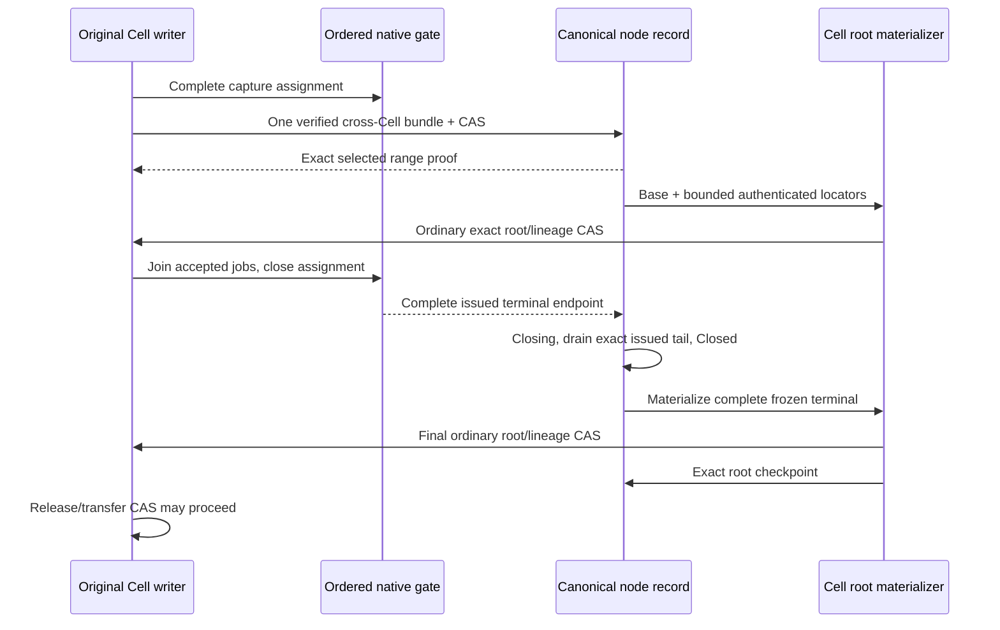

# Bundle coverage implementation

The connected protocol APIs now implement shared selection, independently
awaitable root materialization and complete live-writer closure. They are **not
enabled in the ordinary actor response path**. The prior performance regression
and failed qualification remain the baseline. This slice establishes ordering
and reconstruction evidence; it makes no new throughput or latency claim.

## Celld reference and Cellule adaptation

The reference is celld `f2bf648663a610eefde71f3547ad61e9b896b1f0`.
Its [bundle loop](https://github.com/denoland/celld/blob/f2bf648663a610eefde71f3547ad61e9b896b1f0/crates/celld/ltx_repl.rs#L4401)
gathers Cell tails into one node upload and separates durable coverage from
materialized positions. Its [bundle credit path](https://github.com/denoland/celld/blob/f2bf648663a610eefde71f3547ad61e9b896b1f0/crates/celld/node_log.rs#L6620)
rechecks bucket state and epoch after the upload before crediting rows.
These are architectural references; this module is independently implemented.

Cellule also has independent Cell ownership epochs. It first reserves a
provisional catalog binding, pins the original writer in Cell control, then
opens the binding through node CAS. Interrupted enrollment remains an inventory
obligation; a lower-level Cell pin CAS cannot bypass reservation. The existing
canonical node-record CAS selects catalog and range together. A
heartbeat preserves the head; a conflicting closure requires a fresh proposal.
Uploading an immutable object supplies no coverage proof.

## Implemented contracts

| API or boundary | Behavior |
| --- | --- |
| `NodeDirectory::initialize_bundle_lane` / `bind_bundle_cell` | Establish a boot/epoch catalog; reserve a provisional inventory entry, pin the original Cell's base/code/schema/writer, then open it before issuing bundled commands |
| `NodeLogShipper::submit_assigned` / `NodeDurability::submit_assigned` | Use the existing bounded native shipping lane and return an opaque witness for every frame in a complete capture |
| `prepare_node_bundle` / `select_node_bundle` | Reject missing, overlapping, unassigned or cross-binding ranges; verify origin extents before selecting; reconcile only the exact head under the original lease |
| `BundleCoverageProof` | Retain authenticated immutable locators, logical endpoint, SQLite position and original base; retain no capture bodies |
| `load_bundle_coverage` | Reopen a selected suffix from the authority-pinned canonical catalog, including a fenced boot; grant no writer or follower-suffix closure |
| `CellPublisher::materialize_bundle` | Reconstruct the exact overlay and use normal root preparation, lineage and Cell CAS independently of selection |
| `checkpoint_bundle_cell` | Read current Cell authority and drop only an exact complete materialized prefix; retain newer selected suffix locators |
| `close_cell_issuance` / `begin_bundle_close` / `finish_bundle_close` | Freeze complete assigned issuance, including prior Fleet ACKs above the selected prefix; permit only its old issued tail to drain; close only at the exact terminal endpoint |
| Cell departure CAS | Refuse release, takeover and tombstone until Closed, exact materialization and catalog checkpoint; migration refuses while bound |
| Node withdrawal/maintenance | Refuse unresolved bindings; stale fencing preserves the catalog head; one bundle-bound boot cannot rotate its native log to another epoch |
| Backup and collection | Backup refuses bound Cells. Coverage objects have no deletion path; this is retention, not a qualified collection implementation |

The original SQL/capture/submission jobs must join before `close_cell_issuance`.
Its ordered gate prevents late assignment from consuming a node sequence. The
legacy identity-free `DurabilityGate::issue` cannot produce a per-Cell closure:
using it makes that closure fail closed. Automatic actor joining and scheduling
are still required before enabling this path for application commands.

## Format and bounds

Unbound Cell controls and node records retain version-1 encodings. A binding or
bundle head selects version 2; inconsistent version/field combinations and
unknown fields are rejected. Old readers must not operate on those records.
Use a fresh development prefix and initialize the lane before native issuance;
there is no live-format migration or same-boot bundle-epoch rotation.

The `CNB1` object embeds a complete catalog and native frame extents under
`cells/v1/node-logs/<session>/<epoch>/coverage/v1/<digest>.cnb`. It is outside the
advertisement scan prefix. Both manifests and individual frame extents are
authenticated. New-object locators use a canonical self reference, resolved
against the selected digest, avoiding a self-referential digest field.

| Development bound | Value |
| --- | ---: |
| Immutable object/catalog bytes | 4 MiB |
| Original bindings per boot/epoch | 4,096 |
| Native frames per selection | 64 |
| Uncheckpointed locators per Cell | 32 |
| Encoded suffix bytes verified per Cell | 4 MiB |
| Distinct base-root origin dependencies verified per Cell | 65,536 |

Exhaustion rejects further bundle preparation while retaining the last proof.
These are safety ceilings, **not performance-qualified policies**. The complete
catalog is rewritten per selection and old locator bodies are reverified.
This is not yet the file-backed index needed for the 160/214-command checkpoint
cost constraints in the [authority decision](bundle-coverage-proof.md#quantified-checkpoint-constraint).
The caller owns host memory/native-job admission; automatic materializer budget,
fairness and cancellation/drain ownership are not integrated.

## Verification and remaining delivery

Twenty-three focused tests cover real managed SQLite captures, canonical object-store
CAS and materialization: two-Cell shared selection, byte-identical roots, a prior
Fleet ACK above the selected prefix, held old proposals across closure, hot
siblings and dormant bindings, lost replies, lease loss, partial command groups,
overlaps, corrupt/missing objects, version rejection, checkpoint continuation,
locator pressure and materializer failure. One test removes the original
database/captures, fences the node record and reconstructs the selected outcome
from origin. Its Fleet ACK setup uses the native gate; it is not a physical
follower-fsync qualification.

The asynchronous tests select another command while an older root is pending.
The older root checkpoints a complete prefix without dropping the hot suffix;
the next materializer can continue from that root before or after the catalog
checkpoint. Origin lookup also works between the root CAS and catalog CAS.
Enrollment fault tests cover failure before pin selection and after the pin
but before catalog activation; neither grants a proof or clean maintenance.

The two-Cell selection test observes **one immutable PUT plus one node CAS**,
with both Cell roots unchanged. That excludes enrollment, root materialization,
catalog checkpoints, compaction and maintenance and must not be reported as
total PUTs/command, TPS or a latency result.

The isolated source snapshot passed all contributor checks: **1,887 workspace
tests passed, 38 ignored; 58 local LTX tests passed**. All-feature/all-target
checking, warnings-denied Clippy and API docs, formatting, boundaries, module
ownership, document syntax/links and SQL/peer validation also passed. Ignored
environment-dependent tests and the complete production qualification remain
outside this result.

Remaining work before responses can use bundle proof:

1. Integrate actor/executor proof and query/retry endpoints, release proved
   capture retention, and schedule admitted materializers with joined shutdown.
2. Replace complete catalog rewrites with a bounded authenticated file-backed
   lookup/checkpoint index; measure the full checkpoint and collection cost.
3. Fence and seal a failed original node's complete follower-issued suffix,
   including ACKs above the selected head, before reconstructing and closing
   every original binding, including interrupted provisional enrollments.
   Current departure/maintenance guards refuse this
   unfinished recovery rather than advancing a replacement writer.
4. Implement complete cross-Cell reference inventory, pins and grace-qualified
   collection. Preserve original catalog and base dependencies throughout.
5. Run the unchanged all-ACK cold recovery, paired Docker throughput/latency,
   debt, read, overload and drain qualification from the
   [performance proposal](write-performance-proposal.md).
