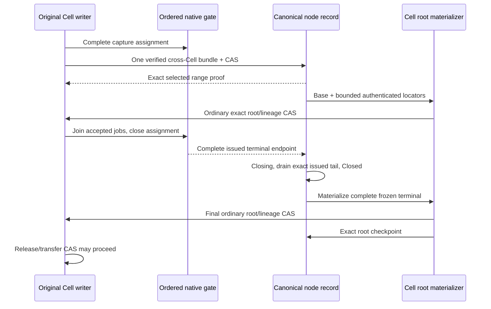

# Bundle coverage implementation

The [2,000-Cell comparison](pr67-base-cohort-measurement.md) overlaps fresh
small-base verification within the original 20-MiB admission. One Fleet write
pair completes 372.87 writes/s versus 271.00 before; celld completes 1,999.80/s
at 2,000 offered/s. Candidate successful scheduled p99 improves to 932.77 ms,
but errors, drops and joined drain fail. All warm ACKs pass; Cellule cold audit
is not reached. Read-only throughput is 17,456.38/s versus celld's 19,973.25/s
at 20,000 offered/s, with drops in both. All profiles remain unqualified.

The [submission diagnosis](pr67-submission-timing-measurement.md) identifies
publication capacity held under the global issuance lock. The latest candidate
still spends about 99% of successful submission time waiting for that lock.
Celld pipelines native progress independently of bucket publication. Similar
components do not imply the same response path. PR #67 remains a draft.

The installed original producer provides admitted shared receipts, independent
root materialization and complete live-writer closure. The Fleet SQL example
installs it; Bucket benchmark wiring bypasses it. Remaining gaps are publication
and verification cost, publication-coupled native admission, materializer
progress and remaining overload availability, ordered shipping, safe collection
and full lifecycle/performance qualification.
The [historical-read experiment](pr67-historical-read-measurement.md) was reverted
after a severe Fleet regression. Earlier measured slices remain linked from the
[delivery record](write-performance-delivery.md).

## Celld reference and Cellule adaptation

The reference is celld `f2bf648663a610eefde71f3547ad61e9b896b1f0`.
Its [bundle loop](https://github.com/denoland/celld/blob/f2bf648663a610eefde71f3547ad61e9b896b1f0/crates/celld/ltx_repl.rs#L4401)
gathers Cell tails into one node upload and separates durable coverage from
materialized positions. Its [bundle credit path](https://github.com/denoland/celld/blob/f2bf648663a610eefde71f3547ad61e9b896b1f0/crates/celld/node_log.rs#L6620)
rechecks bucket state and epoch after the upload before crediting rows.
These are architectural references; this module is independently implemented.

Cellule also has independent Cell ownership epochs. It first reserves a
provisional catalog binding, pins the original writer in Cell control, then
opens the binding through node CAS. Interrupted enrollment remains an inventory
obligation; a lower-level Cell pin CAS cannot bypass reservation. The existing
canonical node-record CAS selects catalog and range together. A
heartbeat preserves the head; a conflicting closure requires a fresh proposal.
Uploading an immutable object supplies no coverage proof.

## Implemented contracts

| API or boundary | Behavior |
| --- | --- |
| `NodeDirectory::initialize_bundle_lane` / `bind_bundle_cell` | Establish a boot/epoch catalog; reserve a provisional inventory entry, pin the original Cell's base/code/schema/writer, then open it before issuing bundled commands |
| `NodeLogShipper::submit_assigned` / `NodeDurability::submit_assigned` | Use the existing bounded native shipping lane and return an opaque witness for every frame in a complete capture |
| `prepare_node_bundle` / `select_node_bundle` | Reject missing, overlapping, unassigned or cross-binding ranges; verify origin extents; select the bundle and enrolled native coverage in one node CAS; reconcile only the exact head and coverage under the original lease |
| `NodeDurability::confirm_bundle` | Confirm only the exact original assigned captures and lease locally, with no storage I/O or second authority CAS; reject cold reconstruction proofs and replacement gates or guards |
| `BundleCoverageProof` | Retain authenticated immutable locators, logical endpoint, SQLite position and original base; retain no capture bodies |
| `load_bundle_coverage` | Reopen a selected suffix from the authority-pinned canonical catalog, including a fenced boot; grant no writer or follower-suffix closure |
| `CellPublisher::materialize_bundle` | Reconstruct the exact overlay and use normal root preparation, lineage and Cell CAS independently of selection; bounded small tails reuse canonical native coalescing and packing |
| `checkpoint_bundle_cell` / `checkpoint_bundle_cells` | Require the opaque proof matching each freshly read materialized root; drop only its identical locator prefix, retain newer suffixes, and select up to 64 checkpoints with one index upload and one node CAS |
| `close_cell_issuance` / `begin_bundle_close` / `finish_bundle_close` | Freeze complete assigned issuance, including prior Fleet ACKs above the selected prefix; retain that same opaque issuance witness through terminal closure; read only its authenticated shard |
| Cell departure CAS | Refuse release, takeover and tombstone until Closed, exact materialization and catalog checkpoint; migration refuses while bound |
| Node withdrawal/maintenance | Refuse unresolved bindings; stale fencing preserves the catalog head; one bundle-bound boot cannot rotate its native log to another epoch |
| Backup and collection | Backup refuses bound Cells. Coverage objects have no deletion path; this is retention, not a qualified collection implementation |

The producer admits receipt metadata for the complete original cohort together.
When credit is exhausted, it retains that verified cohort and services canonical
checkpoint callbacks whose joining can release older materializer credit. It
then transfers the admitted memory and rechecks the original live gate/lease
before confirming coverage. It never repeats durable selection to obtain credit.
This fixes a reproduced terminal capacity failure; sustained progress and
pressure-safe read/retry still require application qualification.

Live confirmation now reports `DurabilitySource::Bundle` separately from a
materialized Cell root. Adjacent exact ranges merge into compact source
intervals; root-only gaps keep their original source. A later exact root CAS
can still return an Object proof. Actors require the original admitted receipt,
assignment and Cell pin before accepting a Bundle response; raw local gate
confirmation alone cannot grant it. A boot without enrolled native log state supplies reconstruction
proofs only. Root work superseded by confirmed coverage joins its old flusher
before removing already-covered queue entries, including after lease loss.

The two-Cell regression verifies one immutable upload plus one combined node
CAS while Cell roots lag; exact local confirmation and retry add zero PUTs.
Cases also cover lost replies, heartbeat rebasing with later root coverage,
cancellation, lease loss, foreign gates and cold proofs. Historical catalogs
whose coverage watermark lagged remain tested through cold recovery; a
matching head alone cannot reconcile a new live selection. This is protocol
and component I/O evidence, not an application TPS improvement.

Failed-owner recovery now joins dependency-verified selected prefixes and the
sealed follower witness in the same file-backed builder. Complete shard
inventory includes selected-only Cells; identical native overlap is skipped,
while conflicting bytes and an omitted Cell reject before attachment. A bound
control may retain only its original recovery session/epoch after canonical
fencing. Its pin remains until complete terminal materialization/checkpoint;
the lower-level node seal enforces that obligation too. `recover_and_seal` now
materializes bound overlays under the fenced original binding, retaining normal
lineage and exact root CAS. It verifies every original root, including quiet
Cells, stages at most 64 checkpoints per immutable upload, then selects the
complete terminal catalog with one fresh-claim node CAS before sealing the log.
Only exact lost replies reconcile. Partial-root retries retain the original
manifest; verified closed roots allow resumption after transfer or interrupted
log seal. Quiet provisional enrollment is reconciled against current Cell
authority and its verified original base. An unpinned reservation can close
without changing a Cell that has released or moved. A pin CAS authorized before
fencing may still select that exact original base, but cannot reopen its closed
catalog; departure then uses the ordinary closed-binding guard. Native frames
issued before activation fail recovery before attachment or terminal selection,
retaining the unresolved obligation. Admitted host scheduling and full lifecycle
qualification remain unfinished. Bundle responses require the original installed
feed and admitted proof; the new connection is experimental and unqualified.

The original SQL/capture/submission jobs must join before `close_cell_issuance`.
Its ordered gate prevents late assignment from consuming a node sequence. The
legacy identity-free `DurabilityGate::issue` cannot produce a per-Cell closure:
using it makes that closure fail closed. Managed close waits for the complete
issued producer prefix and joins exact checkpoint callbacks before Cell departure.
After that prefix joins, at most eight close callbacks may enter the provider's
shared authority mutex queue. This bounds callbacks ahead of heartbeat renewal
during a population-wide drain. Lease fencing wakes callers outside the callback
cohort; cancellation returns admission while retaining frozen issuance. The
bound does not shorten an individual provider operation.
Failed-actor closure and sustained materializer progress remain unqualified.

## Format and bounds

Unbound Cell controls and node records retain version-1 encodings. A binding or
bundle head selects version 2; inconsistent version/field combinations and
unknown fields are rejected. Old readers must not operate on those records.
Use a fresh development prefix and initialize the lane before native issuance;
there is no live-format migration or same-boot bundle-epoch rotation.

New `CNB3` objects contain a fixed authenticated root index, changed catalog
shards, native extents and detached histories under the existing
`cells/v1/node-logs/<session>/<epoch>/coverage/v1/<digest>.cnb` path. The head digest
authenticates the 32 KiB header; shard digests authenticate each binding row and
its exact history extent; history digests authenticate every native reference.
New histories share the one immutable upload. Old native bodies are never copied
into a new history. Unchanged shards and histories keep exact object/range/digest
references without walking a predecessor chain.

A point lookup fetches one header, one shard and only the requested Cell's
history, then its exact native frames. A shared shard keeps unrelated histories
as authenticated references, including when those bodies are unavailable.
Selection verifies every participating Cell's origin and native suffix before
CAS; point selection grants no sibling drain or collection authority.
Complete maintenance inventory still verifies every shard, retaining one
bounded shard at a time and at most 4,096 duplicate-pin entries. An unresolved
history remains a drain obligation.

Hot lookups preflight selected shard lengths against 4 MiB before leaf reads,
then preflight the selected histories plus those shards against that same bound
before the first history read. This bounds protocol input, not total heap usage
or host admission. Hydration alone does not rewrite a shard; modifications to an
unloaded history reject.

`CNB1` complete catalogs and `CNB2` inline indexed shards remain readable, with
their original 32-inline-locator bound. Updating them selects `CNB3` without
changing Cell pins; unchanged inline shards can remain referenced. Older binaries
cannot read `CNB3`. Upgrade every recovery consumer before selecting it, using a
fresh development prefix. This does not migrate unbound live actor activations
or enable bundle responses.

| Development bound | Value |
| --- | ---: |
| Immutable object or individual catalog shard bytes | 4 MiB |
| Selected shard plus history encoded metadata | 4 MiB, checked before the respective reads |
| Authenticated index header | 32 KiB / 256 shard references |
| Original bindings per boot/epoch | 4,096 |
| Native frames per selection | 64 |
| Detached exact frame references per Cell | 256 |
| One encoded history | 32 KiB |
| Legacy inline locators per Cell | 32 |
| Native suffix bytes verified per Cell | 4 MiB |
| Distinct base-root origin dependencies verified per Cell | 65,536 |

Exhaustion rejects preparation while retaining the last proof. These are safety
ceilings, **not performance-qualified policies**. Old native bodies are still
reverified. The 215-command checkpoint density is now represented and measured
for a small-image fixture; total lifecycle cost is not qualified. Host memory,
native-job admission and materializer progress still require qualification.
The actor now owns bounded admitted scheduling and joins accepted jobs; its
latest application measurement fails availability. See the
[node performance design](../crates/cellule-runtime/docs/write-performance-design.md).

## Verification and remaining delivery

The atomic-coverage snapshot passed all twelve contributor checks: **1,940
top-level workspace cases passed, 38 ignored; 60 local LTX cases passed**.
The first full run timed out at an unchanged five-second follower-backlog drain.
That exact binary passed the case alone in 0.91 seconds; the identical frozen
source then passed the complete workspace rerun with the same four test workers
and deadlines. Failed runs, source hashes and count provenance remain outside
Git. A subsequent [fresh application measurement](pr67-write-measurement-4957985.md)
at `4957985` observed 344.19 Fleet-configured TPS and 147.98 Bucket TPS, with
failed qualification. Fleet successful-write p99 regressed, and ordinary bundle
ACKs stay disabled; component I/O reductions do not establish application gains.

The detached-history regression first fails at the original 32-reference
ceiling. With the new representation, one actual Cell among a **2,000-binding
catalog** selects 215 commands without checkpoint and cold-restores its seed and
all 215 outcomes while excluding a later unselected command. The other bindings
are metadata fixtures; this is not 2,000 active writers or node capacity evidence.
Density alone initially costs **220 materialization PUTs**. Streaming verified
rows through the existing admitted coalescer reduces it to **four**, retaining
the 256 KiB changed-page bound. A public file-backed LTX test exercises more than
256 KiB of aggregate native input and uses two LTX PUTs, plus the runtime's lineage
and Cell CAS. The 256-reference boundary also costs four in this fixture; an
oversized changed image preserves the ordinary bundle fallback.

The new one-Cell update among 1,000 bindings uses **35,416 metadata bytes**, versus
35,223 with inline `CNB2`. Recovery uses four coverage-object ranges: header,
shard, history and native frame. Prefix checkpoint uses three ranges with no
native-body reads. The extra history read buys selective dense lookup; it is not
a claimed read TPS improvement. One shared shard test corrupts a sibling history:
the requested Cell still selects without fetching or rewriting it, while a
complete reconstruction load rejects the missing/corrupt sibling. Additional
codec tests cover original pin/session/epoch, exact count/native-byte claims,
truncation, the 256-reference limit and aggregate admission before history I/O.
Both legacy complete catalogs and inline indexed suffixes migrate with the same
Cell pin. All raw logs remain outside Git.

The frozen detached-history and streaming-materialization source passed all
twelve contributor checks: **1,908 workspace tests passed, 38 ignored; 60 local
LTX tests passed**. Its 39 focused bundle/index tests include the 215-command
exact-root and outcome regression. The file-backed recovery test also passes.
These results verify correctness and component work; this milestone did not
include an end-to-end TPS measurement. Ordinary application responses still use
per-Cell publication, and production bundle ACK integration remains unfinished.

The combined selected-prefix/follower recovery snapshot passed all twelve
contributor checks: **1,916 workspace tests passed, 38 ignored; 60 local LTX
tests passed**. Its five new two-Cell cases use real managed captures and
file-backed follower fsync, verifying a pruned prefix with a prior Fleet ACK,
identical overlap, selected-only recovery, conflicting overlap and omitted
inventory. Separate tests cover a 2,000-scope manifest codec and retention of
scratch admission when a cancelled waiter leaves cache work running. The scope
codec is a metadata fixture, not 2,000 writers or throughput evidence.

The terminal recovery regressions cold-restore selected and prior Fleet outcomes
before allowing Cell transfer. They cover a partial root CAS, lost root/catalog
replies, expired claims and resumption after terminal catalog selection when one
Cell has transferred but log seal was interrupted. A **65-real-Cell** case crosses
the cohort boundary: **two immutable catalog uploads, one complete terminal node
CAS, then one log seal**. This excludes per-Cell roots, recovery manifest uploads,
enrollment and steady-state application work; it is not TPS or full M4 evidence.
The existing 215-command/four-PUT test remains passing.

The terminal-recovery snapshot passed all twelve contributor checks: **1,923
top-level workspace cases passed, 38 ignored; 60 local LTX cases passed**.
The earlier 1,920 count incorrectly excluded three distinct compile-fail
doctests as nested executions. Only one actual nested follower subprocess is
excluded from this corrected count. Default-parallel verification first expired four unchanged lease/grant
fixtures; a four-worker control run passed the identical runtime source. The
long density fixtures now renew only after authoritative heartbeat CAS, retaining
the same production lease duration and catalog head. The final isolated suite
uses four test workers; qualification concurrency and thresholds are unchanged.
These checks do not measure application TPS or complete lifecycle qualification.

The provisional-recovery snapshot passed all twelve contributor checks:
**1,928 top-level workspace cases passed, 38 ignored; 60 local LTX cases passed**.
Five new cases cover quiet unpinned and pinned reservations, a released Cell,
an original pin CAS delayed across fencing, and rejection of pre-activation
issued frames before attachment or terminal selection. Discovery counts its
fresh authority reads even when no Cell catalog pages are scanned. The locator
boundary now forces a production time-based checkpoint through a controlled
file-age input: 255 SQL commands contribute 256 complete native frames, still
materializing with four PUTs and excluding the next unselected command. It does
not equate commands with frames or increase either protocol bound.

The first complete suite stopped on an unchanged application deadline test
with three admitted reads instead of four. That exact binary passed alone,
and the identical frozen source passed the complete workspace rerun with the
same four test workers and deadlines. The earlier aborted incomplete snapshot,
failed runs, source hashes and count correction remain outside Git. No new
application TPS was measured, and bundle-based responses remain disabled.

The following counts describe the earlier inline-index snapshot, not the latest
application TPS:

The index regression reproduces a **783,146-byte** metadata rewrite for one
update among 1,000 Cells on the old source. The same test measures **35,223 bytes**
with the original `CNB2` (95.5% less), retains one immutable PUT plus one node CAS, and recovers
through three coverage-object ranges: header, chosen shard and native frame.
An exact materialized-prefix checkpoint among those 1,000 Cells falls from
**253 coverage-object reads to two**, without reading old native frames. A
64-Cell checkpoint cohort selects all completed roots with **two PUTs**, keeping
a hot Cell's newer suffix; an unmaterialized participant rejects the whole cohort
without a partial CAS. That small independent materialization used the canonical
native coalescer and pack: **256 PUTs instead of 320** for those 64 roots, or four
per root. A 32-locator suffix falls from **37 PUTs to four**, and cold restore
includes every selected outcome while excluding the later unselected command.
The aggregate native rows, indexes and pack headers must fit the existing
256 KiB budget; larger tails preserve the ordinary bundle representation.
The [updated cost calculation](bundle-coverage-proof.md#quantified-checkpoint-constraint)
requires at least 215 commands per Cell checkpoint if that four-PUT path and
64/64 cohorts hold, before retries or maintenance. Real larger checkpoints must
be measured; that original 32-locator safety ceiling did not satisfy this constraint.

Additional tests cover legacy migration with the same Cell pin, a reused shard
without reading its old header, corrupt and missing reused shards, and refusal
to omit a corrupt shard from complete inventory. Bootstrap enrollment accepts
the runtime's command-zero root only before any native issuance; the first
command materializes and a quiet Cell drains without inventing a command.
An exact installed checkpoint retry preserves hot newer locators without another
PUT. A chosen cohort exceeding the metadata budget refuses before fetching its
first leaf. These regressions were reproduced before their fixes.
This is metadata/I/O evidence,
not application TPS or complete M4 qualification.

The original twenty-three focused tests cover real managed SQLite captures, canonical object-store
CAS and materialization: two-Cell shared selection, byte-identical roots, a prior
Fleet ACK above the selected prefix, held old proposals across closure, hot
siblings and dormant bindings, lost replies, lease loss, partial command groups,
overlaps, corrupt/missing objects, version rejection, checkpoint continuation,
locator pressure and materializer failure. One test removes the original
database/captures, fences the node record and reconstructs the selected outcome
from origin. Its Fleet ACK setup uses the native gate; it is not a physical
follower-fsync qualification.

The asynchronous tests select another command while an older root is pending.
The older root checkpoints a complete prefix without dropping the hot suffix;
the next materializer can continue from that root before or after the catalog
checkpoint. Origin lookup also works between the root CAS and catalog CAS.
Enrollment fault tests cover failure before pin selection and after the pin
but before catalog activation; neither grants a proof or clean maintenance.

The two-Cell selection test observes **one immutable PUT plus one node CAS**,
with both Cell roots unchanged. That excludes enrollment, root materialization,
catalog checkpoints, compaction and maintenance and must not be reported as
total PUTs/command, TPS or a latency result.

The original bundle source snapshot passed all contributor checks: **1,887 workspace
tests passed, 38 ignored; 58 local LTX tests passed**. All-feature/all-target
checking, warnings-denied Clippy and API docs, formatting, boundaries, module
ownership, document syntax/links and SQL/peer validation also passed. Ignored
environment-dependent tests and the complete production qualification remain
outside this result.

The final indexed publication/materialization snapshot passed all twelve
contributor checks: **1,902 workspace tests passed, 38 ignored; 60 local LTX
tests passed**. This includes warnings-denied Clippy and API docs, all-feature
and all-target checking, formatting, boundary/layout checks, document syntax
and links, SQL/peer validation and performance-harness tests. Its 34 focused
bundle/index tests and two public recovery-overlay tests cover the new cost,
checkpoint retry, command-zero bootstrap and larger-tail fallback behavior.
Source manifests, failed-before/pass-after logs and build outputs remain in the
external `cellule-write-perf-8ad1` evidence directory. Environment-dependent
ignored tests and production performance qualification remain outstanding.

The experimental checkpoint API now takes its `BundleCoverageProof`, and
`finish_bundle_close` takes the same retained `CellIssuedRange` used for Closing.
Consumers must pass those original capabilities; a pin or sampled endpoint is
not a substitute. The singleton checkpoint method delegates to the cohort path.

## Selected capture cleanup in the actor

The existing publisher now consumes a complete selected oldest capture prefix
before reading files for root preparation. The native worker checks original
scope, command endpoint, SQLite position, frame count and every captured segment
descriptor/body digest, and checks the live proof for each whole assignment.
It validates the complete prefix before deleting any local file. A matching
endpoint or a cold proof alone cannot release capture retention.

For the managed producer, the worker removes selected physical captures and
heap outcome entries, retains one latest admitted proof, and keeps retry results
in SQLite. The actor coalesces one root-debt obligation per Cell. Its original
publisher reconstructs admitted roots from authenticated locators, preserves due
time and uses ordinary lineage, Cell CAS and exact catalog checkpoint. Storage
retries retain the existing grace; shutdown joins accepted materializers and
complete original issued-range closure. The manual-feed/unleased fallback retains
its bounded 100-ms selection opportunity and ownership of files already preparing.

Confirmed roots retain bounded process-local hash-chain witnesses for original
and intermediate bases. A later selected proof may drop only that identical
materialized prefix and must retain its complete unresolved suffix. Witnesses
expire beyond the 256-locator bound; their heap capacity transfers from memory
admitted before root I/O. They grant no live ACK or origin availability.

The real actor test blocks root preparation until selection, then pauses root
CAS and verifies that every selected capture file is absent. It issues a later
write and verifies that an unproven suffix refuses a query before its handler
runs; proving that exact later capture restores visibility. Both commands then
survive joined drain and cold restore. Separate cases retain prior Fleet ACKs
and accepted mutations after caller cancellation. These are ordering and
reconstruction tests, not TPS qualification.

Remaining work before qualified production enablement:

1. Fix the measured Fleet availability regression. Prove admitted materializer
   progress, exact checkpoint continuation under active writes and application
   minimum-receipt read/retry visibility. Address verification overhead and
   failed-actor closure. Connect Bucket-only publication while preserving exact
   capture/visibility gates.
2. Build on the authenticated index: bound admitted maintenance inventory,
   increase checkpoint density with retained-byte accounting, and measure the
   complete materialization/checkpoint/collection cost.
3. Integrate admitted failed-boot orchestration around combined reconstruction,
   provisional reconciliation, exact materialization and atomic terminal
   selection. Keep admission closed until enrollment activates. Departure and
   canonical seal guards refuse unfinished original bindings before replacement
   admission; pre-activation issuance is not a recoverable quiet reservation.
4. Implement complete cross-Cell reference inventory, pins and grace-qualified
   collection. Preserve original catalog and base dependencies throughout.
5. Run the unchanged all-ACK cold recovery, paired Docker throughput/latency,
   debt, read, overload and drain qualification from the
   [performance proposal](write-performance-proposal.md).
