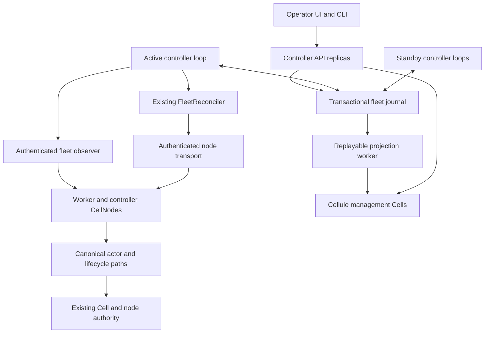

# Cellule fleet control plane design and implementation plan

Status: proposed implementation handoff. This document delivers the design;
the controller application, HTTP API, UI, and production journal described here
are implementation targets.

Prepared: October 1, 2026, America/Vancouver.
Inspected committed baseline: `58721227e56dac3ebcda6b74b4ed2a514f8cc42b`.
Concurrent reader enrollment work was present during inspection. This design
does not certify that work or depend on its uncommitted API names.

Build a highly available fleet management application on Cellule. Several
controller capable nodes serve the management API and UI; one fenced controller
per fleet drives the existing reconciliation path. The application identifies
slow, pressured, and unhealthy nodes, records operator intent, and automates
bounded Cell relocation and maintenance through canonical runtime mechanisms.

The audience is implementers and operators. The decisions, interfaces, ordered
changes, commands, and acceptance criteria below are sufficient to start work
without earlier conversation context. Sections explicitly marked proposed do
not describe shipped APIs. Reference and production acceptance are separate.

## Delivery contract

The deliverable is a runnable reference application, a production journal
adapter, an authenticated node management adapter, a versioned API, a fleet UI,
fault scenarios, and deployment runbooks. Three controller processes must adopt
durable operations across failure while actual CellNodes preserve acknowledged
application state and the single writer contract.

| Decision | Initial implementation |
| --- | --- |
| Controller topology | Three controller capable nodes in distinct failure domains; API service on all three, one fenced reconciler per fleet. |
| Controller runtime | One `CellNode` and one runtime per controller process; ordinary Cellule hosting and lifecycle. |
| Deployment isolation | Dedicated controller pool by default; mixed worker/controller nodes are supported only with reserved management resources. |
| Journal | PostgreSQL application adapter implements all existing fleet journal traits in one transaction domain. The current SQLite example remains a local reference. |
| Cellule management state | Real management Cells provide disposable fleet read models and audit mirrors. Canonical operation state remains in the journal for this release. |
| Fleet execution | Reuse `FleetReconciler`, runtime planner/reducer, node action executor, and canonical Cell authority. |
| Admission and safety | Local pressure protection, lease fencing, publication, and recovery continue without a controller. |
| API and UI ownership | Embedding application owns HTTP, authentication, authorization, credentials, assets, and deployment. |
| Initial bounds | Existing maximum of two unresolved fleet movement attempts, 8 GiB restore budget, and one planned node maintenance operation per fleet. |
| Automation defaults | Observation only; enable relief, maintenance, slow-node relocation, and balancing through individually qualified policy stages. |
| Bootstrap | Journal, catalog, object storage, node identities, and canonical authority are available independently of controller management Cells. |

Three controller processes provide application redundancy. Journal availability
requires a separately qualified database deployment with fenced primary
promotion and preservation of acknowledged commits. Controller election does
not implement database consensus.

### Relationship to the existing fleet plan

The [fleet operations plan](fleet-operations-plan.md) remains authoritative for
movement, enrollment, role evacuation, primitive quiescence, recovery, and
finalization. This document supplies the application and deployment around it.
It does not introduce another Cell authority or weaken its acceptance gates.

| Present foundation | Use here | Remaining dependency |
| --- | --- | --- |
| [FleetReconciler](../crates/cellule-host/src/fleet/reconciler/mod.rs) | One bounded reconciliation pass; adapter interfaces and progress report. | Complete observation and maintenance barriers from the fleet plan. |
| [FleetJournal](../crates/cellule-host/src/fleet/controller.rs) | Controller claims, revision checks, permits, intents, scheduling, history. | Production adapter and atomic application request/policy transactions. |
| [FleetRoster](../crates/cellule-host/src/fleet/roster/mod.rs) | Traverse retained intents and enrollments, including failed boots and Pending work. | Match complete native writer, reader, producer, and follower evidence. |
| [Fleet action contracts](../crates/cellule-host/src/fleet/actions.rs) | Journal exact node effects and preserve original accepted inputs/results. | Full maintenance actions and finalization qualification. |
| [Pressure classifier](../crates/cellule-runtime/src/fleet/pressure.rs) | Use actual locally classified, signed pressure. | Application telemetry and independent health/slowness evaluation. |
| [Fleet operations example](../crates/cellule-host/examples/fleet_operations/README.md) | Journal contracts and real movement/restart scenario patterns. | Remote HTTP, multiple processes, sustained convergence, production authentication and providers. |

The current ownership-only example explicitly reports incomplete role coverage.
Its overload and controller-restart scenarios do not establish complete node
maintenance or production availability. Track completion against the exact
source revision and [fleet execution evidence](fleet-operations-progress.md).

## Architecture and responsibilities



Every controller process exposes HTTP routes and hosts real Cellule management
Cells when admitted. Only the journal lease holder reconciles a fleet. The
management Cells use the ordinary fenced writer, durable response gate, and
recovery paths; their writer may live on a different controller than the fleet
lease holder. These two ownership concepts are independent.

| Layer | Responsibility |
| --- | --- |
| Runtime | Pure placement, operation transitions, authority, recovery, local admission, and resource accounting. |
| Host | Fleet driver, exact node actions, inventory, lifecycle, retained work, and one drain lane. |
| Controller application | Supervised loop, health evaluation, policy, journal adapter, API, node transport, projections, UI, and audit presentation. |
| Embedding worker application | Install fleet facilities; supply trusted Cell catalog/providers, boot enrollment, signing, management endpoints, and deployment policy. |
| Deployment | Database failover, object storage, identity and certificate provisioning, load balancing, failure domains, process restart, and backups. |

Controller role is application deployment metadata associated with a stable
physical `NodeId` and fresh boot `SessionId`. It is not a new Cell ownership
kind. Keep capability metadata in the journal application schema; do not
silently extend signed advertisements or reinterpret their persisted fields.
Metadata alone cannot authorize enrollment, receive capacity, or takeover.

### Proposed application layout

Create `examples/fleet_controller/` as a standalone reference application with
its own Cargo workspace and lockfile, using path dependencies on the framework.
This keeps product dependencies outside provider neutral library crates. The
application is runnable in this repository and reusable by an embedding product.

```text
examples/fleet_controller/
  Cargo.toml                 # standalone workspace, binary fleet-controller
  Cargo.lock
  AGENTS.md                  # application boundary and verification rules
  src/main.rs
  src/bootstrap/mod.rs       # one CellNode, enrollment, management Cells
  src/controller/mod.rs      # bounded long-running loop and takeover
  src/journal/mod.rs         # existing fleet traits plus application transactions
  src/journal/postgres.rs
  src/requests/mod.rs        # durable request and policy processing
  src/observer/mod.rs        # complete retained roster and native role matching
  src/health/mod.rs           # bounded health and slow-node evaluation
  src/transport/mod.rs        # authenticated exact-boot node calls
  src/http/mod.rs             # public and internal management routes
  src/projection/mod.rs       # Cellule read model and audit mirror
  src/management_cells/mod.rs
  migrations/
  openapi.yaml
  ui/                        # static TypeScript UI assets and build lockfile
  deploy/                    # local fixture and production configuration examples
  qualification/             # subprocess/provider scenarios and evidence runner
  README.md
```

Use an application HTTP server, a PostgreSQL driver with bounded connection
pooling, and a small TypeScript UI with pinned dependencies and reproducible
asset builds. Select and pin concrete dependencies in CP1; record the selected
versions and license review in the application manifest rather than copying
unverified versions into this plan. Avoid importing Rust files from another
example with `#[path]`. Share test contracts by fixtures or a deliberate
application support module, keeping one production execution path.

## Controller startup and bootstrap

The controller cannot require its own running reconciliation loop to create
the facilities necessary to start that loop. Initial journal provisioning and
roster import are explicit deployment operations.

1. Provision the database, canonical catalog, authority/object storage, stable
   physical identities, and application signing keys through deployment tooling.
2. Create the fleet journal with movement stopped and bootstrap incomplete.
   Import the controlled node roster and retained obligations. Commit bootstrap
   only after the existing enrollment barrier is satisfied; an empty live
   directory is insufficient.
3. Start each controller with a fresh session. Read its exact physical intent
   and follow the existing [fleet boot admission](../crates/cellule-host/docs/lifecycle.md#fleet-boot-admission)
   sequence, including Pending, canonical advertisement, Established, atomic
   confirmation, required probes, and ordinary host start.
4. Start API, observer, projector, and reconciliation tasks under explicit
   ownership. Management readiness and Cell serving readiness remain separate.
5. Create or recover the declared management Cells through ordinary catalog and
   authority paths. Their absence delays projections, not journal reconstruction
   or already authorized fleet work.
6. A controller observes the current journal lease, then attempts a claim if
   eligible. Bootstrap does not require becoming leader first.
7. Begin observation only. Enable new movement through a durable revision
   checked policy command after qualification.

The controller pool is excluded from ordinary automatic workload balancing in
the initial deployment policy. Management Cells are placed only within that
pool through trusted application placement inputs. Pool discovery and recovery
use ordinary canonical directory/authority facilities. If no controller is
available, data nodes retain local protection and ordinary recovery, but no
optional fleet operation starts.

CP1 must enforce management Cell eligibility at ordinary acquisition as well as
fleet receiver preparation. Declare management code/schema support only on the
controller pool and validate it through the trusted catalog/provider path; route
management clients only to compatible signed boots. Test an attempted ordinary
acquisition on a worker. Controller labels alone cannot enforce this constraint.

An entirely Cellule backed journal is a future adapter, not a prerequisite for
this delivery. It must prove atomicity across head, registry, accepted actions,
requests, policy, and audit plus independent bootstrap and failover. Hosting
an ordinary SQL Cell alone does not establish those contracts.

## Durable journal and application transactions

Implement `FleetJournal`, `FleetEnrollmentJournal`, and `FleetActionJournal`
against one PostgreSQL primary and transaction domain. Never validate a permit
from a cache or follower and then accept an action in another database.

### Proposed record model

Canonical records use existing bounded codecs. Application records have their
own explicit schema version, length limits, checksums, and migration rules.
All primary keys include application and fleet scope.

| Record | Essential fields and rules |
| --- | --- |
| Fleet head and registry | Canonical encoded records, exact head/registry revisions, validated immutable `FleetProfile`, bootstrap and scheduling state. |
| Intents and enrollments | Existing exact physical identities, boot sessions, original specs, statuses, evidence, and retained revisions. Preserve failed and Pending obligations. |
| Actions, basis, results, history | Existing immutable exact inputs/proofs; retain unknown results and permits; atomically publish history with permit retirement. |
| Controller capabilities | NodeId, enrolled session, eligibility, failure domain, build/schema compatibility, bounded lease diagnostics. |
| Operator request | Request ID, principal, kind, target, idempotency key, canonical body digest, expected policy/intent revisions, submitted time, expiry, state, linked canonical operation/attempt IDs. |
| Policy | Revision, automation stage, health thresholds, target exclusions, controller pool, risk limits, and policy digest. No credentials. |
| Decision | Decision ID, policy revision, observation/evidence digest, rationale, target, proposed cost, and resulting request/attempt IDs. |
| Audit and event outbox | Per-fleet ordered sequence, request/actor identity, transition type, referenced canonical evidence, previous/new revision, commit time. Append in the same transaction as the change. |
| Health checkpoint | Exact boot, signal/window identifiers, original sample range, state, reason, expiry. Advisory; cannot substitute for current role evidence. |
| Projection cursor | Last applied journal event sequence, model schema, and Cell identity/incarnation. A projection cursor never authorizes mutation. |

Operator requests and decision records are bounded independently of the small
fleet head. Start with at most 128 queued requests per fleet and a 64 KiB public
request body. Excess requests return capacity errors. Terminal audit/history
retention is controlled by referenced proof obligations and documented archival
policy; never delete evidence because a UI retention period elapsed.

### Transaction recipe

Use serializable transactions and a consistent lock order: fleet head, registry,
application policy/request metadata, then sorted intent/enrollment/action rows.
Lock the fleet head for mutations to serialize allocation, policy acceptance,
enrollment, and action acceptance. Run the existing pure reducer inside the
transaction; insert referenced rows and events before committing the resulting
head. Recheck exact expected versions and complete immutable replay inputs.

PostgreSQL serialization failures require retrying the whole transaction.
Use the same immutable request ID, bounded retries, and the remaining deadline;
do not repeat external node effects inside a database retry. Row locks end at
transaction completion. These mechanisms are described in the official
[transaction isolation](https://www.postgresql.org/docs/current/transaction-iso.html)
and [locking documentation](https://www.postgresql.org/docs/current/explicit-locking.html).

Production database deployment must preserve acknowledged commits during
primary promotion, reject writes on the old primary, and route authorization
reads to the current primary. Qualify synchronous WAL durability and the
promotion rule together. Synchronous replication can wait for standby WAL
durability or application, depending on configuration; it does not supply
primary fencing by itself. See the official
[synchronous replication contract](https://www.postgresql.org/docs/current/warm-standby.html#SYNCHRONOUS-REPLICATION).
Record the selected database release, replica configuration, backup/restore
process, and failure proof in CP2 and CP10.

An ambiguous commit response is Unknown. Retry lookup using the original
idempotency identity. Never reply with a definite rejection if the transaction
could have committed. HTTP clients may safely resubmit the same request.

### Proposed request processing contract

`submit_request` performs authorization, canonical validation, scope/revision
checks, idempotency comparison, request insertion, and audit insertion in one
transaction. Equal key and equal body return the original result; equal key
and different body return conflict. This contract is application owned and
does not yet exist in `FleetJournal`.

A `202 Accepted` response means the request is durably queued. It does not mean
the node is cordoned, a move has begun, or maintenance is complete. Expose
`Queued`, `Running`, `Blocked`, `Completed`, `Rejected`, and `ExpiredBeforeStart`
as application status views with explicit canonical phase and evidence fields.
Do not map an unknown accepted effect to a terminal rejection or expiration.

The active controller adopts a queued maintenance request by atomically linking
its request to `BeginMaintenance` and the committed node intent. Only one node
maintenance operation may be active initially; another request remains visibly
queued with `MaintenanceBusy`. Recheck its expected target revisions and expiry
before adoption. Requests that expired before any canonical action may become
`ExpiredBeforeStart`; started requests preserve their intent and obligations.

Policy updates and scheduling stop/resume commit atomically with their audit
event and registry gate. Existing charged attempts continue settling after
stop. Acceptance and Allocate recheck the policy revision in the same
transaction. `FleetProfile` resource bounds are immutable for a journal scope
in this release; changing them requires a separate qualified migration.

### Proposed application interfaces

Implement these logical methods on the same journal adapter, with original
source errors, canonical immutable inputs, bounded pages, and retained jobs:

```text
submit_request(scope, authorized_principal, immutable_request, deadline)
  -> OriginalOrNewRequest
adopt_request(expected_head_and_registry, controller_epoch, request_id, now)
  -> RequestLinkedToCanonicalTransition
replace_policy(scope, expected_policy_and_registry, immutable_request, now)
  -> CommittedPolicyAndAudit
load_operation(scope, request_or_operation_id)
  -> CanonicalStatusWithEvidenceReferences
events_page(scope, after_sequence, limit)
  -> BoundedCommittedEvents
load_controller_eligibility(scope, physical_node, exact_session)
  -> RevisionedEligibility
```

Authorization is verified by the application adapter before transaction entry;
persist its principal and scope with the accepted immutable request. Fleet
action acceptance independently verifies authenticated node scope and current
journal authorization. Request adoption checks expiry, compatibility, target
revision, policy revision, current epoch and shared budget together. No method
calls a node or performs Cell activation inside its database transaction.

## Controller ownership and process lifecycle

Each process has a fresh claimant `SessionId`. No static leader setting, API
load balancer choice, or management Cell writer replaces the existing
`ControllerLease` epoch. Every transition and node acceptance verifies current
journal authorization. Already accepted work remains owned by its node executor
and must be adopted after takeover.

Use the current profile defaults initially: 30 second controller lease,
15 second periodic reconciliation, two unresolved attempts, and 8 GiB restore
budget. The profile validates lease duration at no more than 30 seconds. Use
a proposed 10 second pass budget so a slow pass leaves renewal headroom.
Progress events can wake the loop sooner, but coalesce them and allow only one
pass per process/fleet. Bound active fleet loops explicitly; start with one
fleet in the reference fixture.

The journal and nodes need one qualified time domain for authorization. The
application clock supplies nonnegative time that cannot regress during a pass;
database transactions validate deadlines and lease claims against trusted
primary time and reject excessive skew. Configure a proposed one second maximum
skew and fail closed when it cannot be maintained. Test clock jumps, primary
changes, and lost time synchronization. Browser timestamps never authorize
effects. Process monotonic time bounds waiters separately from journal time.

```text
while supervised application task is running:
    load current committed lease and compatibility/eligibility
    if another live claimant owns it:
        wait for lease change or bounded periodic wake with jitter
    else:
        reconcile_once(trusted_clock, pass_deadline)
        treat claim conflicts/fencing as a return to standby
        preserve source errors, back off journal failures, publish diagnostics
        adopt queued requests through the same fenced transaction contract
    join/check owned tasks; coalesce bounded event notifications
```

Lease lookup is advisory scheduling information. Only CAS authorizes leadership.
Do not claim a lease twice around each pass: `reconcile_once` already claims or
renews it. New application request transitions must use the current epoch and
the same head transaction. Hold no database transaction over an HTTP call.

Liveness reports whether the process and supervisor are running. API readiness
reports usable authorization/journal access. A separate controller status
reports claimant, epoch, last completed pass, and lease expiry. Standby is a
healthy state. Unavailable projections produce explicit degraded reads rather
than a false complete fleet view.

### Controller maintenance and shutdown

For controller maintenance, require another eligible, compatible controller
outside the same maintenance target and a healthy qualified journal. Initially
permit at most one controller maintenance operation at a time, preserving two
eligible controllers from the three-node pool. This is an application safety
policy, not a claim that controllers form a quorum.

If the target is active, stop its new controller passes and let its lease expire;
there is no implied lease-transfer API today. Another controller claims the next
epoch and proves adoption of charged attempts before the target drains. This
step retains ordinary node lease maintenance and management access. Recheck
controller eligibility and policy when claiming; an enrolled maintenance node
cannot reacquire controller eligibility merely by rebooting.

For graceful process shutdown, close new API mutation admission, stop starting
passes, join the current bounded pass, join application transaction/projection
owners, and invoke the canonical host drain. Keep node lease renewal and
management endpoints for as long as accepted work and role settlement require
them. Controller lease expiry does not cancel node effects or release permits.
Retain task handles across cancelled drain waiters; forced process death relies
on durable adoption and recovery and is tested separately.

Use the host task group for long-running application tasks. Finite journal jobs,
native capture jobs, and node effects require retained completion owners with
bounded admission; do not report normal finite-task completion as supervisor
failure or assume aborting a waiter cancelled native work.

## Observation and health evaluation

Capture authenticated, exact-boot observations for the complete retained
roster. Preserve busy/transitioning writers, managed readers and accepted reader
jobs, leader enrollment producers, local and cold follower lanes, authoritative
foreign node-log obligations, enrollment state, and current lifecycle evidence.
Recheck head/registry versions after collection and after dependent actions.

Page traversal is bounded and revision aware. Start with existing canonical
limits: 128 entries per page, 1 MiB encoded native page, and 10,000 scanned
records per roster category. Reject mixed versions and explicit overflow;
never declare completeness from truncation. Controllers cache advisory displays
with original capture times; actions require their existing fresh inspections.

### Independent status dimensions

| Dimension | Proposed values | Meaning |
| --- | --- | --- |
| Reachability | Reachable, Suspect, Unreachable, Unknown | Recent authenticated communication; absence does not prove writer failure. |
| Service health | Healthy, Degraded, FailedProbe, Unknown | Required component/runtime probes and independent application availability signals. |
| Performance | Normal, Slow, InsufficientSamples | Workload-aware latency and queue-delay evaluation. |
| Pressure | Existing signed node pressure tier | Actual local classifier result; controller cannot fabricate or re-sign it as node telemetry. |
| Desired mode | Existing retained node intent | Active, maintenance/evacuation, or later lifecycle intent, independent of pressure recovery. |
| Observation coverage | Complete, Partial, Stale, Incompatible | What the collector proved for the displayed roster revision. |

Do not treat a failed management endpoint as proof that application serving is
dead. Health evaluation never bypasses canonical failed-session proof,
authority fencing, enrollment barriers, or exact recovery.

### Proposed initial evaluation policy

Keep sample times, sample counts, workload class, histogram schema, error class,
and authenticated producer identity. Evaluate separate per-window histograms;
do not average node p99 values into a fleet p99. Aggregate compatible histogram
buckets or expose separate quantiles. Retain at most twelve ten-second windows
per boot and at most 32 configured workload classes; excess cardinality becomes
an explicit missing-data diagnostic. Detailed time series live in the embedding
telemetry backend, not the fleet journal.

| Rule | Proposed starting value | Response |
| --- | --- | --- |
| Missing observations | Three missed ten-second capture windows | Suspect and exclude from proactive receiver selection; retain previous ownership as unknown. |
| Slow node | At least 100 comparable completed operations/window; p95 above configured class SLO and twice the median of at least two healthy peer p95 values for six consecutive windows | Mark Slow with the exact class and sample range. Without two peers or enough samples, report InsufficientSamples. |
| Slow recovery | Six valid windows below class SLO and below 1.5 times peer median | Clear Slow; never clear maintenance intent. |
| Failed local probe | Three consecutive fresh failed probe samples | Mark FailedProbe and exclude proactive receiving; distinguish application failure from management reachability. |
| Pressure relief | Existing signed sustained Shedding/Critical tier | Use the current planner, demand, receiver admission, and fleet permits. |
| Repeated ineffective relocation | Two trial moves without class latency improvement during the next valid two-minute windows | Suspend slow-node trials and expose a capacity/workload blocker. |

These values are proposed reference defaults, not measured production SLOs.
Record policy revision and complete evidence for each decision. Restart restores
unexpired checkpoints and original window ranges; if evidence is missing,
collect a full new dwell before acting. A missing or stale sample cannot declare
recovery. Operator thresholds must be validated and revised durably.

## Automation and operation safety

Automatic decisions and operator requests use the same journal, resource
budgets, action executor, and evidence. Process charged/unknown work first,
then planned maintenance, sustained pressure relief, qualified slow-node trials,
and ordinary balancing. Local actor pressure protection remains independent.

### Proposed automation stages

| Stage | Allocations permitted | Prerequisite |
| --- | --- | --- |
| Observe | None; settle already accepted work when policy stops new allocations. | Authenticated API and explicit completeness/freshness diagnostics. |
| Relief | Current pressure-driven movement. | Trusted pressure, admissible receiver, qualified observer and movement fault gates. |
| Maintenance | Operator requested full role evacuation and finalization. | Fleet W6–W8 native barriers and controller maintenance adoption proof. |
| Slow trials | One eligible trial movement for a slow-node decision, within shared permits. | Explicit policy eligibility extension, comparable telemetry, durable trial/cooldown history, and fault qualification. |
| Balance | Existing count/resource balancing. | Complete fresh membership, role coverage, stable post-batch evidence, and measured convergence. |

The current driver has no general application API for forced Cell moves or
slow-node targeting. CP7 must extend the existing planner/driver contracts with
explicit policy exclusions and typed relocation reasons, then use canonical
attempt allocation. Specify compatibility and codec changes before adding
persisted fields. Do not falsify signed pressure, remove missing nodes from the
roster, or translate Slow into a permanent maintenance cordon to obtain a move.

Receiver exclusions for Slow, Suspect, or FailedProbe are application policy
inputs with expiry and revision. They supplement actual signed capacity,
compatibility, and intent checks. They cannot increase advertised capacity or
authorize a stale boot. A policy revision race must fail Allocate or first effect
acceptance in the same transaction; already accepted effects remain adopted.

The proposed host constructor accepts one `FleetPolicyProvider` supplying a
revisioned policy basis for the pass. Extend the existing planner with pure
`PlannerPolicy` inputs for exact boot exclusions and requested settled Cell
relocations; retain authenticated placement observations unchanged. Include
policy digest and relocation reason in the canonical planning/attempt evidence
through an explicitly versioned format change. The journal adapter validates
that basis again at Allocate and effect acceptance. Keep the existing driver
as the sole executor; these names and constructor changes require CP7 API and
producer/consumer review before implementation.

Requested Cell moves specify exact Cell incarnation and source boot, with an
optional preferred receiver. They preserve admission, generation, authority,
residence, cooldown and shared resource bounds. Explicit operator intent may
replace the optimizer's gain threshold after policy validation, while runtime
safety gates remain unchanged. An unavailable preferred receiver produces a
blocker instead of silently changing the requested destination.

For a slow-node trial, select a settled eligible Cell with a qualified cost,
compatible receiver, complete input evidence, and existing residence/cooldown
requirements. Record hypothesis and pre-move class latency. At most one trial
per affected node may be unresolved, while total attempts still obey the
existing fleet maximum. Validate improvement before another trial. Hot/oversized
Cells, fleet-wide backend latency, and no-capacity conditions become blockers
with guidance to partition demand or add capacity.

### Maintenance completion

Writers leaving a node is one milestone. Completion requires canonical evidence
for primitive quiescence, reader closure/replacement where policy requires it,
leader and foreign follower obligations, accepted job settlement, native host
shutdown, `Stopped`, exact session withdrawal, and retained enrollment
retirement under the unchanged registry revision barrier.

`safe_to_take_offline` is false or unknown until the committed finalization
proof is verified. A deadline, zero writer count, missing advertisement, expired
lease, or successful cordon is insufficient. Provider shutdown/reboot is an
embedding deployment action following this proof; no generic controller route
deletes leases or powers off machines. Return to service requires a newer
authorized Active intent and a new boot through normal admission.

Initial Cell maintenance consists of inspection and settled relocation. Busy
Cell quiescence is authorized through node maintenance and its existing exact
intent barrier. Exposing an independent busy-Cell pause, repair or deletion
requires an additional typed operation with primitive-specific contracts;
CP9 does not imply a generic destructive Cell maintenance endpoint.

## HTTP API and transport contracts

Public routes are versioned under `/api/v1/fleets/{fleet}`. Authorization binds
principal, application, fleet, resource, and action. Define Viewer, Operator,
and Administrator roles. Operator can request operations and stop scheduling;
Administrator can alter policy, enrollment bootstrap, and controller eligibility.
Deploy browser identity through the embedding identity provider. For cookie
sessions enforce CSRF protection and bounded session lifetime. Never expose
cloud credentials or local storage paths in requests or responses.

### Proposed public routes

| Route | Contract |
| --- | --- |
| `GET /api/v1/fleets/{fleet}` | Committed revisions, controller epoch, health/capacity summary, coverage and capture age. |
| `GET /api/v1/fleets/{fleet}/nodes` | Paginated exact physical/boot identities, capabilities, observed health, desired intent, obligations and blockers. |
| `GET /api/v1/fleets/{fleet}/cells` | Paginated Cell identity/incarnation, observed writer, cost, residence, eligibility and movement evidence. |
| `GET /api/v1/fleets/{fleet}/operations` | Paginated requests and canonical operation/attempt links. |
| `POST /api/v1/fleets/{fleet}/operations` | Idempotent durable maintenance, CellMove, ReturnToService, ExtendDeadline, StopScheduling or ResumeScheduling request. Advertise only qualified kinds. |
| `GET /api/v1/fleets/{fleet}/operations/{id}` | Durable request state, canonical phase, independent release/activation/recovery counts, unknown effects, obligations and offline proof. |
| `GET /api/v1/fleets/{fleet}/policy` | Revision and supported automation capabilities. |
| `PUT /api/v1/fleets/{fleet}/policy` | Validated complete policy replacement with expected revision and idempotency key. |
| `GET /api/v1/fleets/{fleet}/events` | Authorized server-sent events from committed event outbox. |
| `GET /livez` and `GET /readyz` | Process liveness and API readiness; controller ownership is a separate diagnostic. |

Require `Idempotency-Key` for mutations and an expected revision in their body.
Document `202` queued, `200` replay/read, `400` invalid, `401` unauthenticated,
`403` unauthorized, `404` absent within authorized scope, `409` revision/key
conflict, `413` body too large, `422` unsupported operation/stage, `429` bounded
capacity, and `503` unavailable/unknown commit outcome. Error bodies carry a
stable code, request ID, retryability, and sanitized source diagnostic. Unknown
commit responses instruct clients to retry the same identity.

Proposed maintenance request and acceptance, shown as schema examples:

```json
{
  "kind": "NodeMaintenance",
  "node_id": "canonical-node-id",
  "expected_intent_revision": 17,
  "expected_policy_revision": 4,
  "deadline_ms": 1790900000000,
  "reason": "planned hardware service"
}
```

```json
{
  "request_id": "generated-request-id",
  "state": "Queued",
  "operation_id": null,
  "intent_committed": false,
  "safe_to_take_offline": false,
  "status_url": "/api/v1/fleets/example/operations/generated-request-id"
}
```

Identifiers and time in these examples are placeholders, not executable valid
requests. `openapi.yaml` must define canonical ID encoding, numeric ranges,
supported request variants, response versions, nullability, and error schemas.

### Paging and event delivery

Limit public pages to 128 rows and encoded responses to 1 MiB. Cursors bind
scope, filters, sort key, snapshot/projection revision, and schema version. A
changed revision requires an explicit restart response; do not silently combine
pages. Show capture time separately from response time and journal revision.
Strong operation reads come from the primary journal, while projected fleet
views disclose their event watermark and missing coverage.

SSE event IDs bind fleet and ordered committed sequence. Replay from the retained
outbox; duplicates are permitted and clients deduplicate. An expired cursor
returns an explicit reset requirement followed by full refresh. Start with 128
streams per controller, 64 queued events per stream, and a 1 MiB queue byte cap;
disconnect lagging clients rather than growing memory. Notifications wake readers
but are not the durable event record.

### Proposed internal node routes

Serve fleet observation capture/pages, effect dispatch, and fresh inspection
under `/internal/fleet/v1/`. Use mutual authentication binding a peer to enrolled
scope and exact boot session. Check version, payload size, digest, deadline,
registry revision, controller authorization and intent before the existing host
method. Keep viewer credentials separate from controller-to-node permissions.

Observation capture is read-only and request-bound; capture nonce, exact boot,
roster revision, original time interval, and signature remain attached to pages.
Do not cache an effect result as a fresh observation. Effect dispatch carries
the canonical bounded `FleetAction` encoding. Inspection carries its canonical
request and validates the returned observation against it. Requests carry Cell
identity and trusted catalog references, never receiver filesystem paths.

Application node endpoints must work during maintenance while new role admission
is closed. Accepted native effects are owned by host facilities across HTTP
disconnects. Dropping the HTTP future must not release credit, cancel native
work, or erase journal acceptance. Remote capture ownership and deadline behavior
are part of the observer gate, including unresolved producer jobs.

## Management Cells and UI

Define a management application namespace with a declared catalog and schema.
Use one read-model Cell per fleet initially and bounded audit mirror segments.
Store event sequence, canonical record references/digests, model schema and
capture metadata. Large telemetry stays in the application metrics backend.

Projection applies each event through an idempotent Cell command whose outcome
and model mutation commit together. Use event ID as the command identity and
compare the embedded sequence before advancing the watermark. Resolve ambiguous
command outcomes through the ordinary receipt/outcome path. Only persist a
journal projection cursor after durable Cell acknowledgement. On rebuild or
incarnation change, replay retained events or rebuild from a consistent journal
snapshot and resume from its watermark.

Projection failure delays display but cannot acknowledge an operator mutation,
authorize a node action, or block journal takeover. Audit source records remain
in the journal; management Cells are rebuildable mirrors. This avoids a
distributed transaction between a Cell command and the fleet journal.

### Required UI views

| View | Information and controls |
| --- | --- |
| Fleet overview | Active/standby controllers, epoch/expiry, compatible builds, observation coverage, capacity, pressure, slow/unhealthy counts and blocked operations. |
| Nodes | Physical node and boot, role/failure domain, independent health/pressure/intent, sample age, writer/reader/follower responsibilities, maintenance request. |
| Cells | Exact incarnation/owner, resource cost, class performance, eligibility, blockers, historical move outcomes, qualified move request. |
| Operation detail | Durable request timeline, canonical phases, release versus activation/recovery, pending/unknown actions, remaining role obligations, deadline extension and offline proof. |
| Policy and audit | Current revision/stage, validated edits, decision reasons, principal/request identity and immutable transition history. |

Display stale/partial/unknown values visibly. A missing node is not shown as
zero load; released is not rendered as serving elsewhere. Disable unsupported
actions using server capability metadata and explain their blockers. Reconnect
SSE by cursor, recover with full refresh after reset, and render API revision
conflicts with an explicit reload/retry workflow. Include keyboard navigation,
accessible status text, mobile layouts, and pagination/virtualization for large
fleets. The operation page reads canonical journal status even if projections
are unavailable.

## Ordered implementation packages

Each package produces a reviewable commit sequence. Production acceptance
requires the listed evidence; prototypes and synthetic observation tests do
not mark later native or provider gates complete. Before edits, read the nearest
crate guide, search producers/consumers/tests, and inventory concurrent changes.

| Package | Concrete changes and suggested commit sequence | Exit evidence |
| --- | --- | --- |
| CP0 Contract inventory | Record baseline and existing fleet gaps; map every public API and journal transaction to canonical contracts; create dependency checklist linking fleet W1–W10. | All proposed names marked; no application duplicate of planner, authority, enrollment, or drain. |
| CP1 Application bootstrap | Commit standalone manifest/lockfiles/config validation first; integrate one actual CellNode and proper boot enrollment after CP2 journal core; then management Cell catalog, eligibility enforcement, supervised owners and lifecycle endpoints. | Fresh/maintenance reboot behavior; real management command receipt/readback; ordinary worker acquisition refused for management code; invalid config starts no runtime; shutdown joins all owned work. |
| CP2 Production journal | Commit versioned migrations/canonical codecs; then shared transaction implementation of all three fleet traits; then request/policy/audit transactions, trusted clock, bounded pool and retained jobs; then backup/promotion fixtures. | Same contract cases as SQLite reference, independent process races, late stale action, unknown commit replay, no lost acknowledged acceptance after qualified promotion. |
| CP3 API and requests | Commit OpenAPI and auth/scope middleware; then idempotent request/status/policy handlers; then durable outbox/SSE and paging. Add unsupported-capability responses before exposing unfinished effects. | Same key replays one request; different body conflicts; unauthorized cross-fleet access denied; accepted queued request is visible after process crash; disconnect/slow client stays bounded. |
| CP4 Controller availability | Commit supervised standby/active loop; then fenced request adoption and diagnostics; then controller maintenance eligibility and orderly handover via expiry. | Three actual processes, one valid epoch, lost controller adopts existing attempts, paused old controller cannot allocate/accept new effects, maintenance target does not reclaim. |
| CP5 Complete observer | Consume fleet W2–W3 envelopes and native inventory/producer work; commit exact boot transport and signature checks; then complete roster/role/authority matching and revision barriers; then fresh inspection integration. | Missing boot, Pending work, stale page, cold follower lane, cancelled reader open, dead-owner epoch, key mismatch and mid-scan revision prevent false completeness. |
| CP6 Health evaluation | Commit bounded telemetry/window codecs and authenticated capture; then pure workload-aware evaluator/checkpoints; then decisions and UI fields. | Deterministic dwell/recovery, workload mismatch, absent peers, low count, stale/replayed/regressed samples and restart; no missing sample implies failure proof or recovery. |
| CP7 Automation policy | Commit explicit planner/driver eligibility and reason contracts with versioned compatibility; then revision-checked operator CellMove and slow trial allocation; then shared-budget enforcement, cooldowns, stop/resume and staged activation. | Real pressure relief, trial effectiveness and no-capacity blockers; policy race fences new work; no extra budget/synthetic pressure/second move engine; accepted work settles after stop. |
| CP8 UI and management Cells | Commit receipt-bound idempotent projector/rebuild; then static UI overview/nodes/cells; then operation/policy/audit pages, SSE recovery and accessibility. | Rebuild read model, duplicate/lost acknowledgement, unavailable projection fallback, fresh canonical operation status, pagination resets, bounded streams, role restrictions. |
| CP9 Complete maintenance | Finish fleet W6–W8 role settlement/finalization; connect worker/controller maintenance and settled Cell relocation routes; add failed-owner obligations and return-to-service workflow. | Continuous busy traffic, readers, foreign follower tails, Cron/Blob external owners, controller handover, reboot cordon, host Stopped and withdrawal; offline flag only from full proof. |
| CP10 Qualification | Commit multi-process fault runner/evidence format; then database/network/clock/receiver/source faults and mixed binary scenarios; then convergence/load/performance and backup restore campaign. | Unchanged existing qualification profiles plus the acceptance matrix below, exact source/provider artifacts, no outstanding unclassified safety failures. |
| CP11 Deployment and runbooks | Commit local fixture and reproducible assets; then production pool/identity/database/metrics templates; then bootstrap, canary, incident, upgrade and rollback instructions. | An operator launches reference fleet and performs audited maintenance/takeover from API/UI without private Rust calls or log-based completion guesses. |

Dependencies: land CP1 scaffold, then CP2 journal core, then finish CP1 native
bootstrap before CP3–CP4 application integration. CP3 and CP8 read-only
views can use truthful partial observations before CP5 completion. CP6 can
classify advisory telemetry before mutation is enabled. CP5 and fleet W4–W5
qualification gate CP7 movement. CP9 requires fleet W6–W8. CP10 qualifies each
capability before CP11 enables it. Finish framework gaps in their canonical
modules, then consume them here; do not implement application substitutes.

### First delivery slice

Implement CP0–CP4 plus the read-only part of CP5 and CP8 first. The deliverable
is three controller instances serving a truthful fleet view, actual management
Cells, durable idempotent maintenance requests shown as queued or blocked, and
fenced controller takeover. Its capability response advertises incomplete
maintenance explicitly. New automatic allocations remain disabled until their
native and provider gates pass.

The next slice enables sustained pressure relief through CP5/CP7, preserving
the existing movement fault contracts. Slow trials and full maintenance follow
their distinct proof gates. The complete delivery includes CP0–CP11; the first
slice is not completion of this plan.

## Commands and executable acceptance

Commands in this subsection are implementation targets until their packages
land. Every command must be implemented and documented, return nonzero on
failure, and write a bounded evidence summary. Invocations below assume the
workspace root and an isolated verification checkout for process/provider work.
Do not run broad process suites in the active development checkout.

CP1 installs the standalone manifest. CP11 supplies `dev-up` to provision a
local PostgreSQL fixture, canonical object/authority provider, development
identities and three controllers plus three worker processes. Fixture credentials
are local only; real-provider qualification uses its documented environment.

```sh
export CARGO_INCREMENTAL=0
export CARGO_TARGET_DIR="$HOME/Workspace/crabbuild-target/cellule-controller-verification"
cargo build --manifest-path examples/fleet_controller/Cargo.toml --locked
cargo run --manifest-path examples/fleet_controller/Cargo.toml --locked -- dev-up --state-dir /tmp/cellule-controller-demo
```

The fixture prints API/UI addresses, fleet ID, enrolled sessions and supported
capabilities. CP3 supplies an authenticated client using a credential file with
owner-only permissions; do not print tokens or place them in command arguments.

```sh
cargo run --manifest-path examples/fleet_controller/Cargo.toml --locked -- client --config /tmp/cellule-controller-demo/client.toml fleet-status
cargo run --manifest-path examples/fleet_controller/Cargo.toml --locked -- client --config /tmp/cellule-controller-demo/client.toml maintenance --node worker-1 --idempotency-key maintenance-worker-1
cargo run --manifest-path examples/fleet_controller/Cargo.toml --locked -- client --config /tmp/cellule-controller-demo/client.toml operations
```

`worker-1` is a fixture alias resolved to its canonical NodeId; the client fetches
and displays expected intent/policy revisions on first submission, and retains
that immutable body for retries using the same key. Identical input returns
the same request without a new deadline or refreshed expected revision. An
incomplete maintenance implementation reports its
unsupported capability or retained blocker and cannot pass the full scenario.

CP10 delivers these named scenarios, all using actual subprocesses and the same
production application routes/adapters. The runner uses a disposable isolated
state directory, cleans up only its owned processes/resources, and preserves
failure artifacts.

```sh
cargo run --manifest-path examples/fleet_controller/Cargo.toml --locked -- qualify --scenario controller-failover
cargo run --manifest-path examples/fleet_controller/Cargo.toml --locked -- qualify --scenario pressure-convergence
cargo run --manifest-path examples/fleet_controller/Cargo.toml --locked -- qualify --scenario slow-node-trial
cargo run --manifest-path examples/fleet_controller/Cargo.toml --locked -- qualify --scenario worker-maintenance
cargo run --manifest-path examples/fleet_controller/Cargo.toml --locked -- qualify --scenario controller-maintenance
cargo run --manifest-path examples/fleet_controller/Cargo.toml --locked -- qualify --scenario journal-failover
cargo run --manifest-path examples/fleet_controller/Cargo.toml --locked -- qualify --scenario receiver-loss
cargo run --manifest-path examples/fleet_controller/Cargo.toml --locked -- qualify --scenario projection-rebuild
cargo run --manifest-path examples/fleet_controller/Cargo.toml --locked -- dev-down --state-dir /tmp/cellule-controller-demo
```

`pressure-convergence` sustains reproducible load across multiple batches;
it does not stop the producer after the first two moves. Record time to relief,
admission pressure and actual latency separately. A permanently saturated fleet
may end BlockedCapacity; it cannot claim convergence or continue unsafe moves.
`slow-node-trial` injects node-specific latency as well as a separate fleet-wide
backend slowdown and proves the latter does not trigger relocation storms.

### Scoped verification routes

Run checks only against an inventoried snapshot. Application manifests and
lockfiles are outside the root workspace, so verify them explicitly. CP8 adds
UI lockfile/build scripts and an API contract gate; CI must invoke both.

```sh
cargo fmt --manifest-path examples/fleet_controller/Cargo.toml --all --check
cargo check --manifest-path examples/fleet_controller/Cargo.toml --all-targets --all-features --locked
cargo test --manifest-path examples/fleet_controller/Cargo.toml --all-features --locked
cargo clippy --manifest-path examples/fleet_controller/Cargo.toml --all-targets --all-features --locked -- -D warnings
RUSTDOCFLAGS='-D warnings' cargo doc --manifest-path examples/fleet_controller/Cargo.toml --all-features --no-deps --locked
python3 scripts/check-boundaries.py
python3 scripts/check-module-layout.py
python3 scripts/check-doc-rust-fences.py
python3 scripts/check-doc-links.py
```

Update static gates in CP1 so the standalone application sources, documentation,
Cargo manifest/lockfile and UI assets are covered; current workspace scans must
not silently omit the new application. Framework changes run the scoped host
and runtime suites plus root CI routes from `AGENTS.md`. Provider, process,
cloud and broad qualification require their existing documented environments.
Do not weaken latency, throughput, fault, or compatibility profiles to pass.

## Acceptance matrix and required evidence

| Scenario | Required result |
| --- | --- |
| Three controllers race | One current journal claimant; no duplicate permit allocation; all replicas can return committed request/status. |
| Kill active controller during accepted move | Successor adopts original action, permits and evidence; receipt-bound state survives; no second release or writer. |
| Pause old controller then resume after expiry | New epoch remains authoritative; stale new allocations/effects refused; already accepted work may complete and is adopted. |
| Journal unavailable or promoted | New effects stop without current authorization; no acknowledged request/acceptance disappears under the qualified database failure envelope. |
| Request response lost after commit | Same identity returns original request/operation; unknown response never manufactures rollback. |
| Receiver lost before or after release | Source stays authoritative before confirmed release; after release, exact root is recoverable through canonical paths; unused credit is joined. |
| Missing or forged node sample | No false completeness or proactive receiver; original retained ownership/obligations remain visible. |
| Slow management endpoint with serving worker | Report reachability suspicion; no fabricated failed-session proof, writer takeover, or maintenance success. |
| Slow hot Cell or fleet-wide backend | Effectiveness gate stops trials; expose workload/capacity diagnosis; no repeated relocation storm. |
| Oscillating pressure/performance | Dwell, minimum residence, cooldown, shared budgets and post-batch freshness bound movement. |
| Sustained overload | Qualified multi-batch relief or explicit no-capacity blocker; actual workload state remains readable through receipts. |
| Policy update races allocation/acceptance | Exact revision checked in the mutation transaction; new work obeys policy; accepted work is preserved. |
| Busy node maintenance | Accepted foreground work settles; native reader/follower/producer obligations close; Stopped and withdrawal evidence precede offline flag. |
| Dead owner with follower tail | Tail remains protected until object coverage or canonical recovery and exact retirement; zero local writers is insufficient. |
| Controller pool maintenance | Another eligible controller adopts before target drain; target cannot regain eligibility from stale metadata or reboot. |
| Controller majority lost | Optional automation may be unavailable; canonical data safety holds; no application quorum or automatic database promotion is inferred. |
| Projection unavailable or rebuilt | Canonical status/mutations still use journal; Cells rebuild receipt-bound views without duplicate command effects or unsafe mutation authority. |
| SSE overflow or expired cursor | Bounded memory, explicit disconnect/reset, successful consistent refresh; no event loss presented as complete history. |
| Mixed versions and rollback | Unsupported codecs/capabilities fail closed; new state is not read by an incompatible binary; rollback cannot delete accepted work. |
| Clock jumps and shutdown cancellation | Authorization fails closed, no stale lease allocation, retained finite owners remain joinable, no leaked native handles/credit/tasks. |
| Database backup restore | Refuse normal automation until restored journal and authority are reconciled; old snapshot cannot erase newer action obligations or revive stale epochs. |

Evidence for each run includes source commit and dirty-source fingerprint,
manifests/lockfiles, binary and UI digests, provider/database versions and
configuration, scenario seed/load, actual enrolled boot identities, journal
epoch/revision timeline, action/authority evidence, acknowledged command receipts
and readback, resource maxima, cleanup result, raw logs, and terminal failures.
Record functional, performance, availability and safety results separately.
Unexplained existing failures remain tracked; a later pass does not establish
their cause. No test count by itself certifies complete role coverage.

Proposed fixture availability target: under a healthy journal, bounded skew,
and reachable peers, controller takeover is visible within 60 seconds of active
process loss. This target includes the 30 second lease plus detection/claim/pass
time and must be measured. It is not a bound on recovery when the journal or
required role evidence is unavailable. Publish measured fleet-size and API/load
limits; this plan makes no unmeasured scalability claim.

## Deployment and operator runbooks

Deploy controllers separately from application workload capacity, reserve host
resources for API/reconciliation and management Cells, and spread the three
instances across failure domains. Set explicit pools, connections, scan/page
bounds, queue limits, timeouts, and telemetry cardinality. Startup validates
configuration, capabilities, identity scope, immutable profile, and schema
versions before opening mutation readiness.

Runbooks must cover bootstrap/import, capacity addition, pressure with no
receiver, hot Cell diagnosis, stuck/unknown operation, worker and controller
maintenance, journal outage/promotion, certificate rotation, incomplete role
coverage, failed-owner follower obligations, deadline extension, backup restore,
upgrade, rollback and return to service. Each states the API status/evidence
required and the action permitted. A journal restore is an incident requiring
reconciliation with current authority and retained node acceptances before
automation resumes; deployment must fence old controller sessions.

Roll out observation-only API/UI, then pressure canaries, maintenance canaries,
slow trials, and full balancing. Deploy compatible readers and node adapters
before writing new persisted or signed formats. Disable new allocations during
incompatible transitions, while retaining resolution paths. Rollback preserves
committed intents, accepted actions, and immutable history; use the last binary
that understands the current record formats.

## Completion checklist

- [ ] Standalone controller application builds reproducibly and hosts real management Cells.
- [ ] Three controller processes serve authorized API/UI and prove fenced adoption.
- [ ] Production journal implements all fleet/application transactions with qualified promotion and restore behavior.
- [ ] Complete fresh observation covers retained boots and all native role obligations.
- [ ] Slow, overloaded, unhealthy, unknown and maintenance states are independently visible.
- [ ] Pressure relief, explicit Cell moves, slow trials and balancing share canonical actions and budgets.
- [ ] Worker and controller maintenance finish only with complete native and withdrawal evidence.
- [ ] OpenAPI, bounded pagination/events, management Cell rebuild and accessible UI are delivered.
- [ ] All named process/provider scenarios and unchanged qualification gates have recorded results.
- [ ] Deployment, compatibility, incident and rollback runbooks are executable by an operator.

The plan is delivered when this document is saved and reviewable. The control
plane is delivered only when these implementation and qualification gates are
met; publishing the design does not mark the underlying fleet work complete.
