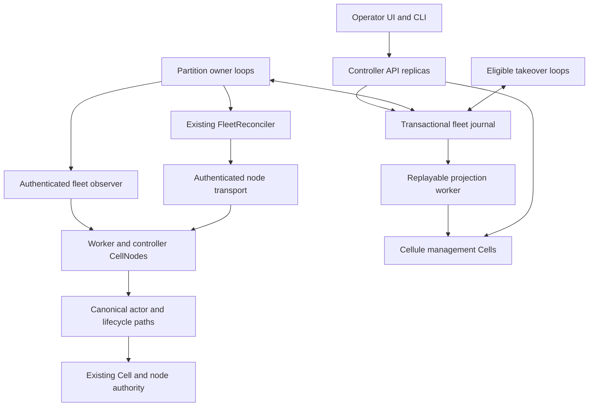

# Cellule fleet control plane design and implementation plan

Status: proposed implementation handoff. This document delivers the design;
the controller application, HTTP API, UI, and production journal described here
are implementation targets.

Prepared: October 1, 2026, America/Vancouver.
Inspected committed baseline: `58721227e56dac3ebcda6b74b4ed2a514f8cc42b`.
Concurrent reader enrollment work was present during inspection. This design
does not certify that work or depend on its uncommitted API names.

Build a highly available fleet management application on Cellule. Several
controller capable nodes serve the management API and UI. One fenced owner per
execution partition drives canonical reconciliation under shared fleet budgets.
The application identifies
slow, pressured, and unhealthy nodes, records operator intent, and automates
bounded Cell relocation and maintenance through canonical runtime mechanisms.

The audience is implementers and operators. The decisions, interfaces, ordered
changes, commands, and acceptance criteria below are sufficient to start work
without earlier conversation context. Sections explicitly marked proposed do
not describe shipped APIs. Release acceptance includes the production and scale
gates in this document.

The [production audit](fleet-control-plane-audit.md) records the gaps found in
the first design and maps each to a required implementation and release gate.

| Read first | Purpose |
| --- | --- |
| [Product and integration](#production-product-and-application-integration) | What Cellule supplies and what an application team configures. |
| [Fleet scale](#fleet-scale-and-partitioned-execution) | Partition safety, complete incremental inventory, history lifecycle and measurable scale targets. |
| [Lifecycle automation](#capacity-control-and-lifecycle-automation) | Capacity, disruption budgets, upgrades and low-intervention operation. |
| [Implementation packages](#ordered-implementation-packages) | Ordered source changes, dependencies and exit evidence. |
| [Release acceptance](#acceptance-matrix-and-required-evidence) | Native faults, performance, operational usability and required artifacts. |

## Delivery contract

The deliverable is a versioned controller binary/container with bundled UI and
CLI, a maintained worker SDK, a supported production journal adapter, standard
identity and platform integrations, automated lifecycle workflows, fault
scenarios, and deployment runbooks. Three controller processes must adopt
durable operations across failure while actual CellNodes preserve acknowledged
application state and the single writer contract.

| Decision | Initial implementation |
| --- | --- |
| Controller topology | Three controller capable nodes in distinct failure domains; API service on all three, fenced reconcilers per execution partition with shared fleet budgets. |
| Controller runtime | One `CellNode` and one runtime per controller process; ordinary Cellule hosting and lifecycle. |
| Deployment isolation | Dedicated controller pool by default; mixed worker/controller nodes are supported only with reserved management resources. |
| Journal | PostgreSQL application adapter implements all existing fleet journal traits in one transaction domain. The current SQLite example remains a local reference. |
| Cellule management state | Real management Cells provide partitioned, rebuildable read models and audit mirrors. Canonical operation state remains in the journal for this release. |
| Fleet execution | Reuse `FleetReconciler`, runtime planner/reducer, node action executor, and canonical Cell authority. |
| Admission and safety | Local pressure protection, lease fencing and publication continue without a controller; new enrollment and recovery-role recruitment can depend on the journal gateway. |
| API and UI ownership | Ship the controller application and optional worker SDK with HTTP, identity integration, UI, and deployment defaults; framework core remains provider neutral. |
| Initial bounds | Retain two unresolved moves and 8 GiB per partition; add atomic fleet and installation caps and disruption permits before enabling partition parallelism. |
| Automation defaults | Observation only; enable relief, maintenance, slow-node relocation, and balancing through individually qualified policy stages. Production release must qualify every advertised baseline feature. |
| Bootstrap | Journal, catalog, object storage, node identities, and canonical authority are available independently of controller management Cells. |

Three controller processes provide application redundancy. Journal availability
requires a separately qualified database deployment with fenced primary
promotion and preservation of acknowledged commits. Controller election does
not implement database consensus.

### Relationship to the existing fleet plan

The [fleet operations plan](fleet-operations-plan.md) remains authoritative for
movement, enrollment, role evacuation, primitive quiescence, recovery, and
finalization. This document supplies the application and deployment around it.
It does not introduce another Cell authority or weaken its acceptance gates.
Partitioning, snapshot/archive closure and management-generation fencing require
explicit versioned amendments to the fleet plan in CP0. Until those protocols
and migrations are implemented and qualified, current global bounds and strict
roster contracts remain authoritative; this document cannot be used to bypass
them by configuration.

| Present foundation | Use here | Remaining dependency |
| --- | --- | --- |
| [FleetReconciler](../crates/cellule-host/src/fleet/reconciler/mod.rs) | One bounded reconciliation pass; adapter interfaces and progress report. | Complete observation and maintenance barriers from the fleet plan. |
| [FleetJournal](../crates/cellule-host/src/fleet/controller.rs) | Controller claims, revision checks, permits, intents, scheduling, history. | Production adapter and atomic application request/policy transactions. |
| [FleetRoster](../crates/cellule-host/src/fleet/roster/mod.rs) | Traverse retained intents and enrollments, including failed boots and Pending work. | Match complete native writer, reader, producer, and follower evidence. |
| [Fleet action contracts](../crates/cellule-host/src/fleet/actions.rs) | Journal exact node effects and preserve original accepted inputs/results. | Full maintenance actions and finalization qualification. |
| [Pressure classifier](../crates/cellule-runtime/src/fleet/pressure.rs) | Use actual locally classified, signed pressure. | Application telemetry and independent health/slowness evaluation. |
| [Fleet operations example](../crates/cellule-host/minion/README.md) | Journal contracts and real movement/restart scenario patterns. | Remote HTTP, multiple processes, sustained convergence, production authentication and providers. |

The current ownership-only example explicitly reports incomplete role coverage.
Its overload and controller-restart scenarios do not establish complete node
maintenance or production availability. Track completion against the exact
source revision and [fleet execution evidence](fleet-operations-progress.md).

## Architecture and responsibilities



Every controller process exposes HTTP routes and hosts real Cellule management
Cells when admitted. Only the journal lease holder reconciles its assigned
execution partition. The management Cells use the ordinary fenced writer, durable response gate, and
recovery paths; their writer may live on a different controller than a partition
lease holder. These two ownership concepts are independent.

Controllers host one dedicated management application and runtime, with
management Cell namespaces keyed by authorized tenant/fleet. A controller's boot
enrolls in that management scope; it is not advertised as a worker boot in every
managed application. Its service identity receives explicit grants for the
managed fleet scopes. Partition claim validation binds that identity to its
management boot, deployment and granted scope. Worker actions always retain the
worker application's own FleetScope, NodeId and SessionId. A cross-fleet move is
rejected; operating many fleets does not merge their data authority or identity.
Management pool maintenance is coordinated through its own scope by surviving
controllers, and its disruption policy protects all managed fleets' service.

| Layer | Responsibility |
| --- | --- |
| Runtime | Pure placement, operation transitions, authority, recovery, local admission, and resource accounting. |
| Host | Fleet driver, exact node actions, inventory, lifecycle, retained work, and one drain lane. |
| Controller application | Supervised loop, health evaluation, policy, journal adapter, API, node transport, projections, UI, and audit presentation. |
| Worker SDK supplied with Cellule | Install fleet facilities, enroll boots, publish observations, bind native action owners, expose standard management transport, renew identity, and supervise intent. |
| Embedding worker application | Supply its existing catalog/providers, application identity and business-specific workload constraints; configure the SDK once. |
| Deployment | Database failover, object storage, identity and certificate provisioning, load balancing, failure domains, process restart, and backups. |

Controller role is application deployment metadata associated with a stable
physical `NodeId` and fresh boot `SessionId`. It is not a new Cell ownership
kind. Keep capability metadata in the journal application schema; do not
silently extend signed advertisements or reinterpret their persisted fields.
Metadata alone cannot authorize enrollment, receive capacity, or takeover.

### Proposed application layout

Create `apps/fleet-controller/` as a supported application workspace with its
own lockfile, using path dependencies on the framework during development. Ship
versioned binary/container, CLI, UI, and a publishable optional `cellule-fleet-agent`
SDK from this workspace. Production artifacts pin compatible framework versions.
HTTP, identity, database and platform dependencies stay in these application
packages. The reference fixture exercises the same release binaries.

```text
apps/fleet-controller/
  Cargo.toml                 # application workspace, fleet-controller and cellule-fleetctl
  Cargo.lock
  AGENTS.md                  # application boundary and verification rules
  src/main.rs
  src/bin/cellule-fleetctl.rs
  agent/                     # optional cellule-fleet-agent SDK
  src/bootstrap/mod.rs       # one CellNode, enrollment, management Cells
  src/controller/mod.rs      # partition leases, fairness and takeover
  src/partitions/mod.rs      # assignment epochs and cross-partition reservations
  src/capacity/mod.rs        # desired node pools and disruption budgets
  src/journal/mod.rs         # existing fleet traits plus application transactions
  src/journal/postgres.rs
  src/inventory/mod.rs       # snapshot manifests, deltas and evidence archive
  src/platform/mod.rs        # built-in Kubernetes lifecycle adapter
  src/requests/mod.rs        # durable request and policy processing
  src/observer/mod.rs        # complete retained roster and native role matching
  src/health/mod.rs           # bounded health and slow-node evaluation
  src/transport/mod.rs        # authenticated exact-boot node calls
  src/http/mod.rs             # public and internal management routes
  src/projection/mod.rs       # Cellule read model and audit mirror
  src/management_cells/mod.rs
  migrations/
  openapi.yaml
  ui/                        # static TypeScript UI assets and build lockfile
  deploy/                    # supported Helm release, VM templates and profiles
  release/                   # signed artifacts, SBOM and compatibility manifest
  qualification/             # subprocess/provider scenarios and evidence runner
  README.md
```

Use an application HTTP server, a PostgreSQL driver with bounded connection
pooling, and a small TypeScript UI with pinned dependencies and reproducible
asset builds. Select and pin concrete dependencies in CP1; record the selected
versions and license review in the application manifest rather than copying
unverified versions into this plan. Avoid importing Rust files from another
example with `#[path]`. Share test contracts by fixtures or a deliberate
application support module, keeping one production execution path.

## Production product and application integration

The production deliverable is maintained by Cellule and distributed as one
controller image with API, UI, scheduler and journal gateway, plus a CLI and an
optional worker SDK. A managed PostgreSQL service and the application's existing
Cellule object/authority storage are the required persistence dependencies. No
separate message broker, bespoke operator, time-series service or coordination
cluster is required for the baseline. External metrics and identity systems can
be connected through supplied integrations.

### Application team contract

The team supplies its existing `CellNodeBuilder`, trusted catalog and storage
providers, application scope, an identity binding, and optional business-specific
workload constraints. The SDK supplies enrollment, intent watching, node
observations, signatures, bounded management transport, action wiring, accepted
work ownership, certificate renewal, metrics and graceful drain integration.
A team using supported deployment providers writes no journal, observer,
transport, election, health classifier, UI or maintenance state machine.

The proposed `FleetAgent::install(builder, config, application_hooks)` returns a
validated builder and owned management service. It binds to the single existing
CellNode/runtime, uses one lifecycle drain lane, and fails before runtime start
when required facilities or identity are missing. The SDK can mount its router
in an application HTTP server or own a dedicated management listener. Both modes
use identical authentication, bounds and native contracts. The release supplies
a complete compiling integration example and upgrade guide.

Business hooks are explicit: catalog lookup, primitive-specific readiness that
cannot be inferred by the framework, workload-class SLOs, and optional placement
constraints. Every supported built-in primitive gets a shipped readiness
adapter. Unknown/custom primitives block their affected moves with a named
capability error; they cannot block unrelated healthy Cells or be treated as
safe by omission. Preflight reports the exact missing hook before automation
is enabled.

Worker agents do not receive database credentials. Their journal trait adapter
calls the controller's authenticated journal gateway, available on every
controller replica. The gateway executes the same PostgreSQL transactions and
binds each request to the enrolled physical node, exact boot and allowed role.
Controller-to-node dispatch followed by node-to-gateway acceptance creates no
open database transaction across the network. The native effect starts only
after acceptance is confirmed; an ambiguous gateway reply retains the original
request for reconciliation. Controller leadership is unnecessary for gateway
availability, while mutations still validate the current partition epoch.

Already serving Cells retain canonical local protection during a controller
outage. New fleet effects and enrollment require the gateway and may block new
boots or recovery-role recruitment. Publish this dependency in availability
status and deployment planning; do not promise that an arbitrarily long control
plane outage is invisible to a restarting fleet.

### Included operator workflows

Ship `cellule-fleetctl` and matching UI/API workflows for fleet creation/import,
node-pool enrollment, preflight, dry-run placement, maintenance scheduling,
rolling upgrades, capacity scaling, cancellation of unstarted requests, stopping
new scheduling, safe retirement, replacement, and return to service. A bulk
operation stores a selector snapshot and bounded child cursor. Re-evaluate
current safety constraints for each child; nodes enrolled later do not silently
join the operation. Resume from durable progress after process failure.

One declarative FleetSpec contains identity bindings, node pools, failure
domains, storage references, workload constraints, capacity limits, disruption
budgets, maintenance windows and automation policy. A revision-checked apply
operation reports drift, validates capability compatibility and records a plan.
Applying that same specification again creates no duplicate work. Exported
configuration contains secret references only. Bootstrap/import and fleet
retirement are resumable operations with evidence and visible blockers.

The supported baseline deployment is Kubernetes: ship a Helm chart for the
controller pool, worker SDK deployment templates, the PostgreSQL connection
profile, probes, resources, disruption policy, identity integration, dashboards
and alerts. A VM/systemd deployment uses the same binary and protocol; automatic
machine provisioning is advertised only for built-in qualified providers.
Application teams can use an existing managed database and cluster identity.
Provider configuration is owned once by the platform team. Each node pool
binds a `cluster_ref`, namespace/workload UID and instance UID; one regional
installation may span several supported Kubernetes clusters. The 10,000-node
target does not imply one Kubernetes cluster exceeds its own qualified limits.

## Fleet scale and partitioned execution

The current implementation has one controller head per FleetScope, two active
attempts, 8 GiB restore credit, full roster traversal and a 10,000-row bound.
These are current foundations, not large-fleet qualification. The production
release must add the versioned contracts below before claiming scale support.
Raising constants or running several unfenced copies of the current driver is
not sufficient.

### Execution partition contract

Introduce `ExecutionPartitionId` and `assignment_epoch` in management journal
namespaces and authorization envelopes. Keep canonical Cell IDs, application
identity, fleet identity and Cell authority unchanged. Each admitted worker
boot belongs to exactly one execution partition, normally selected by node pool
and failure domain. Target at most 256 live nodes per partition; provision more
partitions before reaching that target. A partition can have a larger retained
obligation set, which is paged and indexed rather than loaded into one vector.

Each partition owns a head, registry, lease, pending work queue and disruption
permit ledger. Each head initially retains the current two-attempt and 8 GiB
bounds. One controller owns a partition lease, while all three controllers may
own different partitions. Deterministic assignment plus journal CAS distributes
leases; bounded work stealing reassigns eligible partitions after failure.
Maintain one canonical reconciler, instantiated with a partition-aware journal
view. A short fleet metadata record contains policy, partition assignments and
shared caps; it is not updated for every sample or ordinary partition pass.

Use a proposed default of 64 unresolved moves and 256 GiB restore credit per
fleet, and 128 moves/512 GiB per installation, subject to lower admission and
operator limits. These new aggregate defaults require measured qualification;
existing profile limits remain unchanged within each partition. Charge global,
fleet, partition, source/receiver and failure-domain permits atomically before
first dispatch. Unknown work retains every charge. Telemetry writes never take
these budget locks. Reserve capacity for resolving accepted work so discovery,
UI traffic and low-priority balancing cannot exhaust it.

A cross-partition move has one immutable attempt owned by its source partition
and a destination reservation reference. One PostgreSQL transaction compares
both assignment epochs and intents, locks the relevant budget and head rows in
stable order, reserves the receiver and charges all required ledgers. Only the
source partition's fenced owner advances the attempt; destination actions
validate the same journal attempt and exact destination boot. Receiver credit
and both partitions' references are retired together only after canonical
settlement. Count a crossing move once in fleet/installation attempt totals while charging
the applicable resources in both partitions. The destination reference cannot
allocate a second attempt or independently free the original permit. Limit the production baseline
to one journal transaction domain per installation; cross-database or cross-region
Cell migration is an explicit unsupported capability until a separate protocol
is qualified.

Node repartitioning is a durable operation: stop new placement and enrollment
for that boot, retain its old partition's effects, settle accepted work and
cross-partition references, prove a complete responsibility handoff, then CAS a
new assignment epoch. Stale envelopes cannot authorize work after the switch.
If no safe handoff exists, keep the assignment and add another partition for new
nodes. An automatic rebalancer cannot rewrite membership while work is unknown.
Partition maintenance preserves the initial one-drain-per-partition limit and
also consumes the fleet/failure-domain disruption permits below.

### Complete inventory without repeated full scans

Replace each-pass all-history traversal with a canonical versioned inventory
snapshot and a durable change log. Every enrollment producer updates its role
record, exact boot index, role/Cell adjacency index, per-partition count/digest
and monotonic change sequence in the same journal transaction. Snapshot manifests
name immutable page roots, membership revision and sequence watermarks. Capture
native pages against the manifest; retain each page's actual boot, generation,
capture interval, signed count and completeness flags.

The observer bootstraps from a complete manifest, then consumes ordered deltas.
It detects sequence gaps, compares digest/count checkpoints, and rebuilds the
affected scope after a gap or incompatibility. Background full reconciliation
runs incrementally at least every 15 minutes, with jitter and bounded bandwidth;
it never blocks renewal or accepted-work settlement. Hot mutation authorization
rechecks current intent, membership, policy and exact native source/receiver
facts. A cached complete manifest authorizes no effect by itself.

Unrelated head renewal or new work in another partition must not restart the
whole scan. A valid MVCC/immutable snapshot remains readable for its bounded
lifetime; current authorization independently detects changes that matter to
an action. Scope closure evidence includes every unresolved crossing reference
and dirty producer. Finalization atomically closes the enrollment gate, pins a
barrier, drains all pre-barrier accepted jobs, and compares the resulting exact
role/dependency set before committing. It cannot use a partial incremental cache.
The existing strict roster contract remains in force until this replacement
has equivalent completeness and race proofs in public host tests and models.

Cache lightweight node summaries every ten seconds with jitter. Fetch detailed
Cell/role pages on change, candidate selection, operator demand and background
reconciliation. Controller replicas share persisted inventory; standby controllers
do not each poll every node. Bound all caches and page buffers by bytes, use
indexed candidate queues, and batch cost/cooldown lookups. A pass's expected
cost is proportional to changed nodes and candidate pages, not total history.
Maintain an index for greatest committed movement time per incarnation and
partition scope in the same retirement transaction; historical linked-list traversal
cannot remain on the production planning path.

### History and terminal evidence lifecycle

Separate unresolved responsibility indexes from terminal history. Preserve
Pending, Unknown, current enrollment, foreign tails, accepted jobs and all
referenced proofs in the active closure set. Compaction may archive a terminal
record only after terminal native evidence, durable result and all dependent
references are settled. Publish an immutable archive manifest/digest and a
lookup/exclusion index in the same transaction that removes it from active scans.
A reader can prove active-set completeness across active and archived roots.

Exact request replay retrieves the original archived inputs and outcome.
Late acceptance for an archived terminal identity is rejected or returns that
original terminal outcome; it can never recreate Pending from absence. Retain
session tombstones and terminal exclusions under the canonical authority rules.
Archive unavailability produces an explicit Unknown/blocker, never permission
to repeat an effect. Compaction, index rebuild and backup restore use the same
proof rules. Run them automatically with space forecasts and bounded IO.

Qualify more than ten million terminal enrollments and repeated boot churn
without increasing steady-state active scan cost with historical row count.
The current 10,000-row collector cannot satisfy this; changing only its numeric
cap is not an acceptable implementation. Page byte limits, backpressure and
explicit over-limit status remain mandatory even after the collector changes.

### Qualification scale and service objectives

These are proposed release targets, not results. Publish measured limits and a
resource profile with each release. Small installations use one partition and
need no manual partition configuration. Large installations add partitions and
controllers through the supplied reconciler and declarative specification.

| Profile or objective | Required qualification target |
| --- | --- |
| Small supported installation | Up to 100 nodes, 10,000 Cells and 10 fleets; three controllers with 4 vCPU/8 GiB each; journal sizing profile recorded. |
| Large supported installation | Up to 10,000 nodes, 1,000,000 Cells and 100 fleets in aggregate, with one fleet allowed to use the full node/Cell total; three controllers with 16 vCPU/32 GiB each and initial journal profile 16 vCPU/64 GiB. |
| Large workload | 1,000 node summaries/s, 10,000 bounded inventory deltas/s, 200 operator requests/s, 500 API reads/s, and 1,000 concurrent event streams; specified burst/queue tests included. |
| Read API | p95 below 250 ms and p99 below one second for indexed status and bounded pages under the published load and network profile. |
| Durable request admission | p95 below 500 ms and p99 below two seconds, excluding client retry time; saturation returns bounded explicit rejection. |
| Freshness | p99 node summary age below 30 seconds for reachable nodes; role coverage and detailed-page age are separately exposed. |
| Takeover | p99 partition owner replacement within 60 seconds with healthy journal and peers; control plane can lose one controller while meeting the supported load. |
| Fairness | At least one eligible reconciliation opportunity per active partition within 30 seconds under the profile; no quiet fleet starvation from a noisy fleet. |
| Soak | 72 hours with repeated boot churn, backlog, partition reassignment, history compaction and one-controller-loss periods; memory, connections, queues and storage-growth slopes remain within published bounds. |

Per-controller connection and stream limits are sized from this profile; replace
the initial 128-stream prototype limit with a qualified default of 1,024 streams
per controller, still enforcing per-tenant and byte caps. Demand beyond published
limits returns a capacity diagnosis and installation scaling recommendation.
A claimed large-fleet release requires real native inventory/role behavior and
full-topology control-plane measurements. Synthetic generator throughput alone
cannot establish the large profile; record simulator and native results separately.

## Controller startup and bootstrap

The controller cannot require its own running reconciliation loop to create
the facilities necessary to start that loop. Initial journal provisioning and
roster import are explicit deployment operations.

1. Provision the database, canonical catalog, authority/object storage, stable
   physical identities, and application signing keys through deployment tooling.
2. Create the fleet journal with movement stopped and bootstrap incomplete.
   Import the controlled node roster and retained obligations. Commit bootstrap
   only after the existing enrollment barrier is satisfied; an empty live
   directory is insufficient.
3. Start the controller database adapter and authenticated bootstrap/gateway
   service independently of management Cell readiness. A controller enrolls its
   own runtime through that same local journal implementation; it need not call
   a gateway that depends on its own runtime having started. Platform identity
   and certificate issuance must also be available independently of management
   Cells. Start each controller with a fresh session. Read its exact physical intent
   and follow the existing [fleet boot admission](../crates/cellule-host/docs/lifecycle.md#fleet-boot-admission)
   sequence, including Pending, canonical advertisement, Established, atomic
   confirmation, required probes, and ordinary host start.
4. Start the remaining API, observer, projector, and reconciliation tasks under explicit
   ownership. Management readiness and Cell serving readiness remain separate.
5. Create or recover the declared management Cells through ordinary catalog and
   authority paths. Their absence delays projections, not journal reconstruction
   or already authorized fleet work.
6. A controller observes assigned partition leases, then attempts a claim if
   eligible under the current assignment epoch. Bootstrap does not require becoming leader first.
7. Begin observation only. Enable new movement through a durable revision
   checked policy command after qualification.

The controller pool is excluded from ordinary automatic workload balancing in
the initial deployment policy. Management Cells are placed only within that
pool through trusted application placement inputs. Pool discovery and recovery
use ordinary canonical directory/authority facilities. If no controller is
available, data nodes retain local protection and ordinary recovery, but no
optional fleet operation starts.

CP1 must enforce management Cell eligibility at ordinary acquisition as well as
fleet receiver preparation. Declare management code/schema support only on the
controller pool and validate it through the trusted catalog/provider path; route
management clients only to compatible signed boots. Test an attempted ordinary
acquisition on a worker. Controller labels alone cannot enforce this constraint.

An entirely Cellule backed journal is a future adapter, not a prerequisite for
this delivery. It must prove atomicity across head, registry, accepted actions,
requests, policy, and audit plus independent bootstrap and failover. Hosting
an ordinary SQL Cell alone does not establish those contracts.

## Durable journal and application transactions

Implement `FleetJournal`, `FleetEnrollmentJournal`, and `FleetActionJournal`
against one PostgreSQL primary and transaction domain. Never validate a permit
from a cache or follower and then accept an action in another database.

### Proposed record model

Canonical records use existing bounded codecs. Application records have their
own explicit schema version, length limits, checksums, and migration rules.
All primary keys include application and fleet scope.

| Record | Essential fields and rules |
| --- | --- |
| Partition head and registry | Canonical encoded records, partition/assignment epoch, exact head/registry revisions, validated immutable per-partition `FleetProfile`, bootstrap and scheduling state. |
| Fleet and installation budgets | Aggregate move/restore/IO/disruption permits, policy revision and referenced immutable attempts; updated atomically with partition allocation/retirement. |
| Intents and enrollments | Existing exact physical identities, boot sessions, original specs, statuses, evidence, and retained revisions. Preserve failed and Pending obligations. |
| Actions, basis, results, history | Existing immutable exact inputs/proofs; retain unknown results and permits; atomically publish history with permit retirement. |
| Controller capabilities | NodeId, enrolled session, eligibility, failure domain, build/schema compatibility, bounded lease diagnostics. |
| Operator request | Request ID, principal, kind, target, idempotency key, canonical body digest, expected policy/intent revisions, submitted time, expiry, state, linked canonical operation/attempt IDs. |
| Policy | Revision, automation stage, health thresholds, target exclusions, controller pool, risk limits, and policy digest. No credentials. |
| Decision | Decision ID, policy revision, observation/evidence digest, rationale, target, proposed cost, and resulting request/attempt IDs. |
| Audit and event outbox | Per-partition ordered sequence, request/actor identity, transition type, referenced canonical evidence, previous/new revision, commit time. Append in the same transaction as the change. |
| Health checkpoint | Exact boot, signal/window identifiers, original sample range, state, reason, expiry. Advisory; cannot substitute for current role evidence. |
| Projection cursor | Last applied journal event sequence, model schema, and Cell identity/incarnation. A projection cursor never authorizes mutation. |

Operator requests and decision records are bounded independently of the small
fleet head. Start with at most 128 active child requests per execution partition and 1,024 accepted
bulk parents per fleet; a parent keeps a bounded cursor rather than materializing
an unbounded queue. Cap queued interactive requests at 128 per partition and a 64 KiB public
request body. Excess requests return capacity errors. Terminal audit/history
retention is controlled by referenced proof obligations and documented archival
policy; never delete evidence because a UI retention period elapsed.

### Transaction recipe

Use serializable transactions and a consistent lock order: installation and fleet budget rows when required, sorted partition heads,
partition registries, application policy/request metadata, then sorted
intent/enrollment/action rows.
Lock the affected partition heads for canonical mutations; lock shared budget
rows only for permit changes. Telemetry, list reads and projection updates do
not lock scheduling heads. Policy revision and scope suspension checks remain
in each authorization transaction. Run the existing pure reducer inside the
transaction; insert referenced rows and events before committing the resulting
head. Recheck exact expected versions and complete immutable replay inputs.

PostgreSQL serialization failures require retrying the whole transaction.
Use the same immutable request ID, bounded retries, and the remaining deadline;
do not repeat external node effects inside a database retry. Row locks end at
transaction completion. These mechanisms are described in the official
[transaction isolation](https://www.postgresql.org/docs/current/transaction-iso.html)
and [locking documentation](https://www.postgresql.org/docs/current/explicit-locking.html).

Production database deployment must preserve acknowledged commits during
primary promotion, reject writes on the old primary, and route authorization
reads to the current primary. Qualify synchronous WAL durability and the
promotion rule together. Synchronous replication can wait for standby WAL
durability or application, depending on configuration; it does not supply
primary fencing by itself. See the official
[synchronous replication contract](https://www.postgresql.org/docs/current/warm-standby.html#SYNCHRONOUS-REPLICATION).
Record the selected database release, replica configuration, backup/restore
process, and failure proof in CP2 and CP12.

An ambiguous commit response is Unknown. Retry lookup using the original
idempotency identity. Never reply with a definite rejection if the transaction
could have committed. HTTP clients may safely resubmit the same request.

### Proposed request processing contract

`submit_request` performs authorization, canonical validation, scope/revision
checks, idempotency comparison, request insertion, and audit insertion in one
transaction. Equal key and equal body return the original result; equal key
and different body return conflict. This contract is application owned and
does not yet exist in `FleetJournal`.

A `202 Accepted` response means the request is durably queued. It does not mean
the node is cordoned, a move has begun, or maintenance is complete. Expose
`Queued`, `Running`, `Blocked`, `Completed`, `Rejected`, and `ExpiredBeforeStart`
as application status views with explicit canonical phase and evidence fields.
Do not map an unknown accepted effect to a terminal rejection or expiration.

The active controller adopts a queued maintenance request by atomically linking
its request to `BeginMaintenance` and the committed node intent. Only one node
maintenance operation may be active per execution partition initially; fleet
and failure-domain disruption permits additionally constrain concurrent drains.
Another request remains visibly queued with `MaintenanceBusy`. Recheck its expected target revisions and expiry
before adoption. Requests that expired before any canonical action may become
`ExpiredBeforeStart`; started requests preserve their intent and obligations.

Policy updates and scheduling stop/resume commit atomically with their audit
event and registry gate. Existing charged attempts continue settling after
stop. Acceptance and Allocate recheck the policy revision in the same
transaction. `FleetProfile` resource bounds are immutable for a journal scope
in this release; changing them requires a separate qualified migration.

### Proposed application interfaces

Implement these logical methods on the same journal adapter, with original
source errors, canonical immutable inputs, bounded pages, and retained jobs:

```text
submit_request(scope, authorized_principal, immutable_request, deadline)
  -> OriginalOrNewRequest
adopt_request(expected_head_and_registry, controller_epoch, request_id, now)
  -> RequestLinkedToCanonicalTransition
replace_policy(scope, expected_policy_and_registry, immutable_request, now)
  -> CommittedPolicyAndAudit
load_operation(scope, request_or_operation_id)
  -> CanonicalStatusWithEvidenceReferences
events_page(scope, partition_cursor_vector, limit)
  -> BoundedCommittedEvents
load_controller_eligibility(scope, physical_node, exact_session)
  -> RevisionedEligibility
```

Authorization is verified by the application adapter before transaction entry;
persist its principal and scope with the accepted immutable request. Fleet
action acceptance independently verifies authenticated node scope and current
journal authorization. Request adoption checks expiry, compatibility, target
revision, policy revision, current epoch and shared budget together. No method
calls a node or performs Cell activation inside its database transaction.

## Partition ownership and process lifecycle

Each process has a fresh claimant `SessionId`. No static leader setting, API
load balancer choice, or management Cell writer replaces the existing
`ControllerLease` epoch. Every transition and node acceptance verifies current
journal authorization. Already accepted work remains owned by its node executor
and must be adopted after takeover.

Use the current timing/profile defaults per partition initially: 30 second partition lease,
15 second periodic reconciliation, two unresolved attempts, and 8 GiB restore
budget per partition. The profile validates lease duration at no more than 30 seconds. Use
a proposed 10 second pass budget so a slow pass leaves renewal headroom.
Progress events can wake the loop sooner, but coalesce them and allow only one
pass per owned partition. A controller admits at most 16 concurrent passes,
128 outstanding node RPCs and 32 database transactions by default; lease renewal
and accepted-work settlement have reserved capacity. Qualification sizes these
limits within the controller resource envelope. The fixture starts with one
fleet and two execution partitions to exercise shared budgets.

The journal and nodes need one qualified time domain for authorization. The
application clock supplies nonnegative time that cannot regress during a pass;
database transactions validate deadlines and lease claims against trusted
primary time and reject excessive skew. Configure a proposed one second maximum
skew and fail closed when it cannot be maintained. Test clock jumps, primary
changes, and lost time synchronization. Browser timestamps never authorize
effects. Process monotonic time bounds waiters separately from journal time.

```text
while supervised application task is running:
    fairly select a due partition within bounded local capacity
    load its committed lease, assignment epoch and compatibility/eligibility
    if another live claimant owns it:
        wait for lease change or bounded periodic wake with jitter
    else:
        reconcile_once(trusted_clock, pass_deadline)
        treat claim conflicts/fencing as a return to standby
        preserve source errors, back off journal failures, publish diagnostics
        adopt queued requests through the same fenced transaction contract
    join/check owned tasks; coalesce bounded event notifications
```

Lease lookup is advisory scheduling information. Only CAS authorizes leadership.
Do not claim a lease twice around each pass: `reconcile_once` already claims or
renews it. New application request transitions must use the current epoch and
the same head transaction. Hold no database transaction over an HTTP call.

Liveness reports whether the process and supervisor are running. API readiness
reports usable authorization/journal access. A separate controller status
reports each owned partition, claimant, epoch, last completed pass and lease expiry. Standby is a
healthy state. Unavailable projections produce explicit degraded reads rather
than a false complete fleet view.

### Controller maintenance and shutdown

For controller maintenance, require another eligible, compatible controller
outside the same maintenance target and a healthy qualified journal. Initially
permit at most one controller maintenance operation at a time, preserving two
eligible controllers from the three-node pool. This is an application safety
policy, not a claim that controllers form a quorum.

If the target owns partitions, stop its new passes and let those leases expire;
there is no implied lease-transfer API today. Eligible controllers claim the next
epoch for each partition and prove adoption of every charged attempt before the
target drains. This
step retains ordinary node lease maintenance and management access. Recheck
controller eligibility and policy when claiming; an enrolled maintenance node
cannot reacquire controller eligibility merely by rebooting.

For graceful process shutdown, close new API mutation admission, stop starting
passes, join the current bounded pass, join application transaction/projection
owners, and invoke the canonical host drain. Keep node lease renewal and
management endpoints for as long as accepted work and role settlement require
them. Controller lease expiry does not cancel node effects or release permits.
Retain task handles across cancelled drain waiters; forced process death relies
on durable adoption and recovery and is tested separately.

Use the host task group for long-running application tasks. Finite journal jobs,
native capture jobs, and node effects require retained completion owners with
bounded admission; do not report normal finite-task completion as supervisor
failure or assume aborting a waiter cancelled native work.

## Observation and health evaluation

Capture authenticated, exact-boot observations for the complete active closure
set plus its committed terminal archive/exclusion roots. Preserve busy/transitioning writers, managed readers and accepted reader
jobs, leader enrollment producers, local and cold follower lanes, authoritative
foreign node-log obligations, enrollment state, and current lifecycle evidence.
Revalidate the pinned inventory basis and action-relevant current revisions
after collection and after dependent actions; finalize only under a closed
enrollment barrier.

Page traversal is bounded and revision aware. Retain canonical page bounds of 128 entries and 1 MiB. Replace the current
10,000-row whole-roster materialization with the snapshot/delta/archive protocol
above before large-scale release. Reject mixed snapshots, gaps and explicit
overflow; never declare completeness from truncation. Controllers cache advisory displays
with original capture times; actions require their existing fresh inspections.

### Independent status dimensions

| Dimension | Proposed values | Meaning |
| --- | --- | --- |
| Reachability | Reachable, Suspect, Unreachable, Unknown | Recent authenticated communication; absence does not prove writer failure. |
| Service health | Healthy, Degraded, FailedProbe, Unknown | Required component/runtime probes and independent application availability signals. |
| Performance | Normal, Slow, InsufficientSamples | Workload-aware latency and queue-delay evaluation. |
| Pressure | Existing signed node pressure tier | Actual local classifier result; controller cannot fabricate or re-sign it as node telemetry. |
| Desired mode | Existing retained node intent | Active, maintenance/evacuation, or later lifecycle intent, independent of pressure recovery. |
| Observation coverage | Complete, Partial, Stale, Incompatible | What the collector proved for the displayed roster revision. |

Do not treat a failed management endpoint as proof that application serving is
dead. Health evaluation never bypasses canonical failed-session proof,
authority fencing, enrollment barriers, or exact recovery.

### Proposed initial evaluation policy

Keep sample times, sample counts, workload class, histogram schema, error class,
and authenticated producer identity. Evaluate separate per-window histograms;
do not average node p99 values into a fleet p99. Aggregate compatible histogram
buckets or expose separate quantiles. Retain at most twelve ten-second windows
per boot and at most 32 configured workload classes; excess cardinality becomes
an explicit missing-data diagnostic. Detailed time series live in the embedding
telemetry backend, not the fleet journal.

| Rule | Proposed starting value | Response |
| --- | --- | --- |
| Missing observations | Three missed ten-second capture windows | Suspect and exclude from proactive receiver selection; retain previous ownership as unknown. |
| Slow node | At least 100 comparable completed operations/window; p95 above configured class SLO and twice the median of at least two healthy peer p95 values for six consecutive windows | Mark Slow with the exact class and sample range. Without two peers or enough samples, report InsufficientSamples. |
| Slow recovery | Six valid windows below class SLO and below 1.5 times peer median | Clear Slow; never clear maintenance intent. |
| Failed local probe | Three consecutive fresh failed probe samples | Mark FailedProbe and exclude proactive receiving; distinguish application failure from management reachability. |
| Pressure relief | Existing signed sustained Shedding/Critical tier | Use the current planner, demand, receiver admission, and fleet permits. |
| Repeated ineffective relocation | Two trial moves without class latency improvement during the next valid two-minute windows | Suspend slow-node trials and expose a capacity/workload blocker. |

These values are proposed qualification defaults, not measured production SLOs.
Record policy revision and complete evidence for each decision. Restart restores
unexpired checkpoints and original window ranges; if evidence is missing,
collect a full new dwell before acting. A missing or stale sample cannot declare
recovery. Operator thresholds must be validated and revised durably.

## Automation and operation safety

Automatic decisions and operator requests use the same journal, resource
budgets, action executor, and evidence. Process charged/unknown work first,
then planned maintenance, sustained pressure relief, qualified slow-node trials,
and ordinary balancing. Local actor pressure protection remains independent.

### Proposed automation stages

| Stage | Allocations permitted | Prerequisite |
| --- | --- | --- |
| Observe | None; settle already accepted work when policy stops new allocations. | Authenticated API and explicit completeness/freshness diagnostics. |
| Relief | Current pressure-driven movement. | Trusted pressure, admissible receiver, qualified observer and movement fault gates. |
| Maintenance | Operator requested full role evacuation and finalization. | Fleet W6–W8 native barriers and controller maintenance adoption proof. |
| Slow trials | One eligible trial movement for a slow-node decision, within shared permits. | Explicit policy eligibility extension, comparable telemetry, durable trial/cooldown history, and fault qualification. |
| Balance | Existing count/resource balancing. | Complete fresh membership, role coverage, stable post-batch evidence, and measured convergence. |

The current driver has no general application API for forced Cell moves or
slow-node targeting. CP7 must extend the existing planner/driver contracts with
explicit policy exclusions and typed relocation reasons, then use canonical
attempt allocation. Specify compatibility and codec changes before adding
persisted fields. Do not falsify signed pressure, remove missing nodes from the
roster, or translate Slow into a permanent maintenance cordon to obtain a move.

Receiver exclusions for Slow, Suspect, or FailedProbe are application policy
inputs with expiry and revision. They supplement actual signed capacity,
compatibility, and intent checks. They cannot increase advertised capacity or
authorize a stale boot. A policy revision race must fail Allocate or first effect
acceptance in the same transaction; already accepted effects remain adopted.

The proposed host constructor accepts one `FleetPolicyProvider` supplying a
revisioned policy basis for the pass. Extend the existing planner with pure
`PlannerPolicy` inputs for exact boot exclusions and requested settled Cell
relocations; retain authenticated placement observations unchanged. Include
policy digest and relocation reason in the canonical planning/attempt evidence
through an explicitly versioned format change. The journal adapter validates
that basis again at Allocate and effect acceptance. Keep the existing driver
as the sole executor; these names and constructor changes require CP7 API and
producer/consumer review before implementation.

Requested Cell moves specify exact Cell incarnation and source boot, with an
optional preferred receiver. They preserve admission, generation, authority,
residence, cooldown and shared resource bounds. Explicit operator intent may
replace the optimizer's gain threshold after policy validation, while runtime
safety gates remain unchanged. An unavailable preferred receiver produces a
blocker instead of silently changing the requested destination.

For a slow-node trial, select a settled eligible Cell with a qualified cost,
compatible receiver, complete input evidence, and existing residence/cooldown
requirements. Record hypothesis and pre-move class latency. At most one trial
per affected node may be unresolved, while total attempts still obey the
existing fleet maximum. Validate improvement before another trial. Hot/oversized
Cells, fleet-wide backend latency, and no-capacity conditions become blockers
with guidance to partition demand or add capacity.

Receive eligibility must also reach ordinary acquisition paths. The shipped
SDK installs a revisioned receive gate through canonical host/runtime admission,
covering ordinary writer acquisition, reader/follower recruitment, recovery
receiver selection and prepared movement. A health-policy exclusion cannot be
only a controller planner filter. Keep it separate from sticky maintenance
intent and locally measured pressure; clearing it cannot reopen an operator
cordon. Existing valid owners continue serving. A missing required policy or
unknown startup intent blocks new role admission with a typed reason. CP7 must
prove these paths through public runtime/host behavior before exposing automatic
health exclusion as complete.

### Maintenance completion

Writers leaving a node is one milestone. Completion requires canonical evidence
for primitive quiescence, reader closure/replacement where policy requires it,
leader and foreign follower obligations, accepted job settlement, native host
shutdown, `Stopped`, exact session withdrawal, and retained enrollment
retirement under the exact closed enrollment barrier, current assignment and
management generation. Unrelated inventory writes cannot substitute for or
invalidate the target-specific closure proof.

`safe_to_take_offline` is false or unknown until the committed finalization
proof is verified. A deadline, zero writer count, missing advertisement, expired
lease, or successful cordon is insufficient. Provider shutdown/reboot is an
embedding deployment action following this proof; no generic controller route
deletes leases or powers off machines. Return to service requires a newer
authorized Active intent and a new boot through normal admission.

Initial Cell maintenance consists of inspection and settled relocation. Busy
Cell quiescence is authorized through node maintenance and its existing exact
intent barrier. Exposing an independent busy-Cell pause, repair or deletion
requires an additional typed operation with primitive-specific contracts;
CP9 does not imply a generic destructive Cell maintenance endpoint.

## Capacity control and lifecycle automation

The controller owns desired worker-pool capacity and operation scheduling within
operator-approved limits. Ship a `CapacityPolicy` with minimum/maximum replicas,
per-pool resource shape, failure-domain requirements, restore headroom, cost
ceiling, scale-up/down dwell and maintenance windows. Forecast from admitted
Cell demand and measured restore peaks; CPU or average Cell count alone is
insufficient. Unknown cost prevents unsafe contraction and creates a named
measurement blocker.

The default platform adapter scales an application-owned Kubernetes StatefulSet
worker pool, with stable physical identities and explicit partition ownership
of its replica count. Use the existing cluster provisioning system to supply
physical compute. A Pending pod, cloud quota or unavailable machine shape stays
`CapacityPending`; do not claim capacity from a desired replica count. Competing
HPA/GitOps writers produce a visible ownership conflict until the user selects
one authority. Ship configuration that prevents accidental competing ownership.

Scale-up records an idempotent `EnsureCapacity` operation before provider calls,
then advances a retained retired node intent through authorized return-to-service
when reusing its physical identity, and waits for exact new instances, enrollment,
compatible capabilities, probes
and fresh signed receive headroom. Scale-down selects the exact instance the
provider will remove, acquires a disruption permit, drains it through canonical
maintenance, and verifies offline proof for the current instance UID, boot and
intent revision before reducing replicas. In the StatefulSet baseline choose
the next removable ordinal and use a resource-version precondition. Generic
replica decrement that may kill a different, unprepared node is forbidden. The
implementation must pin the supported [StatefulSet lifecycle semantics](https://kubernetes.io/docs/concepts/workloads/controllers/statefulset/)
and test them for the released Kubernetes versions. A Kubernetes disruption
budget does not replace the fleet role barrier; voluntary and involuntary
disruptions differ as described in the [Kubernetes disruption contract](https://kubernetes.io/docs/concepts/workloads/pods/disruptions/).

Provider actions have immutable request IDs, target instance UIDs, revision
preconditions, deadlines, accepted/unknown/result state and bounded retries.
Persist provider acceptance before reporting success; ambiguous responses are
resolved through provider lookup and original identities. Restart or replacement
is limited to policy-authorized cases after canonical fencing/closure permits
it. An unreachable worker cannot be destroyed solely to make a drain appear
complete. The Kubernetes baseline removes the exact managed pod, not its shared
host machine. Whole-machine removal is supported only when the adapter proves
closure for every resident managed runtime/tenant; otherwise it is refused. No opaque provider action bypasses Cell durability or protected tails.

### Disruption policy and placement constraints

Define pools and workload classes with minimum available capacity, minimum
reader/follower redundancy, allowed code/schema versions, required labels,
anti-affinity/failure domains and maintenance windows. Reserve at least one
node of restore headroom per pool and a proposed 20 percent resource reserve,
subject to measured Cell peak requirements. A smaller authorized deployment
must show its reduced failure envelope explicitly.

Initial disruption policy permits at most one planned unavailable worker per
failure domain and at most five percent of ready workers per fleet, rounded up
for nonempty fleets, while always preserving declared minimum availability and
redundancy. Controller maintenance permits only one of three controllers.
Compute disruption against actual unavailable nodes plus reserved future
outages; an unexpected node failure consumes the budget and stops new planned
drains. Take the permit atomically with the corresponding intent transition.
Reference counts and original identities survive controller failure.

Prioritize accepted work, failed-node recovery obligations, maintenance already
in progress, sustained pressure and then optional balancing. Apply deficit-based
fair queuing across fleets/partitions and age waiting requests. Per-tenant limits
cover API calls, pending requests, DB time, inventory bandwidth, event streams
and movement IO. Reserve a proposed 25 percent of control-worker capacity for
lease/gateway/accepted-work progress; noisy discovery or UI traffic cannot use it.
Track throughput by successful settlement, not by attempted dispatch count.

### Reduced operator intervention

Ship automatic cooldowns, bounded exponential backoff with jitter, quarantine
for incompatible or repeatedly failing endpoints, and scope-local circuit
breakers. A stalled operation retains its original evidence and retries when
its dependency changes. It cannot generate an endless stream of new requests.
Repeated ineffective movement or widespread infrastructure latency pauses new
optional movement in the affected scope and emits one actionable incident.
Resolved transient failures clear automatically after their recovery window.

Expose `ExplainPlacement`, `ExplainBlocker` and `PlanOperation` as read-only API
and CLI commands. They return exact missing capacity, redundancy, incompatible
capability, oldest unknown action, proof requirement and next permitted action.
Dry-run plans record their policy/snapshot basis and expire; execution always
revalidates. Operator controls include cancel-before-start, stop-new-children,
extend the same deadline, and resume. Cancellation after native acceptance means
stop new work and settle the original effects, never rollback by assumption.

Deploy rolling upgrades as durable parent operations: preflight compatibility,
select a canary, reserve disruption/headroom, maintain it, replace the exact
instance with the desired build, verify new enrollment and a healthy soak, then
advance. Stop automatically on budget exhaustion, error-rate regression or
failed receipt readback. Rollback selects a binary that can read current
persisted records; it does not erase migrated state. Fleet retirement stops
new enrollment, settles all responsibilities, fences/withdraws sessions, and
archives evidence before deleting deployment resources. Application data deletion
remains a separate authorized operation with the Blob cross-Cell proof rules.

## HTTP API and transport contracts

Public routes are versioned under `/api/v1/fleets/{fleet}`. Authorization binds
principal, application, fleet, resource, and action. Define Viewer, Operator,
and Administrator roles. Operator can request operations and stop scheduling;
Administrator can alter policy, enrollment bootstrap, and controller eligibility.
Deploy browser identity through the embedding identity provider. For cookie
sessions enforce CSRF protection and bounded session lifetime. Never expose
cloud credentials or local storage paths in requests or responses.

### Proposed public routes

| Route | Contract |
| --- | --- |
| `GET /api/v1/fleets/{fleet}` | Committed revisions, partition ownership/epochs, health/capacity summary, coverage and capture age. |
| `GET /api/v1/fleets/{fleet}/nodes` | Paginated exact physical/boot identities, capabilities, observed health, desired intent, obligations and blockers. |
| `GET /api/v1/fleets/{fleet}/cells` | Paginated Cell identity/incarnation, observed writer, cost, residence, eligibility and movement evidence. |
| `GET /api/v1/fleets/{fleet}/operations` | Paginated requests and canonical operation/attempt links. |
| `POST /api/v1/fleets/{fleet}/operations` | Idempotent durable maintenance, CellMove, ReturnToService, ExtendDeadline, StopScheduling, ResumeScheduling, EnsureCapacity, RollingUpgrade or RetireFleet request. Advertise only qualified kinds. |
| `GET /api/v1/fleets/{fleet}/operations/{id}` | Durable request state, canonical phase, independent release/activation/recovery counts, unknown effects, obligations and offline proof. |
| `GET /api/v1/fleets/{fleet}/policy` | Revision and supported automation capabilities. |
| `PUT /api/v1/fleets/{fleet}/policy` | Validated complete policy replacement with expected revision and idempotency key. |
| `GET /api/v1/fleets/{fleet}/events` | Authorized server-sent events from committed event outbox. |
| `GET/PUT /api/v1/fleets/{fleet}/spec` | Revision-checked declarative fleet/pool/disruption specification with drift and preflight. |
| `POST /api/v1/fleets/{fleet}/plans` | Bounded dry-run maintenance, capacity or rollout plan with expiring evidence basis. |
| `GET /api/v1/fleets/{fleet}/explanations` | Authorized placement/blocker explanation for one exact target and observation basis. |
| `POST /api/v1/fleets/{fleet}/operations/{id}/control` | Idempotent cancel-unstarted, stop-new-children, extend or resume command; native effects retain their settlement rules. |
| `GET /livez` and `GET /readyz` | Process liveness and API readiness; partition ownership is a separate diagnostic. |

Require `Idempotency-Key` for mutations and an expected revision in their body.
Document `202` queued, `200` replay/read, `400` invalid, `401` unauthenticated,
`403` unauthorized, `404` absent within authorized scope, `409` revision/key
conflict, `413` body too large, `422` unsupported operation/stage, `429` bounded
capacity, and `503` unavailable/unknown commit outcome. Error bodies carry a
stable code, request ID, retryability, and sanitized source diagnostic. Unknown
commit responses instruct clients to retry the same identity.

Proposed maintenance request and acceptance, shown as schema examples:

```json
{
  "kind": "NodeMaintenance",
  "node_id": "canonical-node-id",
  "expected_intent_revision": 17,
  "expected_policy_revision": 4,
  "deadline_ms": 1790900000000,
  "reason": "planned hardware service"
}
```

```json
{
  "request_id": "generated-request-id",
  "state": "Queued",
  "operation_id": null,
  "intent_committed": false,
  "safe_to_take_offline": false,
  "status_url": "/api/v1/fleets/example/operations/generated-request-id"
}
```

Identifiers and time in these examples are placeholders, not executable valid
requests. `openapi.yaml` must define canonical ID encoding, numeric ranges,
supported request variants, response versions, nullability, and error schemas.

### Paging and event delivery

Limit public pages to 128 rows and encoded responses to 1 MiB. Cursors bind
scope, filters, sort key, snapshot/projection revision, and schema version. Pin a bounded-lived immutable snapshot for paging. Unrelated current writes
do not invalidate it. Expiry or unsupported snapshot versions require an explicit
restart response; do not silently combine pages. Show capture time separately from response time and journal revision.
Strong operation reads come from the primary journal, while projected fleet
views disclose their event watermark and missing coverage.

SSE event IDs bind fleet, feed generation and partition cursor vector.
Ordering is guaranteed within a partition and within each operation; a merged
fleet feed does not claim global transaction order. Replay from the retained
outbox; duplicates are permitted and clients deduplicate. An expired cursor
returns an explicit reset requirement followed by full refresh. Start with 1,024
streams per controller, 64 queued events per stream, and a 1 MiB queue byte cap;
disconnect lagging clients rather than growing memory. Notifications wake readers
but are not the durable event record.

### Proposed internal node routes

Serve fleet observation capture/pages, effect dispatch, and fresh inspection
under `/internal/fleet/v1/`. Use mutual authentication binding a peer to enrolled
scope and exact boot session. Check version, payload size, digest, deadline,
registry revision, controller authorization and intent before the existing host
method. Keep viewer credentials separate from controller-to-node permissions.

Observation capture is read-only and request-bound; capture nonce, exact boot,
roster revision, original time interval, and signature remain attached to pages.
Do not cache an effect result as a fresh observation. Effect dispatch carries
the canonical bounded `FleetAction` encoding. Inspection carries its canonical
request and validates the returned observation against it. Requests carry Cell
identity and trusted catalog references, never receiver filesystem paths.

Application node endpoints must work during maintenance while new role admission
is closed. Accepted native effects are owned by host facilities across HTTP
disconnects. Dropping the HTTP future must not release credit, cancel native
work, or erase journal acceptance. Remote capture ownership and deadline behavior
are part of the observer gate, including unresolved producer jobs.

## Management Cells and UI

Define a management application namespace with a declared catalog and schema.
Use a sparse set of management Cells keyed by fleet, projection generation and
stable bucket. Start with 16 buckets and split through a versioned manifest up
to 256 before a bucket exceeds its qualified size; never funnel all fleet events
through a single Cell. Keep audit mirror segments bounded.
Store event sequence, canonical record references/digests, model schema and
capture metadata. Large telemetry stays in the application metrics backend.

Projection applies each event through an idempotent Cell command whose outcome
and model mutation commit together. Use `(partition, sequence, projection generation)` as the command identity and
track independent watermarks for source partitions. A projector acknowledges a
journal event only after every affected bucket has a durable receipt; partial
application replays idempotently after failure. Resolve ambiguous
command outcomes through the ordinary receipt/outcome path. Only persist a
journal projection cursor after durable Cell acknowledgement. On rebuild or
incarnation change, replay retained events or rebuild from a consistent journal
snapshot and resume from its watermark vector. Publish a new immutable page
manifest only after all affected buckets reach the declared cut. Public paging
pins that manifest; it does not combine mutable bucket heads into a claimed
consistent fleet snapshot. Canonical operation reads continue to use the journal.

Projection failure delays display but cannot acknowledge an operator mutation,
authorize a node action, or block journal takeover. Audit source records remain
in the journal; management Cells are rebuildable mirrors. This avoids a
distributed transaction between a Cell command and the fleet journal.

### Required UI views

| View | Information and controls |
| --- | --- |
| Fleet overview | Controllers and owned/takeover-eligible partitions, epochs/expiry, compatible builds, coverage, capacity, pressure, slow/unhealthy counts and blocked operations. |
| Nodes | Physical node and boot, role/failure domain, independent health/pressure/intent, sample age, writer/reader/follower responsibilities, maintenance request. |
| Cells | Exact incarnation/owner, resource cost, class performance, eligibility, blockers, historical move outcomes, qualified move request. |
| Operation detail | Durable request timeline, canonical phases, release versus activation/recovery, pending/unknown actions, remaining role obligations, deadline extension and offline proof. |
| Policy and audit | Current revision/stage, fleet specification and drift, validated edits, decision reasons, principal/request identity and immutable transition history. |
| Pools and lifecycle | Actual versus desired capacity, quota/headroom/disruption budget, bulk maintenance/upgrade progress, canary results and exact blocked child. |
| Service health | Control plane dependencies, inventory lag, backup/restore status, certificate expiry, compatibility and redacted diagnostics. |

Display stale/partial/unknown values visibly. A missing node is not shown as
zero load; released is not rendered as serving elsewhere. Disable unsupported
actions using server capability metadata and explain their blockers. Reconnect
SSE by cursor, recover with full refresh after reset, and render API revision
conflicts with an explicit reload/retry workflow. Include keyboard navigation,
accessible status text, mobile layouts, and pagination/virtualization for large
fleets. The operation page reads canonical journal status even if projections
are unavailable.

## Ordered implementation packages

Each package produces reviewable commits and updates a release evidence ledger.
The changed production scope supersedes the earlier reference-only package
sequence. Implement within these module boundaries and preserve one canonical
runtime path. Framework API/codec changes require reading each nearest crate
guide and every producer/consumer before editing. All new names below are
proposed; actual framework gaps remain prerequisites, not completed features.

| Package | Concrete commit sequence and source boundaries | Required exit evidence |
| --- | --- | --- |
| CP0 Contracts and release ledger | Freeze current codecs and inventory required framework gaps; define partition/generation/snapshot V2 envelopes and migration matrix; add the machine-readable release profile and scenario ledger. | Every advertised capability maps to an implemented path, qualification scenario and supported version; no silent V1 reinterpretation. |
| CP1 Product workspace and worker SDK | Create `apps/fleet-controller` and `agent/`; implement configuration/identity validation; integrate the single CellNode, standard facility binding and management listener; add management catalog and code eligibility. Complete native enrollment after CP2 gateway core. | A clean sample application integrates with supplied SDK, receives/drains a real Cell, preserves receipts and needs no custom fleet adapter. Worker acquisition of management code is refused. |
| CP2 Journal gateway and atomic records | Implement versioned PostgreSQL migrations and all three journal traits plus request/policy/outbox records; add primary-time validation, node-scoped gateway, retained transaction jobs and bounded pools; qualify database promotion. | Independent-client/process races, lost replies and original replay; unauthorized node cannot read/write another scope; no lost acknowledged records under supported primary failure. |
| CP3 Scalable complete inventory | Extend host roster/observer and canonical enrollment contracts with immutable snapshots, transactional delta/index updates and closure barriers; implement native role capture; add terminal archive lookup/exclusion and indexed cooldowns. | Native role completeness including failed owners; no false completion under producer races; more than ten million terminal records with bounded active scan work; gaps trigger bounded scope rebuild. |
| CP4 Partition leases and shared permits | Extend runtime fleet records/reducer, host journal view and reconciler with assignment epochs and per-partition leases; add global/fleet/node/disruption permits, crossing reservation transaction and safe repartitioning. | Two owners racing, cross-partition loss at every boundary, no overcommit, late envelope fenced, one canonical attempt, healthy partitions progress independently. |
| CP5 Controller availability and fairness | Implement assignment, bounded passes, reserved settlement/renewal capacity, fair queues, jitter and controller maintenance adoption; wire supervisor and canonical shutdown. | Three real controllers distribute leases; one failure remains within takeover/load target; noisy tenant cannot starve another; dropped shutdown waiter retains accepted native work. |
| CP6 API and declarative workflows | Commit OpenAPI, authentication/scope middleware, FleetSpec/preflight/dry-run/explanation routes; implement durable requests/bulk parent cursor/control operations, snapshot paging and partition-cursor SSE. | Idempotency, revision conflict, stale selector, cancel/stop semantics, scope isolation, stream overflow/reset and ambiguous commit are correctly reported. |
| CP7 Health and placement automation | Implement workload-aware windows/checkpoints; explicit planner policy basis, receiver exclusions, settled CellMove and slow trials; add effectiveness/cooldown/circuit-breaker rules. | Sustained relief, no fabricated pressure/failure proof, no oscillation, real receiver admission, policy race fenced, fleet-wide dependency slowdown does not create relocation storms. |
| CP8 Capacity and disruption control | Implement durable pool capacity/provider requests and Kubernetes StatefulSet adapter; add failure-domain/redundancy/headroom policy, exact-instance removal, canary upgrade and rolling/bulk cursors. | Capacity becomes usable only after enrollment; quota/backlog explained; stale resource-version cannot delete another boot; unexpected failure consumes disruption budget; rollout resumes safely. |
| CP9 Full maintenance and recovery | Complete fleet W6–W8 native primitives, reader/follower/producer settlement and finalization; consume through SDK/API; implement return-to-service, replacement and fleet retirement. | All supported primitives and foreign tails covered; traffic cannot starve drain; offline proof matches current boot/instance/intent; controller handover precedes its drain. |
| CP10 Management Cells and UI | Implement bucket manifest, idempotent projector/split/rebuild and audit mirrors; deliver fleet/nodes/Cells/pools/operations/policy/service-health screens and accessible workflows. | Projection crash/split cannot lose canonical events; canonical operation fallback; large lists and streams remain bounded; operator can complete baseline scenarios through UI/CLI. |
| CP11 Identity upgrade and disaster recovery | Implement workload identity bootstrap/rotation/revocation, tenant quotas, endpoint validation and diagnostics; add external recovery-generation fencing, restore reconciliation, schema migration and mixed-version rollout. | Revoked/untrusted peers fail closed; old controller generation rejected after stale restore; unknown obligations block only affected scopes; old/new binaries cannot weaken evidence. |
| CP12 Native fault and scale qualification | Deliver subprocess/provider runner and artifacts; run all fault, compaction, scale, noisy-fleet, migration, restore and 72-hour soak profiles; retain unchanged existing qualification gates. | Full matrix below, published measured resource/SLO envelope, zero unresolved safety failures, explicit disposition for performance/availability failures. |
| CP13 Packaged production release | Ship signed binary/image/SDK/CLI and UI, Helm/VM profiles, preflight/doctor, backup automation, dashboards/alerts, runbooks and compatibility contract; run independent operator usability exercise. | Fresh supported deployment and routine lifecycle operations use shipped workflows; release capability manifest enables all baseline features only after CP12 evidence. |

Dependency order: CP0; CP1 scaffold and CP2 core; finish CP1 native integration;
CP3 and CP4; CP5/CP6; CP7/CP8/CP10; CP9/CP11; CP12; CP13. Source work that completes
fleet W1–W10 occurs in the canonical host/runtime modules and is consumed by
these packages. CP8 provider actions remain disabled until CP9 can prove their
required native settlement. CP11 recovery-generation fencing is mandatory before
any production deployment, including the small profile.

### Framework changes that must be explicit

| Existing source | Required change |
| --- | --- |
| `crates/cellule-runtime/src/fleet/operations/` | Versioned partition/generation authorization, shared-permit references, closure/snapshot/archive contracts and pure transition rules. |
| `crates/cellule-runtime/src/fleet/placement/` | Explicit policy basis, cross-partition candidates, workload/failure-domain exclusions and reasoned operator moves; preserve trusted observations. |
| `crates/cellule-host/src/fleet/controller.rs` | Partition-aware journal view and atomic authorization/snapshot semantics; preserve source errors and immutable replays. |
| `crates/cellule-host/src/fleet/roster/` | Replace whole-history vectors with bounded canonical manifest/delta traversal and complete closure proofs. |
| `crates/cellule-host/src/fleet/reconciler/` | Reuse one bounded driver under partition leases; consume shared permits, current policy and incremental observation evidence. |
| Existing host/runtime inventory and enrollment producers | Atomically publish every native role's pending/established/terminal changes and close the exact barrier for finalization. |
| `apps/fleet-controller/` and `agent/` | All HTTP, identity, PostgreSQL, platform, UI and deployment integration; library core stays provider neutral. |

### Milestones and production definition

M1 delivers a runnable single-partition product with SDK, durable API and truthful
partial status. M2 adds complete inventory, partition safety and qualified
movement. M3 completes capacity, all baseline maintenance, identity, recovery
and UI. M4 passes the small and large release profiles, fault matrix, soak and
operator acceptance. M1–M3 are development milestones; they cannot be labeled
fully functional production control plane releases.

Production baseline includes overload relief, unhealthy-node exclusion and
canonical recovery coordination, qualified slow-node trials, balancing, Cell
moves, worker/controller maintenance, capacity control, rolling upgrade, durable
bulk workflow, identity rotation, backup recovery and diagnostics. A provider
may be unsupported, but a baseline capability cannot be deferred behind a
permanent feature flag while the release claims completion.

## Commands and executable acceptance

Commands in this subsection are implementation targets until their packages
land. Every command must be implemented and documented, return nonzero on
failure, and write a bounded evidence summary. Invocations below assume the
workspace root and an isolated verification checkout for process/provider work.
Do not run broad process suites in the active development checkout.

CP1 installs the application manifest. CP5 supplies the initial `dev-up` harness;
CP13 packages it to provision a local PostgreSQL fixture, canonical
object/authority provider, development identities and three controllers plus
six worker processes across two execution partitions. Fixture credentials
are local only; real-provider qualification uses its documented environment.

```sh
export CARGO_INCREMENTAL=0
export CARGO_TARGET_DIR="$HOME/Workspace/crabbuild-target/cellule-controller-verification"
cargo build --manifest-path apps/fleet-controller/Cargo.toml --workspace --locked
cargo run --manifest-path apps/fleet-controller/Cargo.toml --locked --bin fleet-controller -- dev-up --state-dir /tmp/cellule-controller-demo
```

The fixture prints API/UI addresses, fleet ID, enrolled sessions and supported
capabilities. CP6 supplies an authenticated client using a credential file with
owner-only permissions; do not print tokens or place them in command arguments.

```sh
cargo run --manifest-path apps/fleet-controller/Cargo.toml --locked --bin cellule-fleetctl -- --config /tmp/cellule-controller-demo/client.toml fleet-status
cargo run --manifest-path apps/fleet-controller/Cargo.toml --locked --bin cellule-fleetctl -- --config /tmp/cellule-controller-demo/client.toml maintenance --node worker-1 --idempotency-key maintenance-worker-1
cargo run --manifest-path apps/fleet-controller/Cargo.toml --locked --bin cellule-fleetctl -- --config /tmp/cellule-controller-demo/client.toml operations
```

`worker-1` is a fixture alias resolved to its canonical NodeId; the client fetches
and displays expected intent/policy revisions on first submission, and retains
that immutable body for retries using the same key. Identical input returns
the same request without a new deadline or refreshed expected revision. An
incomplete maintenance implementation reports its
unsupported capability or retained blocker and cannot pass the full scenario.

CP12 delivers these named scenarios, all using actual subprocesses and the same
production application routes/adapters. The runner uses a disposable isolated
state directory, cleans up only its owned processes/resources, and preserves
failure artifacts.

```sh
cargo run --manifest-path apps/fleet-controller/Cargo.toml --locked --bin fleet-controller -- qualify --scenario controller-failover
cargo run --manifest-path apps/fleet-controller/Cargo.toml --locked --bin fleet-controller -- qualify --scenario pressure-convergence
cargo run --manifest-path apps/fleet-controller/Cargo.toml --locked --bin fleet-controller -- qualify --scenario slow-node-trial
cargo run --manifest-path apps/fleet-controller/Cargo.toml --locked --bin fleet-controller -- qualify --scenario worker-maintenance
cargo run --manifest-path apps/fleet-controller/Cargo.toml --locked --bin fleet-controller -- qualify --scenario controller-maintenance
cargo run --manifest-path apps/fleet-controller/Cargo.toml --locked --bin fleet-controller -- qualify --scenario journal-failover
cargo run --manifest-path apps/fleet-controller/Cargo.toml --locked --bin fleet-controller -- qualify --scenario receiver-loss
cargo run --manifest-path apps/fleet-controller/Cargo.toml --locked --bin fleet-controller -- qualify --scenario projection-rebuild
cargo run --manifest-path apps/fleet-controller/Cargo.toml --locked --bin fleet-controller -- dev-down --state-dir /tmp/cellule-controller-demo
```

`pressure-convergence` sustains reproducible load across multiple batches;
it does not stop the producer after the first two moves. Record time to relief,
admission pressure and actual latency separately. A permanently saturated fleet
may end BlockedCapacity; it cannot claim convergence or continue unsafe moves.
`slow-node-trial` injects node-specific latency as well as a separate fleet-wide
backend slowdown and proves the latter does not trigger relocation storms.

The production runner also implements the following release suite. It uses
fixed manifests for `small` and `large`, and requires all baseline capabilities;
unsupported or skipped required scenarios cause a nonzero result.

```sh
cargo run --manifest-path apps/fleet-controller/Cargo.toml --locked --bin fleet-controller -- qualify --profile large --all-required --artifacts /tmp/cellule-control-plane-evidence
cargo run --manifest-path apps/fleet-controller/Cargo.toml --locked --bin fleet-controller -- verify-evidence --profile large --require-baseline --artifacts /tmp/cellule-control-plane-evidence
```

The suite includes `inventory-history-churn`, `continuous-enrollment`,
`cross-partition-move`, `repartition-race`, `noisy-fleet-isolation`,
`bulk-rolling-upgrade`, `scale-down-race`, `identity-rotation`,
`stale-backup-recovery`, `mixed-version-upgrade`, `sdk-onboarding`,
`large-native-profile` and `72-hour-soak`, in addition to the named fault cases.
Each artifact records profile/schema version, native/synthetic evidence type,
source and binary fingerprints, platform/database configuration, scenario seed,
measured distributions, exact invariant outcomes and cleanup status.
`verify-evidence` rejects mismatched revisions, missing runs, unsupported required
capabilities, synthetic substitution for native gates and failed thresholds.
The fixed hardware/network/Cell-size distribution is part of the versioned
profile; changing it creates a reviewed profile revision, not a silent pass.

### Scoped verification routes

Run checks only against an inventoried snapshot. Application manifests and
lockfiles are outside the root workspace, so verify them explicitly. CP10 adds
UI lockfile/build scripts and an API contract gate; CI must invoke both.

```sh
cargo fmt --manifest-path apps/fleet-controller/Cargo.toml --all --check
cargo check --manifest-path apps/fleet-controller/Cargo.toml --workspace --all-targets --all-features --locked
cargo test --manifest-path apps/fleet-controller/Cargo.toml --workspace --all-features --locked
cargo clippy --manifest-path apps/fleet-controller/Cargo.toml --workspace --all-targets --all-features --locked -- -D warnings
RUSTDOCFLAGS='-D warnings' cargo doc --manifest-path apps/fleet-controller/Cargo.toml --workspace --all-features --no-deps --locked
python3 scripts/check-boundaries.py
python3 scripts/check-module-layout.py
python3 scripts/check-doc-rust-fences.py
python3 scripts/check-doc-links.py
```

Update static gates in CP1 so the standalone application sources, documentation,
Cargo manifest/lockfile and UI assets are covered; current workspace scans must
not silently omit the new application. Framework changes run the scoped host
and runtime suites plus root CI routes from `AGENTS.md`. Provider, process,
cloud and broad qualification require their existing documented environments.
Do not weaken latency, throughput, fault, or compatibility profiles to pass.

## Acceptance matrix and required evidence

| Scenario | Required result |
| --- | --- |
| Three controllers race | One current journal claimant per partition; no duplicate permit allocation; all replicas can return committed request/status. |
| Kill active controller during accepted move | Successor adopts original action, permits and evidence; receipt-bound state survives; no second release or writer. |
| Pause old controller then resume after expiry | New epoch remains authoritative; stale new allocations/effects refused; already accepted work may complete and is adopted. |
| Journal unavailable or promoted | New effects stop without current authorization; no acknowledged request/acceptance disappears under the qualified database failure envelope. |
| Request response lost after commit | Same identity returns original request/operation; unknown response never manufactures rollback. |
| Receiver lost before or after release | Source stays authoritative before confirmed release; after release, exact root is recoverable through canonical paths; unused credit is joined. |
| Missing or forged node sample | No false completeness or proactive receiver; original retained ownership/obligations remain visible. |
| Slow management endpoint with serving worker | Report reachability suspicion; no fabricated failed-session proof, writer takeover, or maintenance success. |
| Slow hot Cell or fleet-wide backend | Effectiveness gate stops trials; expose workload/capacity diagnosis; no repeated relocation storm. |
| Oscillating pressure/performance | Dwell, minimum residence, cooldown, shared budgets and post-batch freshness bound movement. |
| Sustained overload | Qualified multi-batch relief or explicit no-capacity blocker; actual workload state remains readable through receipts. |
| Policy update races allocation/acceptance | Exact revision checked in the mutation transaction; new work obeys policy; accepted work is preserved. |
| Busy node maintenance | Accepted foreground work settles; native reader/follower/producer obligations close; Stopped and withdrawal evidence precede offline flag. |
| Dead owner with follower tail | Tail remains protected until object coverage or canonical recovery and exact retirement; zero local writers is insufficient. |
| Controller pool maintenance | Another eligible controller adopts before target drain; target cannot regain eligibility from stale metadata or reboot. |
| Controller majority lost | Optional automation may be unavailable; canonical data safety holds; no application quorum or automatic database promotion is inferred. |
| Projection unavailable or rebuilt | Canonical status/mutations still use journal; Cells rebuild receipt-bound views without duplicate command effects or unsafe mutation authority. |
| SSE overflow or expired cursor | Bounded memory, explicit disconnect/reset, successful consistent refresh; no event loss presented as complete history. |
| Mixed versions and rollback | Unsupported codecs/capabilities fail closed; new state is not read by an incompatible binary; rollback cannot delete accepted work. |
| Clock jumps and shutdown cancellation | Authorization fails closed, no stale lease allocation, retained finite owners remain joinable, no leaked native handles/credit/tasks. |
| More than ten million terminal records | Active scans and candidate/cooldown queries stay within the same bounded work envelope; archived replay never recreates a terminal enrollment. |
| Continuous enrollment during observation | Immutable snapshot remains usable; relevant deltas are revalidated; no endless whole-fleet restart and no false closure. |
| Cross-partition movement and repartition | One attempt, atomic aggregate charges, exact receiver credit, assignment fencing, and safe adoption through crashes. |
| Noisy fleet at quota | Other fleets meet the fairness/availability target; DB, RPC, memory, stream and inventory limits hold. |
| Bulk upgrade with mid-run failure | Original selector and cursor preserved; only qualified children start; disruption and canary stop rules hold. |
| Stale provider scale-down | Exact instance/boot/intent/resource-version mismatch blocks destructive action; no healthy successor is removed. |
| Identity expiry, revocation and key rotation | New unauthorized work denied; renewal works through a rolling change; existing obligations remain visible and safely settled. |
| Fleet import and retirement | Bootstrap cannot omit unknown responsibilities; retirement cannot erase data/evidence through deployment cleanup. |
| Independent operator exercise | Integrate one sample app within one engineer-day using only shipped SDK/docs; install the supported profile and complete normal lifecycle work without custom fleet logic or direct DB edits. |
| Database backup restore | Refuse normal automation until restored journal and authority are reconciled; old snapshot cannot erase newer action obligations or revive stale epochs. |

Evidence for each run includes source commit and dirty-source fingerprint,
manifests/lockfiles, binary and UI digests, provider/database versions and
configuration, scenario seed/load, actual enrolled boot identities, journal
epoch/revision timeline, action/authority evidence, acknowledged command receipts
and readback, resource maxima, cleanup result, raw logs, and terminal failures.
Record functional, performance, availability and safety results separately.
Unexplained existing failures remain tracked; a later pass does not establish
their cause. No test count by itself certifies complete role coverage.

Proposed fixture availability target: under a healthy journal, bounded skew,
and reachable peers, controller takeover is visible within 60 seconds of active
process loss. This target includes the 30 second lease plus detection/claim/pass
time and must be measured. It is not a bound on recovery when the journal or
required role evidence is unavailable. Publish measured fleet-size and API/load
limits; this plan makes no unmeasured scalability claim.

## Security recovery and release operations

### Identity and tenant isolation

Ship an OIDC verifier for operator identity and a standard workload-identity to
short-lived mTLS certificate exchange for nodes. Bootstrap enrollment binds the
platform instance UID, tenant/application/fleet, physical NodeId, exact boot,
role and declared capabilities. Bootstrap tokens are scoped, short-lived and
single-use. Renewal happens before expiry with overlapping trusted keys;
revocation fences future management authorization while retaining existing
native obligations. Identity renewal and trust-bundle rollout have fault tests,
including a disconnected node returning with an obsolete key.

Use tenant-scoped keys and authorization on every route, journal gateway call,
object lookup, event subscription and archive retrieval. Controller capability
is not an operator administrator credential. Provide Viewer, Operator,
Administrator and narrowly scoped platform-service permissions, with actor and
reason recorded for changes. Revalidate that a queued actor/request remains
authorized at adoption; revocation stops unstarted work without erasing accepted
native effects. Permission changes and evidence reads are audited.

Controllers discover peer endpoints from authenticated enrollment bound to
platform network policy; users cannot provide arbitrary URLs or local paths in
move requests. Validate URI scheme, network allowlist and peer identity before
connection, and bound redirects or disallow them. Protect browser sessions,
CORS, CSRF, response headers and UI rendering; serve a restrictive CSP and no
raw backend error strings. Encrypt credentials at rest through the deployment
secret manager. The diagnostic bundle redacts secrets and application payloads
and reports only metadata needed to trace a specific operation.

### Backups and recovery generations

Automate database backups, WAL retention, archive verification and restore
exercises using the qualified provider
[continuous archive and recovery contract](https://www.postgresql.org/docs/current/continuous-archiving.html). Publish the data included, encryption/key dependencies, restore size,
RPO and RTO in the deployment profile. Single-controller or database-primary
failure targets zero lost acknowledged control records under the synchronous
replication/fenced-promotion contract. Regional disaster has a separate proposed
journal RPO of five minutes and operator recovery target of 60 minutes at the
published backup size. Application Cell data has its own storage durability
contract; control-journal RPO is not an application-data guarantee.

A restored older journal cannot safely reuse the prior controller epochs.
Introduce a `control_plane_generation` anchored by monotonic CAS in independent
canonical fleet authority storage, outside the restored journal backup. Bind
all management envelopes, gateway authorization and node agent admission to it.
Recovery obtains a newer generation only after old controller identities are
fenced by the same authority. First effect acceptance requires a fresh authority-generation check, never a
UI or telemetry cache. Recovery must prove all old journal writers/gateways are
fenced and invalidate outstanding unaccepted authorization channels before
activating a new generation. If this exclusion cannot be proved, keep mutation
suspended. Accepted old effects remain obligations through this barrier; the
protocol must model the race between generation change and first acceptance.
Nodes fail closed when current generation cannot be established. This is
management fencing and does not replace Cell writer authority.

Restore starts in suspended recovery mode. Enumerate enrolled boots, native
accepted work, pending enrollments, canonical writers and foreign log obligations
against the recovered journal and archive roots. Missing historical acceptance
or result remains Unknown, with conservative permits and its affected scope
quarantined. Never manufacture a clean release from a later authority root.
Resume a partition only after every relevant pre-restore obligation is proved
settled or adopted under canonical recovery. If evidence cannot be recovered,
keep that scope blocked and expose the exact proof needed. The RTO target applies
to restoring management service; unresolved native safety obligations may take
longer and must be reported separately.

### Software and schema lifecycle

Publish signed container/binary/SDK artifacts, SBOM, provenance, pinned lockfiles,
protocol compatibility matrix and upgrade/rollback instructions per release.
Support the current and previous minor protocol versions during a documented
rolling upgrade window. Persisted-format compatibility is separately declared;
unknown critical fields fail closed. Capability negotiation cannot silently
downgrade evidence requirements. Apply expand/backfill/verify/activate/contract
schema migrations with durable progress, bounded batches and restart safety.
Activation waits until every affected producer and consumer is compatible.

Each release includes reproducible install/upgrade commands, automated preflight,
health checks, database/archive migrations, dashboards and actionable alerts.
A `doctor` command checks configuration, identities, network, storage, inventory
coverage, queue pressure and the longest blocked obligations, then produces a
redacted support bundle. It performs no mutation unless an explicit supported
repair operation is requested. Repairs use the ordinary journal/evidence path.

### Service operation objectives

Measure public API availability separately from optional scheduling and actual
Cell serving. Set a proposed 99.9 percent monthly management API availability
target under the supported deployment; expose all dependency outages in reports.
Monitor fresh observation coverage, lease renewal margin, time since useful
reconciliation, unknown-action age, drain completion time, restore headroom,
queue wait, inventory gaps, projection lag, archive/backups and key expiry.
Use bounded metric labels; exact Cell/request identities belong in event/log
records. Supply traces that link request, partition, attempt, node acceptance,
canonical publication and final evidence.

Alerts group by cause and affected scope, include a runbook and next permitted
action, and clear when evidence proves recovery. Avoid paging for every retry or
for healthy standby controllers. Notify on sustained inability to preserve
service objectives, stalled critical maintenance, threatened durability,
credential/backup expiry and capacity exhaustion. No automatic repair may
weaken a safety or qualification gate to suppress an alert.

## Deployment and operator runbooks

Deploy controllers separately from application workload capacity, reserve host
resources for API/reconciliation and management Cells, and spread the three
instances across failure domains. Set explicit pools, connections, scan/page
bounds, queue limits, timeouts, and telemetry cardinality. Startup validates
configuration, capabilities, identity scope, immutable profile, and schema
versions before opening mutation readiness.

Runbooks must cover bootstrap/import, capacity addition, pressure with no
receiver, hot Cell diagnosis, stuck/unknown operation, worker and controller
maintenance, journal outage/promotion, certificate rotation, incomplete role
coverage, failed-owner follower obligations, deadline extension, backup restore,
upgrade, rollback and return to service. Each states the API status/evidence
required and the action permitted. A journal restore is an incident requiring
reconciliation with current authority and retained node acceptances before
automation resumes; deployment must fence old controller sessions.

Roll out observation-only API/UI, then pressure canaries, maintenance canaries,
slow trials, and full balancing. Deploy compatible readers and node adapters
before writing new persisted or signed formats. Disable new allocations during
incompatible transitions, while retaining resolution paths. Rollback preserves
committed intents, accepted actions, and immutable history; use the last binary
that understands the current record formats.

## Completion checklist

- [ ] Supported controller/CLI/UI/worker SDK artifacts build reproducibly and host partitioned management Cells.
- [ ] Application onboarding and normal operations require no custom fleet adapters or direct journal edits.
- [ ] Partition leases, crossing reservations and aggregate disruption/resource permits pass race and takeover gates.
- [ ] Incremental complete inventory and terminal archive replay remain bounded through historical churn.
- [ ] Three controller processes serve authorized API/UI and prove fenced adoption.
- [ ] Production journal implements all fleet/application transactions with qualified promotion and restore behavior.
- [ ] Complete fresh observation covers retained boots and all native role obligations.
- [ ] Slow, overloaded, unhealthy, unknown and maintenance states are independently visible.
- [ ] Pressure relief, explicit Cell moves, slow trials and balancing share canonical actions and budgets.
- [ ] Worker and controller maintenance finish only with complete native and withdrawal evidence.
- [ ] OpenAPI, bounded pagination/events, management Cell rebuild and accessible UI are delivered.
- [ ] All named process/provider scenarios and unchanged qualification gates have recorded results.
- [ ] Capacity, bulk maintenance, upgrades, identity rotation, generation-fenced recovery and retirement are complete.
- [ ] Small and large scale/SLO/soak profiles have measured passing evidence, including one-controller loss.
- [ ] Deployment, compatibility, incident and rollback runbooks pass the independent operator exercise.

Production release requires every baseline gate above. A completed design,
local fixture, partial native implementation or synthetic scale test cannot
establish production readiness.
