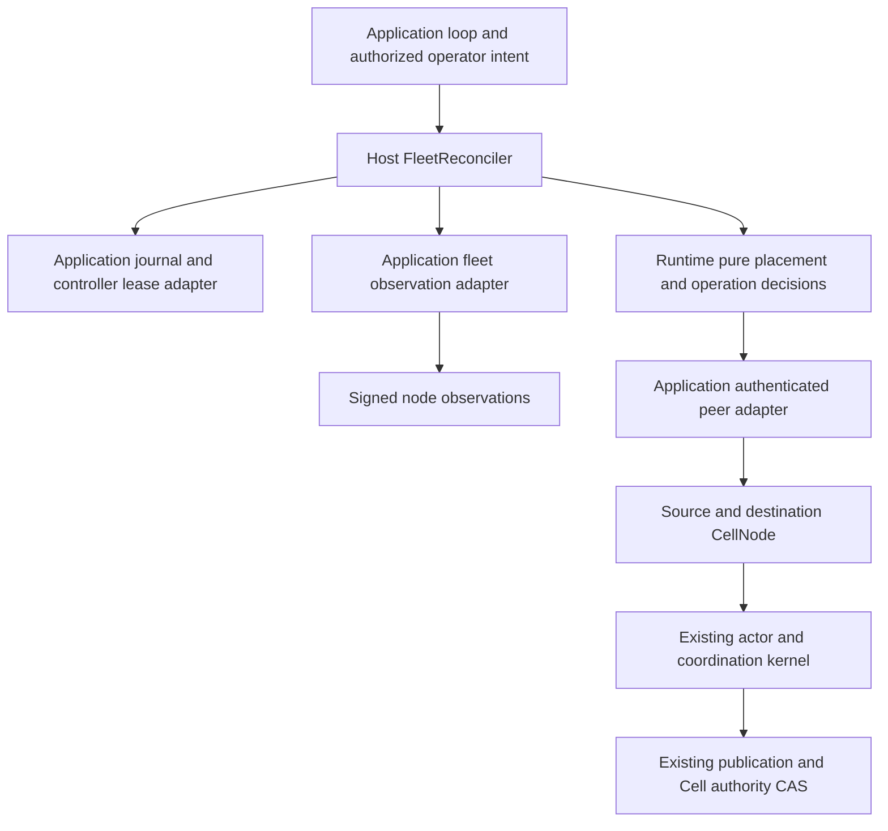
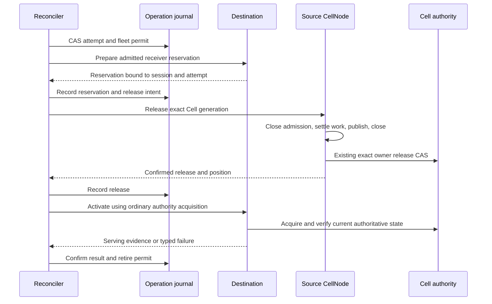
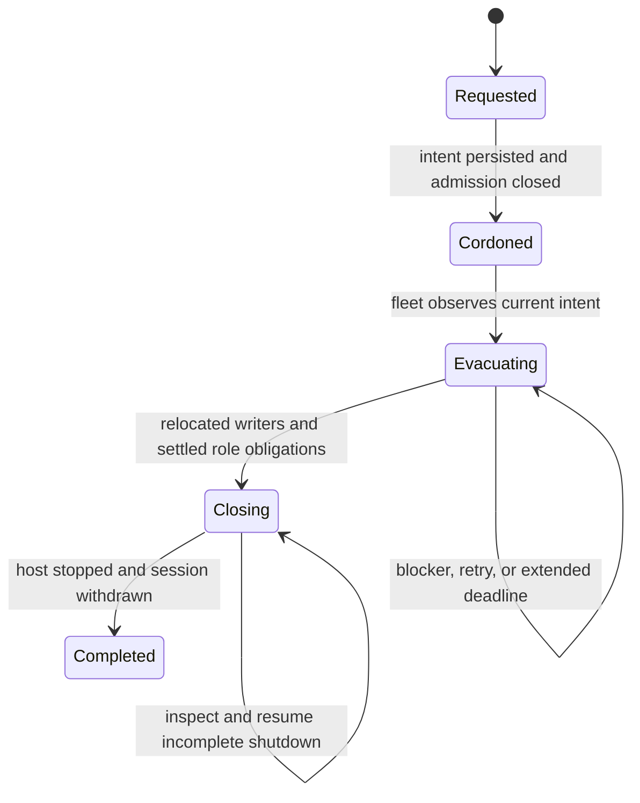

# Cellule fleet operations design and implementation plan

Status: design and execution plan; partial foundations exist, fleet execution
and qualification remain incomplete.
Source baseline: `e07670e2348231ed401cc7280a47e3ab97596ffe`.
Prepared: September 30, 2026, America/Vancouver.
Updated: October 3, 2026, America/Vancouver.

Build one reusable fleet reconciliation path for automatic ownership balancing,
sustained pressure relief, and planned node maintenance. Reuse Cellule's fenced
writer, actor, publication, recovery, and node lifecycle. Applications supply
the recurring loop, operator authorization, peer endpoints, deployment policy,
and a durable operation journal adapter.

The implementation is complete only when a reference fleet demonstrates an
overloaded node shedding eligible Cells, a maintenance node evacuating its
writers and durability obligations, and a restarted controller continuing an
operation without losing acknowledged state or creating a second writer.

This document supplies the decisions, proposed interfaces, failure semantics,
work packages, and verification routes needed to implement that behavior.
Names identified as proposed below do not exist at the baseline revision.

## Implementation brief

The deliverable is a library orchestration path, a runnable three-node example,
and an application integration recipe. An embedding application installs the
node adapters once, runs a supervised reconciliation loop, and exposes durable
maintenance requests and paginated status. The framework owns the safety checks
and finite accepted work. Automatic balancing and operator maintenance use the
same action and evidence contracts.

| Implementer question | Decision |
| --- | --- |
| What ships first? | Settled-Cell movement through W1–W5 and the first overload example. Full maintenance follows W6–W8; deployed automation follows W9–W10. |
| Which algorithm? | Reuse the current weighted placement and pressure classifier; add execution and evidence around them. |
| Which external facilities are required? | A linearizable journal, complete enrollment registry, authenticated management transport, and trusted local Cell inputs. The reference example supplies these behind the same contracts. |
| What keeps operations simple? | One operation ID, one status contract, one application loop, bounded defaults, and one canonical host drain lane. |
| What proves success? | Receipt-preserving actor activation on another node. Maintenance additionally requires settled role obligations, host Stopped, and session withdrawal. |
| What is the next concrete change? | Qualify the current head, including both routing profiles. Complete source/failed-owner successor policy and checked nonexecution for every original and current reader/follower obligation. Native donor policy lookup now discovers latest history automatically through the existing authenticated reader/follower verifiers. The bounded matcher now exposes missing checks and preserves original acceptance digests at the exact full roster barrier. Complete observation around original-writer successors, failed-boot closures and durable unknown work. Connect reader/follower replacement policy and accepted-work barriers to SettleRoles/Finalize. Keep cross-session recovery, process/provider and remaining failure/inspection gates in scope. |

Start with the [first slice commit sequence](#first-slice-commit-sequence).
Every increment must expose a reviewable public behavior and retain its test
evidence. The remaining sections specify the complete handoff; implementation
does not depend on earlier chat messages or an external embedding codebase.

Here, executable means an implementation handoff with ordered changes,
commands, and observable exit conditions. The complete balancer and maintenance
workflow are delivery targets. Commands for a proposed scenario become runnable
when its package lands; the journal inspection command is available now.

### Immediate execution checklist

Use this checklist for the next end-to-end increment in the current working
tree. The detailed contracts later in this document govern each step.

1. **Establish the checkpoint.** Read the root and affected crate guides,
   inventory the current diff, and record the source fingerprint. Compare
   existing code with W1–W4 before adding another implementation of a contract.
2. **Finish observation coverage.** Reuse the reference boot producer and host
   startup barrier and managed reader enrollment binding; wire follower producers to
   `FleetEnrollmentJournal`.
   Compose bounded ownership and role
   pages into `FleetObserver`; compare the membership and registry revisions
   before and after collection. An incomplete scan returns a typed blocker.
3. **Connect transport and driver.** Implement the application's `FleetTransport`
   against the existing `FleetReconciler` under host `fleet/`. Route effect dispatch to
   `apply_fleet_action` and fresh capture to `inspect_fleet_action`. Consume
   the existing planner and reducer, with one journal-backed count/byte budget.
4. **Connect the durable example.** Use the existing `SqliteJournal`, three
   independently leased `CellNode`s, signed local observations, and a trusted
   Cell provider. Invoke the exported driver; the example contains no second
   placement or movement state machine.
5. **Prove the first movement.** Write acknowledged SQL state, make one node
   a sustained donor, reserve an eligible receiver, release and activate, then
   verify receipt-bound readback. Drop an action reply and reconstruct the
   controller from the same journal. Assert one writer and retained permits
   until serving and resource settlement are proved.
6. **Deliver and record.** Add the `overload` example command, run the relevant
   focused gates below, and retain selected test counts and source evidence.
   Proceed to busy maintenance and role evacuation only with this public path
   available as a regression scenario.

The first increment is done when an implementer can run `overload`, observe
separate release and activation progress, reconstruct the controller, verify
acknowledged state, and close every owned task and reservation. Full maintenance
additionally requires W6–W8; deployment requires W9–W10.

For execution from this working tree, begin by inventorying the current
implementations and pending changes listed below. Reuse the W1 registry contracts and strict local journal
adapter, connect the complete observer and W5 driver next, then deliver the
settled-movement example. Busy maintenance and safe node finalization follow
in W6–W8. The [commit sequence](#first-slice-commit-sequence) names each handoff
and the public behavior that must pass before proceeding.

## Starting state for the implementer

Inspection of this working tree through October 1, 2026 found the following
foundations. Inspect the current revision and diff before implementing each
package, reuse matching work, and run its gates before marking it complete.

| Package | Implemented foundation | Remaining exit evidence |
| --- | --- | --- |
| W1 | Pure controller/maintenance/movement transitions; bounded versioned journal codecs; unknown-outcome permit retention; action envelopes, physical-node intent, progress pages, immutable accepted-action records, and distinct recovery basis/evidence/outcomes with complete replay comparisons. Registry records carry boot-bound enrollment, retained intent pages, a bootstrap revision, stop/resume state, and transactional allocation gates. The embedding example supplies one SQLite transaction domain for all three journal contracts, with independent-client races, lost replies and reconstruction tests. Fresh inspection requests/observations bind nonce, complete action, registry revision, endpoint and original capture interval. | Complete fleet/role observation envelopes and enrollment producer wiring; consume fresh inspections and the durable adapter through the public reconciler. Process/fault/provider qualification remains required. |
| W2 | Schema 3 operational decoding/signing; schema 2 bridge serializer and signing checks; canonical byte comparison after one decoder verification pass; monotonic sample checks; shared sticky cordon/reversible pressure gate; writer/read/follower/recovery candidate filtering; host follower gate installation; public pressure/cordon lifecycle test. | Complete signed-snapshot production, broader public node admission scenarios, and the mixed-binary rollout campaign. |
| W3 | Bounded actor ownership pages; worker measurements and conservative costs; residence and stable samples; mutation revision checks; persisted follower-lane pages; expired/fenced log-reference discovery; host managed-reader pages with canonical accepted-work lifetimes, local closure observations and complete bounded native-state continuation fingerprints. | Complete the observer's membership/enrollment barrier and host action consumption, including accepted queries and retained peer views. Run all W3 gates against the current diff before marking the package complete. |
| W4 | Runtime receiver preparation reserves actual Cell, memory, descriptor, affine SQL-job, and scoped LTX disk credit. The host journals source/receiver effects, confirms acquisition/recovery input before CAS and recovery position before actor admission, checks current serving, and owns work across dropped waiters. CleaningReceiver preserves release evidence and charged permits; unused credit can retire before ordinary admitted activation resumes. Public local tests cover receipt preservation, refusal, duplicates, basis faults, post-release cleanup, source loss, and ordinary-acquisition races. A separate fresh inspection path bypasses historical Inspect results and cannot start recovery; its finite jobs share the existing action bound and drain. Canonical runtime acquisition retains immutable exact claim input/materialization before admission. Native prepared-root lineage proves an exact per-movement released/recovered prefix across publication and compaction; complete bounded origin verification and fresh actor/authority checks gate serving evidence. Full original-writer/suffix aggregation remains required. | Complete recovery across receiver sessions and refusal/unknown reconciliation, complete observer consumption, maintenance role actions, durable production adapters, and all process/provider and W4 exit assertions. |
| W5 | Public caller-driven reconciler and observation/transport contracts; production calls to the existing planner and reducer; phase CAS before dispatch, fresh serving checks, cooldown/post-batch journal reads, and permit projections. SQLite-backed sequencing tests exercise simulated effects, lost replies, deadlines and competing drivers. The overload executable moves two real Cells across three leased runtimes; controller-restart changes claimant after actual lease expiry and adopts lost releases. Maintenance now dispatches exact journal-bound Cordon, commits Cordoned then BeginEvacuation, and applies retained intent before donor selection. Partial fresh observations can evacuate settled normal-pressure donors; operation deadlines bound new moves. | Complete producer/observer wiring and the full W5 failure/concurrency evidence; source/receiver failure adoption, cross-session recovery, busy maintenance and all W5 exit evidence. |
| W6 | Node-owned monotonic Cordon closes the shared role gate. Driver retries/adopts lost results and dispatches explicit busy maintenance release using the peak receiver envelope. Canonical quiescence retains accepted foreground and native primitive completion. Public SQL, Queue, Effect, Activity and Workflow cases cover selected receipt/lease/expiry/waiter faults. Configured host startup holds all new roles until atomic Established boot/current intent confirmation and required probes; retained drain exposes management without serving. The example wires actual signed canonical boot enrollment and joined withdrawal/retirement. The existing reader loop now repairs retained producer requests and fenced views without another hint; metadata collection survives pre-lease startup and local fencing while native admission remains lease checked. | Complete primitive/fault matrix, Cron and Blob external owners, failed-owner producer reconciliation; complete reader replacement/failed-process evidence, ongoing intent supervision, sustained traffic, and all W6 assertions. |
| W7–W10 | Prepared follower ensembles retain signed boots before their original-token CAS; conditional refusal competes with that same write, while absence remains unknown. Confirmed member retirement retains original fences across ambiguous authority closure and shares canonical object coverage and authority closure. Epoch-bound host requests wake the existing supervisor, retain strict retries, reject stale/foreign replacement bindings and preserve accepted cleanup across cancellation and host deadlines. Bounded weak inspection handles expose local completion without certifying fleet settlement. The managed follower producer accepts every original member Pending before its one CAS, retains unknown results in the existing supervisor, and publishes original establishment/confirmed retirement events before releasing inventory. Atomic nonexecution exclusions fence delayed reader/follower acceptance. | Complete role observation, replacement-policy and failed-owner evidence, role evacuation/finalization, complete maintenance and failure examples, fault qualification, and runbooks. |

This planning pass does not certify the Rust implementation or provider/process
behavior. Record verification against the exact revision and diff that ran;
earlier test results do not certify subsequent changes. The commands and
required assertions below define the implementation gates.

Focused implementation checkpoints are recorded in
[execution evidence](fleet-operations-progress.md). Each checkpoint states
its source fingerprint, selected commands, and limits; it does not mark an
entire work package complete.

The [fleet journal example](../crates/cellule-host/minion/README.md)
currently supports `inspect-journal <database-path>`, `overload`, and
`controller-restart`. The first reopens the local durable reference journal.
The latter commands exercise real bounded movement, including a new controller
epoch after lost source replies and actual lease expiry. Maintenance and
receiver-loss scenarios, complete production observations, and the full W8
exit requirements remain deliverables.

| Start here | Contents |
| --- | --- |
| [Current implementation](#current-implementation-and-concrete-gaps) | What can be reused and what is missing. |
| [Architecture](#architecture-and-ownership) and [interfaces](#proposed-interfaces-and-data-contracts) | Module ownership and implementation targets. |
| [Movement](#movement-protocol) and [controller state](#durable-controller-state-and-bounded-execution) | Safety, retries, recovery, and resource bounds. |
| [Maintenance](#maintenance-lifecycle-and-busy-cells) and [follower evacuation](#evacuating-readers-and-follower-responsibilities) | Busy work and safe node shutdown. |
| [Operator controls and runbooks](#operator-controls-and-runbooks) | The application contract for maintenance, status, and incident response. |
| [Work packages](#implementation-work-packages) | Ordered changes with concrete exit conditions. |
| [Source map](#source-map-and-first-implementation-slice) | Files to read, proposed modules, and the first end-to-end change. |
| [Execution checkpoints](#execution-checkpoints) | Milestones, focused commands, and evidence to retain. |
| [Acceptance matrix](#acceptance-matrix) and [commands](#verification-commands) | Required implementation and qualification evidence. |

## Reading and execution order

1. Read the current behavior and ownership split below.
2. Implement work packages W1 through W10 in dependency order.
3. Use the acceptance matrix to verify each behavior through its public path.
4. Complete the reference application integration and measured qualification
   before enabling automatic movement in a deployed fleet.

Treat this document as the handoff: the executor needs only this repository,
the listed source files, and the declared qualification environment. Proposed
APIs and example commands become deliverables during implementation; their
presence in this plan does not mean they are callable today.

Read the root and nearest crate `AGENTS.md` before each code change. The
[runtime guide](../crates/cellule-runtime/docs/README.md),
[host lifecycle guide](../crates/cellule-host/docs/lifecycle.md), and
[framework integration guide](framework.md) remain the existing contracts.

## Design decisions

| Decision | Implementation consequence |
| --- | --- |
| One caller-driven reconciler | The application supervises one recurring task; the framework exposes a bounded step and creates no background scheduler. |
| One canonical release and acquisition path | Movement uses ordinary fencing, durable publication, close, and exact-root recovery. No writable database handoff or new Cell authority record. |
| Reserve before release | Lack of receiver capacity leaves the source serving. Reservation success is separate from activation success. |
| Durable fleet intent and attempts | Controller replacement adopts unresolved work; reboot respects physical-node cordon; unknown outcomes retain permits. |
| Explicit eligibility | Pressure and maintenance mode affect local admission and signed remote placement consistently. |
| Three delivery milestones | Ship settled movement first, complete maintenance next, and enable deployed automation only after qualification. |

The reconciler needs three application adapters: a strongly consistent journal,
a complete fleet observer, and an authenticated action transport. Each node
also needs a trusted `FleetCellProvider` for catalog, canonical storage, local
destination, and owner inputs. The local action journal and controller journal
must share the same committed authorization and permit state. W8 delivers
reference implementations in the runnable example. Applications with an
existing CAS store and node registry can reuse those facilities; applications
must satisfy all adapter contracts before enabling movement.

## Terms and desired behavior

| Term | Meaning |
| --- | --- |
| Cordon | Exclude a physical node from new writer, reader, and follower enrollment while existing obligations remain serviceable. |
| Drain | Cordon, settle accepted work, evacuate ownership and follower obligations, then complete normal shutdown. |
| Reconcile | Compare durable intent with current observations and perform a bounded amount of work toward that intent. |
| Move attempt | One advisory proposal, pinned to a source session and actor generation, to release and reacquire one Cell. |
| Released | Source ownership release is confirmed against Cell authority. This does not establish destination readiness. |
| Recovered | Canonical failed-session proof, retained recovery input/position, and current successor serving are proved. It remains distinct from clean source release. |
| Serving elsewhere | A current destination session owns the Cell and its actor has activated the required state. |
| Operation journal | Application-owned CAS records for operator intent, controller ownership, movement permits, and progress. These records never confer Cell ownership. |
| Blocker | A typed reason progress cannot currently continue; the underlying operation remains resumable. |

| Trigger | Required behavior | Completion |
| --- | --- | --- |
| Fleet ownership skew | Move settled Cells toward the existing weighted targets. | No eligible donation remains outside the planner's deadband. |
| Sustained node pressure | Stop new acquisition, preserve durability work, and move eligible Cells to receivers with usable capacity. | Pressure clears through the existing classifier's recovery rules. |
| Planned maintenance or scale-down | Persist a node cordon, move owned Cells, settle follower responsibilities, and shut down. | Verified relocation plus successful host shutdown and session withdrawal. |
| Insufficient fleet capacity | Refuse additional planned releases that cannot be admitted elsewhere; report the capacity shortfall. | Capacity or policy changes permit progress. |
| Node failure | Continue ordinary lease fencing and exact recovery independently of this controller. | Existing recovery establishes a valid successor. |

Moving one hot Cell relocates its single writer; it does not increase that
writer's throughput. Sustained demand beyond one node's capacity requires
application partitioning, admission control, or additional read replicas where
the application's consistency policy permits them. The controller reports this
condition instead of repeatedly moving the same Cell.

## Current implementation and concrete gaps

| Implementation at the source baseline | Evidence and limitation |
| --- | --- |
| Deterministic placement and transfer planning | [PlacementPlanner](../crates/cellule-runtime/src/fleet/placement/mod.rs) ranks nodes, balances weighted Cell counts, projects receiver demand, and bounds a batch. At the baseline, `fleet_balance` and `plan_transfers` have test callers but no production executor in this workspace. |
| Signed placement observations | [NodePlacementCapacity](../crates/cellule-runtime/src/node/capacity.rs) carries totals, Cell/job counts, and three backlog counters. `PlacementObservation::from_signed_advertisement` derives pressure and draining from zero free memory or disk; it does not carry the local hysteretic tier. |
| Local pressure protection | [PressureClassifier](../crates/cellule-runtime/src/fleet/pressure.rs) and the [actor pressure path](../crates/cellule-runtime/src/cell/actor/task.rs) already classify sustained pressure and start bounded idle eviction. This protection must keep working without the fleet controller. |
| Exact idle release | [Runtime movement methods](../crates/cellule-runtime/src/cell/actor/runtime.rs) list candidates and release a session/generation through fresh actor checks. Candidate tuples contain last-use time, not a complete measured Cell demand or residence history. |
| Conservative executable-work checks | [TransferWorkInventory](../crates/cellule-runtime/src/primitives/maintenance.rs) blocks ready/leased Queue work, running Workflows, pending Workflow work, and due Effects/Cron work. A continuously busy node can therefore remain undrained. |
| Local scale-down | [CellNode scale-down](../crates/cellule-host/src/node/scale_down.rs) stops acquisition, attempts local releases, and returns aggregate progress. It does not reserve a destination or verify remote activation. |
| Ordered shutdown | [Host lifecycle](../crates/cellule-host/src/node/lifecycle.rs) retains lease maintenance through runtime/log drain and sets `Stopped` only on success. `ScaleDownStatus::ready_to_stop` alone is not proof of fleet relocation or foreign follower-tail safety. |
| Node-log rotation and retirement | [Host durability](../crates/cellule-host/src/durability/mod.rs), [directory log authority](../crates/cellule-runtime/src/node/directory/log.rs), and [FollowerStore](../crates/cellule-runtime/src/follower/mod.rs) contain the mechanisms to cover and retire old epochs. Planned evacuation of a follower node needs orchestration around them. |

The [earlier scaling design](../crates/cellule-runtime/docs/canonical-ltx-scaling.md#balance-ownership-under-live-pressure)
describes a controller in the historical Crab embedding application. Treat
those references as design context; do not count that external implementation
as a production caller in Cellule or assume its endpoints exist here.

## Architecture and ownership

The caller-driven `FleetReconciler` facade in `cellule-host` performs one
bounded step when called; it starts no scheduler and constructs no runtime.
The embedding application owns the recurring loop and supplies the policy,
journal, observation, and transport adapters. This makes the orchestration
reusable while retaining application control of deployment decisions.



| Location | Responsibility |
| --- | --- |
| `cellule-runtime::fleet::placement` | Receiver eligibility, resource projections, weighted targets, movement policy bounds. |
| `cellule-runtime::fleet::operations` foundations and remaining records | Pure operation transitions, typed observations/actions/results, retry decisions, and fleet permit accounting. No I/O, clocks, tasks, or product identity. |
| Existing `cellule-runtime::coordination` and actor | Per-Cell admission, generation checks, accepted-work drain, publication, close, and release. |
| `cellule-host::fleet` | Bounded `reconcile_once` driver and adapter interfaces; delegate decisions to the runtime planner and operation state machine. |
| `cellule-host::CellNode` | Local action execution, actual resource reservations, role evacuation, and the existing single drain lane. |
| Embedding application | Timer/task ownership, authenticated management routes, authorization, durable journal backend and namespace, membership registry, signing, peer serialization, readiness mapping, process termination, and rollout. |

Keep `cellule-app` dependency-light and free of fleet lifecycle policy. No new
crate, second scheduler, alternative authority record, direct writer handoff,
or writable SQLite file transfer is needed. Keep all Cell-control mutation on
the current runtime path.

## Proposed interfaces and data contracts

Use the current APIs listed below and implement the remaining orchestration
targets. Follow the host's existing boxed-future adapter style; do not
introduce a new async abstraction dependency.

The following distinction applies to this working tree, rather than the
baseline revision. Use the source signatures when implementing against a
present API; the pseudocode below specifies the remaining orchestration.

| Surface | Current state | Implementation instruction |
| --- | --- | --- |
| `CellNodeBuilder::with_fleet_startup_intent` and `CellNode::confirm_fleet_startup` | Present host startup barrier. | Load retained physical intent before build, journal canonical boot enrollment, then confirm its exact key. Confirmation keeps admission held until `start()` validates required facilities; Maintenance exposes management while serving/new roles stay closed. |
| `CellNode::refresh_fleet_intent` | Present caller-driven live intent refresh. | The supervised application membership/lease loop reads current intent and the original Established boot atomically before renewal. Sticky admission closure preserves existing owners; stale replies, changed boot evidence and shutdown races are refused. The example invokes it before canonical heartbeat CAS. Production supervision and complete maintenance qualification remain required. |
| `CellNode::install_fleet_actions(scope, node, journal, cells)` | Present in host `node/fleet.rs`. | Install once during startup, before readiness. Supply the shared atomic action journal and trusted local Cell inputs. |
| `ReadReplicaManager::prepare_source` / `activate_source` and `CellNode::install_fleet_reader_enrollment` | Present exact source bridge and owned durable reader producer. | Install the binding before start/first activation. Ordinary hints and prepared activation journal Pending before native opening, retain completion after waiter cancellation, replay original publication, and retire after joined closure. Configured fleet hosts require the binding. Complete observer and failed-process/replacement evidence remain required. |
| `ReadReplicaManager::fleet_reader_enrollments_page` | Present bounded advisory producer pages. | Scan original requests and native/publication progress even during paused journal/open calls; account accepted preparation, unobserved and joining jobs. Also collect native view pages, current authority and durable roster revisions. Unbound/closed/unavailable inventories cannot prove empty coverage. |
| `CellNode::fleet_follower_enrollments_page` | Present bounded advisory epoch pages. | Preserve every original selected member and unknown acceptance during paused provider/journal work; retain original retirement/error Arcs. Busy protocol includes preparation before a row exists. Also collect supervisor completion, inbound lanes, fresh directory authority and replacement policy; zero rows or idle protocol cannot prove settlement. |
| `CellNode::fleet_durability_supervisor` | Present fixed-metadata advisory capture of the retained native supervisor and its bounded rotation bank. | Preserve distinct unstarted/running/returned/joined states and separate original supervisor/request-stop failures, including capture during drain after byte admission closes. Missing or failed capture supplies no coverage; joined state and local rotation completion still require producer/native lanes, current authority and replacement-policy evidence. |
| `NodeDirectory::prepare_log_enrollment` / `prepare_log_enrollment_attempt` / `commit_log_enrollment` | Present opaque follower selection and CAS bridge. | Revalidate exact boots before acceptance; journal all selected members Pending before dispatch, retain the original attempt, and reconcile that same scope. `fence_log_enrollment` proves only its original-token refusal; absence cannot settle unknown work. Managed host producer and journal retirement remain required. |
| `CellNode::apply_fleet_action(action, now_ms)` | Present; returns a retained `FleetActionCompletion`. | Movement actions use this path. Check `committed`, retain unknown outcomes, and obtain fresh serving evidence. Maintenance integration remains required. |
| `CellNode::inspect_fleet_action(request)` | Present; returns `FleetInspectionObservation`. | Use a fresh nonce, exact head/registry and endpoint, and exclusive capture deadline. Authenticate and validate the full request plus original capture interval; recheck head/registry when committing dependent decisions. Inspection starts no acquisition or cleanup effect; the shared lane can settle prior completed work. |
| `CellNode::fleet_action_work()` / `FleetNodeSnapshot::action_work()` | Present bounded original finite job metadata, including response versus join state, canonical results, original failures, admission closure and effect/inspection turnover. Native snapshots exclude only their exact executing request and refuse changed work; full traversal and global rechecks bind the work fingerprint. | Authenticate the original endpoint, preserve original errors and intervals, and account copied collector buffers. Joined tasks, committed results and known outcomes are independent; unknown durable actions, native/external work and terminal action handoff still need their own barriers. No local count or fingerprint grants finalization. |
| `CellNode::fleet_snapshot(request)` | Present request-bound native page capture; aggregate observation remains incomplete. | Pin the full head/registry, physical boot, nonce, category, original continuation, limit and deadline. Authorize before and after capture through the same finite action bank. Retain original page charges and errors; authenticate and combine every required producer/native page with fresh authority and replacement-policy evidence. Unbound is never empty coverage. |
| `FleetNodeInventoryScan` and `FleetNodeInventory::recheck` | Present complete native traversal and all-category rechecks at a full roster barrier. | Preserve original requests, native lifetimes, transitions and shared errors. Validate enrollment matching, then recheck every category after fleet-wide authority/policy discovery and reconfirm the journal. Native interval evidence cannot settle failed processes or grant finalization. |
| `FleetFollowerReferences` | Present complete foreign-log traversal and exact authority recheck. | Include expired/fenced leaders, retain native continuations and compare all original epoch/phase/ensemble/coverage/liveness fields after native collection. Match original roster requests and reconfirm that full barrier. Missing references cannot settle Pending work; retired local lanes can still have foreign authority obligations. Replacement policy and canonical recovery/retirement remain required. |
| `FleetRoleCoverage` | Present cross-node original producer, native lane and current foreign authority matching. | Supply every required original boot and physical reference scan; finish initial collection, global native rechecks, then exact foreign rechecks and full journal confirmation. Observe enrolled lanes before their first append through the complete original producer/ensemble witness. Authentication, unexpected advertisements, current Cell authority, replacement policy and failed-process closure remain required; coverage does not grant settlement or finalization. |
| `ReaderEvacuationRecord` / `FleetReaderEvacuationJournal` / `FleetReaderEvacuationVerifier` | Present bounded durable reader policy history, complete replacement pages, atomic latest pointers and independent native revalidation/refresh. | Commit through the shared registry transaction; confirm exact policy, authority, enrolled selected boots and ready prefixes after reconstruction. Refresh from the original committed retirement after policy/boot/owner changes, including Closing. Failed-owner follower policy, failed receiver integration, complete fleet observation and aggregate maintenance actions remain required. |
| `FollowerEvacuationRecord` / `FleetFollowerEvacuationJournal` / `FleetFollowerEvacuationVerifier` | Present bounded durable live-owner ensemble history, revisioned application policy, atomic latest pointers and canonical/native revalidation/refresh. | Bind every original Retired member and replacement request, confirm current canonical ensemble plus the actual source/member native owners through `FleetSnapshotTransport`. Refresh after policy/epoch/operation changes without repeating original retirement. Complete failed-owner successor policy, full observer and SettleRoles/Finalize integration; this per-owner evidence cannot finish maintenance. |
| `FleetObservation::with_role_coverage` | Present retained graph attachment and planner-input binding. | Preserve the original interval and reject replacement or scope/registry mismatches. The reconciler rechecks the graph's exact head/registry and full roster digest; unchanged registry alone cannot admit an earlier controller head. Attachment never upgrades partial adapter coverage. |
| `MaintenanceEnrollmentInventory`, `FleetJournal::maintenance_enrollments` and `FleetMaintenanceEnrollments::collect` | Present bounded original Pending/Established reader/follower pages frozen with the first BeginEvacuation CAS, at either physical endpoint including earlier boots. | Retain exact pretransition head, registry, operation and acceptance times. Traverse every page, match original acceptances against the fresh full roster, and attach with `FleetObservation::with_maintenance_enrollments`. Missing history remains unknown; zero requires a committed empty manifest. New source replacement work after capture remains in the current graph. All original and current policy/work obligations remain required before settlement. |
| `FleetObservation::with_role_evacuations` | Present retention of freshly rechecked durable reader/follower policy history, current authority/prefixes and native source/member evidence. Planner digest v10 binds complete original checks and the immutable maintenance enrollment manifest. | Require one exact full head, registry and roster, with every original fresh interval inside the outer observation. Compare signed replacement boots with the existing producer identities and refuse duplicate obligations. Public minion reconciliation consumes actual ready readers and rotated ensembles without upgrading partial coverage. Complete authenticated policy coverage, failed-owner successor policy and accepted-work/finalization barriers remain required. |
| `FleetObservation::check_maintenance_policies` / `FleetReconcileReport::maintenance_policy` | Present bounded matching of every immutable original request and every currently unresolved related reader/follower against all supplied native policy checks. Exact current rows and Established donor original digests are required. Planner digest v10 binds source inputs and every explicit result. | Attach original capture and all policy checks before matching. Missing history refuses matching; missing policy, Pending/Established, source succession and unproven nonexecution remain explicit gaps. Advisory counts retain their own full head/registry/interval; absent coverage stays unknown. Complete source/failed-owner and nonexecution evidence, native/external accepted work and finalization remain required. |
| `FleetReaderEvacuationVerifier::collect_maintenance` / `FleetFollowerEvacuationVerifier::collect_maintenance` | Present complete eligible donor history lookup from the canonical original/current request set, followed by existing authenticated native/current-policy confirmation. Exact original digest/current row and full head/registry/roster checks are retained. | Collect original history first and construct the outer observation after both role collections. Missing latest history supplies no check and stays MissingPolicy in the matcher. One monotonic 30-second capture and caller deadline bound collection; changed heads/policies during native capture fail closed. Source/failed-owner succession, nonexecution, unknown native/external work and finalization remain required. |
| `CellNode::follower_evacuation` | Present per-live-owner replacement and retirement check after the original requested rotation. | Require the declared member minimum, donor exclusion, complete Established replacement rows, pinned signed boots, current authority and full journal rechecks. Retain the original completion/error history and publish/revalidate its interval. This does not settle failed owners, Pending producers or the physical node's other obligations. |
| Recovered-log authorization, member retirement and canonical Retired CAS | Present runtime tail closure after canonical recovery pinning. | Use `RecoveredNodeLogTransport`, receiver-side `authorize_recovered_log_retire` and `FollowerStore::retire_recovered`; confirm every original member before `retire_recovered_log`. Adopt exact committed closure with `retired_recovered_log` before repeating effects. Publish original enrollments through the host capsule, then complete failed-process barriers and maintenance orchestration; native closure alone cannot finish W7. |
| `RecoveryManifestStore::load_manifest` | Complete digest-verified recovered-suffix metadata across every original application, retained after successor materialization. | Read the identity from canonical sealed-log authority, then verify each bundle through its application's ordinary store. Retain the complete original writer set separately, including object-covered Cells without a suffix; check current successor authority, acknowledged prefixes and serving. This metadata read cannot settle roles or finalize a node. |
| `CellCatalog::scan_all` / `CatalogScanReceipt` | Complete bounded traversal captures all 256 scoped heads before page reads, uses ordinary page verification and refuses partial/failed scans or changed final heads. | Authenticate the complete application/tenant source set, join original process/accepted work, retain every delivered owner history under the operation and recheck the catalog receipt. Sequential heads are not a global transaction or durable object pin; catalog completion alone cannot settle roles or finalize a node. |
| `FleetOriginalWriterCapture` / `FleetOriginalWriterJournal` | Complete authenticated catalog traversal and original process joining retain every matching full owner Control, including rootless originals removed by takeover. Bounded manifest/pages publish atomically in minion's existing SQLite owner and preserve original bytes on replay/reconstruction. | Authenticate complete original backend mappings; verify every acknowledged prefix, exact dependency availability and current successor serving. Integrate complete role/native policies into SettleRoles/Finalize and qualify real process/provider failures. Original metadata grants no root pin or settlement rights. |
| `FleetOriginalWriterSuccessorInventory` / `CellRuntime::observe_serving` | Complete original boot suffix inputs are checked against actual managed native successors across applications. Every original root, sealed suffix and inherited-overlay manifest row uses native prefix/origin verification; rootless originals still require current origin verification. Global native serving/boot and original process/log/journal rechecks refuse changed or incomplete inputs. Movement shares the native FIFO/authority/generation observation. `FleetObservation::with_original_writer_successors` retains every application, compares the full roster/head and signed destination/native rows, and binds the complete proof digest in planner inputs. Minion also verifies two inherited overlays after real failed intermediate acquisitions and later native materialization, preserving epochs 1/2/3 and refusing missing/substituted historical inputs. | Complete authenticated production observation with reader/follower replacement policy, failed-boot coverage and accepted-work barriers. Finish remote/process adapters, the remaining process/provider fault campaign and full maintenance finalization. Point collection and partial public-observer consumption do not establish those barriers. |
| `CellAuthority::owner_history` | Canonical owner departure retains full original controls before the existing owner CAS; complete per-incarnation epoch reads refuse missing or changing history. | Use the original capture/journal path to retain the complete authenticated operation set, then verify current successor prefix/serving. Missing legacy, restored or older-binary history is a typed blocker. These rows grant no authority or root retention pin and cannot settle roles or finalize a node. |
| `FleetRecoveredFollowerRetirement` | Present checked publication of recovered ensemble enrollment closure. | Capture the exact canonically Retired physical leader/epoch against the full roster, publish all original member requests through the existing journal, then confirm the complete new roster and canonical authority. Retain every original response/error. Fresh recapture adopts lost replies without native RPCs or timestamp refresh; failed boots, replacement policy and operation integration remain required. |
| `FleetFailedBootRetirement` / `FleetFailedBootProcesses` | Present original failed-boot closure against canonical terminal fencing and durable application process evidence. `confirm` freshly rechecks an already committed retirement without effects. Process confirmation pins the committed request/witness binding. `FleetObservation::with_failed_boot_closures` retains the exact full barrier, original row/process and capture interval inside planner inputs. | Complete every original related request first. The read-only provider proves original process/accepted external work joining and session nonexecution; publication and confirmation share terminal roster/authority/reference/process checks. Public minion observation consumes both an empty-writer surviving graph and combined original-writer/closure evidence across two applications in either attachment order. Complete authenticated observation, actual provider qualification, replacement policy and maintenance actions remain required. |
| `NodeDirectory::fenced_session` / `FleetFailedBootProcessRequest::capture_fenced` / `confirm` | Present process confirmation before leader-log recovery/retirement, using the existing application provider. | Authenticate and join the exact original process and all accepted work, then retain every affected Cell before recovery effects. The v2 identity survives recovery and claim adoption; `capture_retained` reuses it only after strict terminal boot/role checks. Existing terminal v1 identities remain unchanged. Process evidence cannot substitute for original writer inventory or current successor/policy evidence. |
| `FleetFailedReaderRetirement` / `FleetFailedBootProcessRequest::capture` | Present original failed receiver reader publication, including Pending and Established histories, through the existing journal/provider boundary. | Capture the original boot/process request before role settlement, then publish each exact reader only under joined receiver lifetime evidence. Source failure cannot close a live receiver. Persist replacement-policy evidence, handle live receivers through ordinary closure, and qualify actual OS/process/external-job providers before completing W7. |
| `FleetActionJournal` | Present in host `fleet/journal.rs`. | Implement acceptance, result publication, original-action lookup, and acquisition/recovery basis and evidence recording/lookup with the specified atomic and durable semantics. |
| `FleetCellProvider::cell_inputs(spec)` | Present in host `fleet/cells.rs`. | Resolve metadata and canonical local inputs without performing an effect. |
| `FleetCellProvider::recovery_inputs(spec)` | Present in host `fleet/cells.rs`. | Supply existing canonical failed-session proof and manifest access. Ordinary recovery establishes fencing and tail sealing independently. |
| `CellRuntime::fleet_cells_page`, `prepare_receiver`, and `activate_prepared_receiver` | Present in runtime actor modules. | Reuse generation-bound inventory and actual resource-token ownership. Do not replace them with host counters. |
| `AcquisitionObserver` and observed Idle/takeover methods | Present in runtime actor modules. | Confirm exact input before CAS and actual recovery position before admission; use canonical rollback on failure. |
| `FleetJournal` and `FleetEnrollmentJournal` | Present transaction contracts in host `fleet/controller.rs` and `fleet/enrollment.rs`. | Implement both with the action journal in one durable transaction domain. Persist retained rows and operations, exact registry versions, scheduling policy, and history. |
| Example `SqliteJournal` | Present in host `minion/journal/`; implements all three journal contracts. | Reuse for local reference execution. Independent SQLite clients and reconstruction have focused evidence; complete observer coverage and process/provider qualification remain required. |
| `FleetReconciler`, `FleetObserver`, and `FleetTransport` | Present settled-movement driver and adapter contracts under host `fleet/reconciler/`. | Wire real observation and management adapters. Existing evidence uses SQLite and simulated transport effects; it does not establish complete W5 or three-node restoration. |
| `CellRootLineage`, `VerifiedRootPrefix`, runtime `verify_root_prefix` | Present native verified-preparation metadata and exact prefix/origin proof. | Canonical publisher and recovered-overlay materialization retain additive links before root CAS; host serving checks require the exact released/recovered root, complete current origin bytes and fresh native/authority checks. Shared runtime memory admission and bounded inventories refuse excess. Authentication, original physical-boot scope and every sealed recovery suffix still need aggregate producer/observer consumption; a per-movement proof cannot enable SettleRoles/Finalize. |
| `VerifiedRecoveryPrefix`, runtime `verify_recovered_prefix` | Present exact original sealed-suffix materialization and current origin proof, including interrupted claims at later acquisition epochs. | Obtain each row from the original digest-verified manifest; bind its retained closed owner and identical canonical acquisition overlay, then verify exact materialized prefix/current graph and unchanged selected authority. Host recovered serving compares full journal/canonical inputs and results before consuming this proof. Complete authenticated original writer/suffix aggregation, native roles and accepted-work barriers remain required. |
| Complete aggregate observation and node finalization actions | Remaining aggregate/maintenance surfaces. | Compose complete role inventory and implement W6–W7 barriers through the existing drain lane. |

The current local action API receives supplied time. Its action envelope holds
the deadline, and the transport owns its waiter timeout. A proposed facade's
deadline argument must preserve those boundaries; timing out a waiter cannot
cancel accepted work or free its permit.

```text
FleetReconciler::new(scope, claimant, profile, journal, observer, transport)
FleetReconciler::reconcile_once(clock, deadline) -> FleetReconcileReport
  // clock: application callback returning Result<i64> in the node clock domain.
  // Read directly at each boundary; reject regression. Deadline is monotonic.

CellNode::fleet_snapshot(FleetSnapshotRequest) -> retained FleetNodeSnapshot
CellNode::apply_fleet_action(action, now_ms) -> retained FleetActionCompletion

FleetJournal:
  load_snapshot(scope) -> head and registry from one transaction
  claim_controller(scope, expected_revision, claimant, now_ms)
  compare_exchange(expected_snapshot, controller_epoch, now_ms, transition)
  load_operation(scope, operation_id)
  load_progress(scope, digest)
  last_moved_at(expected_snapshot, cell, incarnation)
  last_movement_at(expected_snapshot)
  intents_page(exact_registry_version, cursor, limit)
  enrollments_page(exact_registry_version, cursor, limit)
  set_scheduling(expected_registry_version, enabled)
  // Inherits FleetActionJournal and FleetEnrollmentJournal.

FleetObserver:
  observe(expected_snapshot, now_ms, deadline) -> FleetObservation
  // Application collector uses bounded membership, ownership and role pages.
  // Prove completeness and enrolled signing keys; retain original sample times.

FleetTransport:
  dispatch(authorized_action, deadline) -> FleetActionCompletion
  inspect(exact_request, deadline) -> FleetInspectionObservation
  // Effects return committed evidence or a retained publication obligation.
  // Inspection returns current request-bound evidence, never cached success.

FleetCellProvider:
  cell_inputs(immutable_move_spec) -> FleetCellInputs
  // Metadata lookup only; no hydration, takeover, or writable SQL handle.
```

Operation creation and status endpoints belong to the application. They write
and read the same journal contract used by the reconciler; they do not invoke
unrecorded release operations. `reconcile_once` returns aggregate progress,
bounded events, the next wake deadline, typed blockers, and original endpoint
errors per charged attempt. Each attempt has a bounded share of the pass
deadline so an unavailable endpoint leaves time for healthy siblings. Ambiguous
timeouts require a fresh journal/epoch check before continuing; journal failures
stop the pass. An event can wake
the application loop before its periodic interval.

Keep format sizes concrete for the initial implementation: a fleet head is at
most 64 KiB, a paginated observation/progress response at most 1 MiB and 128
entries, and an individual action/result envelope at most 64 KiB. Large error
details stay in correlated logs; return a bounded classification and source
error reference. Reject oversized inputs before allocation or dispatch. These
limits supplement existing peer body and decoder limits; they never widen them.

`authorized_action` is constructed only after the application's receiver has
validated peer identity, fleet/application scope, journal permit, controller
epoch, deadline, and exact target session. Rust visibility cannot substitute
for remote authentication. Each action also repeats the runtime's local
admission and authority checks.

| Proposed value | Required contents and semantics |
| --- | --- |
| `FleetSnapshot` | Scope, membership revision, capture start/end, sorted live sessions, each signed sample sequence/time, completeness, and digest of the canonical bounded representation. The digest identifies inputs; it does not make a scan atomic. |
| `OwnedCellObservation` | Cell target, incarnation, source session, actor generation, authority epoch/root/sequence if known, actual residence start, last-use time, measured or conservative memory/disk/job cost, stable-sample count, and blocker classes. |
| `FleetAction` | Operation and attempt IDs, journal revision/controller epoch, exact source and destination sessions, Cell identity/incarnation/generation, deadline, snapshot digest, cost, and action kind. |
| Action kinds | Cordon, prepare receiver reservation, quiesce/release Cell, activate reserved Cell, settle follower obligations, and finalize node drain. Duplicate kinds for one attempt return or reconstruct the same result. |
| `FleetActionOutcome` | Reserved, blocked, released with authoritative position, activated with current session/owner evidence, recovered with canonical recovery evidence, already completed, rejected, or outcome unknown. Preserve source errors separately from the bounded status classification. |
| `DrainBlocker` | Incomplete/stale observation, incompatible release/schema, no receiver capacity, busy execution, live external lease, pending publication, follower obligation, unknown inventory, movement budget, action outcome unknown, deadline, or facility failure. |

Bound pages to 128 Cell/progress entries and remote dispatch concurrency to
the active fleet permits. Use cursors bound to a snapshot generation; restart a
scan when its generation changes. Do not copy every Cell into one journal
record, spawn one task per Cell, or expose Cell IDs as metric labels.

### Application startup and adapter handoff

The host startup intent barrier and reference boot producer implement the order
below. Complete observer/role production, ongoing supervision and the full W8
maintenance/deployment evidence remain required. See the
[host startup contract](../crates/cellule-host/docs/lifecycle.md#fleet-boot-admission)
and [recorded evidence](fleet-operations-progress.md).

1. Load a stable physical NodeId, create a fresh boot session, and read its
   committed intent. Missing or ambiguous intent cannot open acquisition.
   Pass it to `with_fleet_startup_intent` before build. The shared gate holds
   writer/reader/follower admission, including under an Active row.
2. Construct canonical catalog/storage inputs and the shared resource ledger.
   Build the CellNode with required owned components, including fleet actions.
   Install its lease through the startup path that keeps readiness closed.
3. Install the action journal and trusted Cell provider, then the required
   durability, reader, follower, and primitive facilities. The Cell provider
   resolves exact identity and local paths; remote requests carry no credentials
   or filesystem paths. Lookup performs no authority mutation or activation.
4. Accept Pending in the shared registry before canonical boot advertisement,
   publish checked Established evidence, and call `confirm_fleet_startup` with
   the exact original enrollment key. Its journal read includes current intent
   in the same transaction. Reconcile retained obligations,
   and publish signed observations from actual local samples. Complete ordinary
   startup probes. Open serving readiness only under the committed intent and
   local admission state. A draining reboot keeps its management/recovery path
   available via `is_management_ready()` while rejecting new role enrollment.
   Confirmation leaves the startup hold until `start()` checks required
   components. Continued intent changes require the authorized action path.
5. Compose one reconciler with the journal, observer, transport, and validated
   profile. Supervise its caller-driven loop; wake on progress and otherwise
   use the proposed 15-second interval. A dropped reconciliation waiter leaves
   accepted node work owned by the node executor.
6. Route authorized maintenance/status commands to the same committed journal.
   Expose `safe_to_take_offline` from the finalization proof. Preserve peer
   endpoints and lease maintenance until the canonical host drain permits
   withdrawal; join the application loop during process shutdown.

| Adapter | Deliverable required before enabling movement |
| --- | --- |
| Journal and enrollment registry | Conditional-write/transaction proof; idempotent request acceptance; durable action/basis lookup; head, permits, intent, and history reconstruction; racing-controller and lost-reply tests. |
| Observer | Complete revisioned roster and role pages; signature/freshness checks; generation-bound demand; explicit incomplete views and post-batch barrier. |
| Transport | Application authentication and scope authorization; bounded decoding; exact session routing; duplicate/ambiguous response handling; no timeout converted into a definite refusal. |
| Cell provider | Exact catalog/Cell/incarnation binding, release/schema compatibility, leased local owner, private destination, and canonical authority/replica construction. |

## Signed pressure and admission

Introduce placement schema 3 with an explicit node mode, pressure tier, and
sample sequence/time. Node mode is `Active`, `Cordoned`, or `Draining` and is
independent of free capacity. Preserve actual capacity measurements on draining
nodes so they remain visible as donors and diagnosable by operators.

Publish the stable result of the existing `PressureClassifier`. Its
`Recovering` variant is an internal transition marker, not a wire state. Do
not reconstruct the tier on a peer, sign a controller guess as a node
measurement, or advance sample time when merely republishing an old sample.
The sample sequence is scoped to the node session and covered by the placement
signature; the directory's CAS heartbeat generation is unsuitable because the
current signing path deliberately excludes it.

Use effective container/process limits and the runtime's resource ledger when
constructing usable headroom. Unknown measurements remain explicitly unknown.
Reserve CPU/queue-age signals for a later measured extension: the first
implementation uses memory, disk, job saturation, and existing backlog data,
and must not claim to identify every kind of CPU overload.

The local acquisition gate becomes reasoned state: pressure is reversible;
cordon and shutdown are sticky until an authorized lifecycle transition.
Clearing pressure cannot clear a maintenance cordon. Do not implement pressure
relief by calling today's one-way `stop_acquiring` and then reopening admission
with an unrelated atomic flag. Gate writer acquisition, new reader activation,
and new follower enrollment at their local admission points as well as in
remote placement.

| Observation | New proactive receive | Existing work and planned movement |
| --- | --- | --- |
| Active and Normal | Eligible after capacity/release checks. | Ordinary cooldown and gain/balance gates. |
| Constrained or stale | No new proactive receive. | Preserve accepted work and publication; obtain fresh evidence before new planned releases. |
| Shedding or Critical | Ineligible. | Keep local bounded protection; prioritize safe relief moves. |
| Cordoned or Draining | Ineligible regardless of pressure. | Existing responsibilities continue until explicitly settled. |
| Unknown placement schema | Ineligible. | Ordinary authority routing remains possible only if identity/lease decoding and verification succeed. |

Apply this eligibility consistently to direct placement, transfer planning,
reader recruitment, follower selection, and the receiving node. The current
planner rejects Critical generally and Shedding on some paths; unify the new
rules so a relief path cannot select a node that balancing would reject.

## Snapshot and demand collection

The observation adapter provides a revisioned enrollment roster. Read the
roster, fetch every required signed advertisement, then recheck the roster
revision. Missing members, duplicates, schema mismatch, regressions, or a
changed roster make count balancing unavailable for that pass. Never compute
weighted fleet totals from a filtered subset and label it complete.

`NodeDirectory::live` alone does not supply that roster revision. If an
embedding application has no suitable registry, its journal adapter must add
an application-owned enrollment roster: register before serving readiness,
retire after authoritative withdrawal, and reconcile unexpected live records
as an incomplete view. The reference adapter must exercise this protocol.
Fresh per-source/per-receiver observations can still support pressure or drain
planning under their own gates, without claiming complete fleet counts.

The current host reconciler implements durable roster traversal through
`fleet/roster/`: canonical bounded pages, strict continuations, full head/registry
rechecks, both original endpoints of unresolved responsibilities, and retained
terminal rows. It supplies `FleetRoster` to `FleetObserver::observe` and binds all
rows into the planner digest. Count balancing additionally requires established
boot coverage, no Pending enrollment and writer rows matching signed counts.
The host also provides `FleetNodeInventoryScan` for canonical all-category
traversal, retained native producer/job state, exact roster matching and fresh
all-category revalidation after fleet-wide discovery. The reference observer
consumes it with canonical signed heartbeats, fresh Cell authority and repeated
native/registry checks, preserving independently verified pressure rows when
count coverage is invalidated. It can
establish complete counts for its closed writer-only construction profile;
unexpected boots, role installation/enrollment or missing obligations invalidate
that coverage. The `balance` command exercises actual residence and repeated
batches. Complete reader/follower role/authority envelopes and the finalization
transaction described below remain required; writer-profile coverage does not
discharge those work packages.

### Enrollment barrier for finalization

The observer needs more than a stable list of live nodes. Implement a durable
enrollment registry in the application adapter, covering node sessions and
reader/follower enrollment that can create a responsibility on a node. Its
records are advisory coordination; ordinary node-log authority still decides
membership and retirement.

1. Before starting an enrollment side effect, CAS a pending entry naming its
   exact participating sessions, physical nodes, epoch, and request identity.
   In that same transaction, check the nodes' intent revisions. A Cordoned or
   Draining target cannot receive a new permit.
2. Perform the existing enrollment protocol. Record authoritative completion
   or a definite refusal. A lost reply leaves the entry pending; expiry alone
   cannot remove it.
3. A maintenance request closes new permits for its physical node in the same
   committed intent transition. Install the local cordon and join or reconcile
   every enrollment admitted before that transition.
4. Capture a registry revision and collect local roles plus the exact authority
   for every registered obligation, including failed sessions. Recheck the
   revision and intent before committing the finalization proof. Changed or
   incomplete observations restart this step.
5. Retire registry obligations only after the ordinary reader close or
   follower coverage/recovery and retirement proof. Withdraw a node's registry
   session only after its authoritative directory withdrawal.

All participating enrollment producers must use this protocol before fleet
maintenance is enabled. Bootstrap existing obligations during a controlled
enrollment pause, including cold local lanes and failed-owner records. Record
the bootstrap revision and reject unknown live records afterward. An adapter
that cannot establish this initial coverage reports an incomplete inventory
and cannot finalize maintenance. The runnable example must demonstrate a
racing enrollment and a lost enrollment reply at the maintenance boundary.

After a dispatched batch, count balancing waits for a complete set of samples
taken after the batch barrier. Keep the existing single-donor rule, weighted
Cell targets, and receiver deadband. Revalidate release compatibility and Cell
schema support before reserving the destination.

Collect Cell costs from actor/worker accounting. Today candidate tuples expose
`last_used_ms`; do not relabel it as residence start. Add generation-bound
residence tracking and real or conservative disk restore demand. Unknown cost
blocks proactive movement until an upper bound can be established. Receiver
admission must charge memory, disk, descriptors, worker jobs, and restoration
resources through the existing ledgers even when the planner uses fewer
dimensions for ranking.

Measure logical SQLite bytes as `page_count * page_size` through the serialized
SQL worker, alongside primitive inventory and commit sequence. Do not use a
sparse file's allocated bytes as full restore demand. Bind the result to actor
generation, inventory revision, and published sequence; a mutation invalidates
the sample, and an older probe cannot restore its validity. Repeated page reads
do not create new samples. Require two independently captured, unchanged
samples for ordinary movement and reject unknown, regressing, or stale samples.

Use validated LTX limits for the conservative disk reservation: twice the
database ceiling, plus the plan-input ceiling, plus canonical restore headroom.
Use checked arithmetic and reject a Cell outside those bounds. Memory,
descriptor, and job demand come from existing resource accounting. These
values are admission estimates; process RSS and actual restore peaks still
need the measured qualification campaign. W4 must reconcile this estimate
with the canonical restore path before claiming that a reservation is enough.

Keep cooldown history for completed moves in the bounded/paged journal and
associate it with Cell incarnation. A controller restart must not erase the
anti-oscillation evidence. Urgent movement may bypass ordinary residence and
gain rules; it never bypasses durability, receiver admission, or known costs.

## Movement protocol



1. Journal the attempt before dispatch. Its identity includes operation, Cell
   incarnation, exact source session/generation, and a monotonically allocated
   attempt sequence. It is never reused for a newer owner generation.
2. The receiver reserves conservative resources locally and binds the
   reservation to the attempt/session. Initial implementation does no
   speculative full database hydration. A reservation confers no ownership.
3. The source checks the valid permit and its own session/generation, then
   follows the actor's release path. For ordinary balancing and pressure,
   retain the existing settled-work predicate. Planned busy-Cell maintenance
   uses the explicit extension described below.
4. Planned release waits until every accepted acknowledged mutation is covered
   by the authoritative object root and local close completes. Failure to
   obtain that proof blocks graceful movement. Owner failure still uses the
   existing follower-log recovery path; never manufacture a clean release.
5. The destination rereads control and acquires normally. A different eligible
   node may have won in the meantime; verify its current serving evidence and
   count that as relocated, releasing the unused reservation. Never overwrite
   a new owner to enforce the planner's preference.
6. Confirm source release and destination activation separately. A successful
   transport send, reservation, started drain, or unowned root is insufficient
   to mark a Cell as serving elsewhere.

Release evidence names the final Cell incarnation, authority epoch, committed
sequence, and exact root. Destination evidence must bind its current owner
session and new epoch to the same incarnation and a sequence at least as new
as the release position. Verify actor-backed readiness at that position using
the runtime's existing admission and receipt-position checks, alongside current
authority. An old advertisement, cached success response, or root hash by
itself is insufficient; the destination may already have advanced to a newer
verified root. The reference application also performs receipt-bound readback.

Use the current `CellNode::release_idle_cell_at(cell, source, generation,
incarnation, epoch)` for settled source release. It delegates to the actor's
existing close and release path, which returns the final `PublishedPosition`.
Persist that result under the accepted action identity. Reading authority
after an ordinary `release_idle_cell` reply cannot replace it: a successor
may already have published a different root. A dropped reply or a crash before
result publication still requires the unknown/recovery rules below.

The actor's `Error::CellReleaseRefused` distinguishes a definite refusal before
this exact request began canonical deactivation from an uncertain close result.
The host publishes Rejected with the underlying error. Existing release-refusal
transitions cancel and join unused receiver credit before retiring the attempt.
Emergency local eviction can invalidate a sampled source independently; its
Idle authority state cannot substitute for this attempt's Released evidence.
An accepted action with no retained original result remains Unknown, even when
the source actor is now absent. Observation or transport errors alone grant no
permission to cancel a possibly accepted source effect.

Keep the reservation charged until it is consumed by activation, explicitly
cancelled and joined, or proven absent. Reservation expiry permits local
cancellation; it does not make an unobserved remote task disappear. If the
destination fails after release, retain the exact unowned root, reconcile any
unknown attempt, and use ordinary recovery/activation on another eligible
node. The donor never resumes from its old SQLite handle.

### Receiver reservation ownership

Implement one reservation object per attempt in the host executor. Bind it to
the fleet scope, Cell incarnation, receiver boot session, exact cost, and
expiry. Keep the actual runtime and LTX resource tokens in that object; the
journal stores their bounded identity and cost, not a claim that tokens
survive a process restart.

| Step | Required resource ownership |
| --- | --- |
| Prepare | Charge Cell/worker slots, native and cache memory, file descriptors, restore scratch, and disk headroom through the existing ledgers. Publish Reserved only after all required tokens are held. Roll back a partial refusal through normal token cleanup. |
| Activate | Move the held tokens into the existing reserved worker activation and restore path. Check measured requirements against the reservation before ownership acquisition. Obtain any additional credit first or refuse; never drop credit to reacquire it later. |
| Serve | Transfer lasting resident charges to the activated Cell. Release temporary restore charges only after their work and scratch owners have closed. |
| Cancel or fail | Join accepted restore/activation work before returning its tokens. If ownership was acquired, use canonical actor close and authority handling; cancellation cannot silently abandon a writer. |
| Receiver reboot | Old in-memory tokens do not return. Reconcile the old session's accepted work and prove its process ended before clearing unknown cost or preparing another attempt. |

Start with `CellRuntime::activate_restored_reserved` in `cell/actor/acquire.rs`
and the worker's `reserve_activation` implementation. Extend their
token ownership boundaries where necessary; do not add an independent host
counter that can disagree with normal cold activation. Test prepared movement
concurrently with ordinary activation and reader hydration on the same ledger.

The runtime foundation now supplies `CellRuntime::prepare_receiver` and
`activate_prepared_receiver`. It uses `DiskReservation::into_budget` and
`DiskBudget::finish_preparation` through the canonical operation host; the
scoped disk budget inherits parent node admission. Preparation holds the full
disk envelope and completion returns only unused bytes. Native memory,
descriptors, Cell slots, and affine SQL-job tokens use the ordinary ledger;
lasting Cell charges remain owned by its worker.

The runtime owns the bounded local receipt and accepted activation task.
Dropping an RPC waiter cannot cancel takeover, and shutdown joins it before
the actor/worker barrier. Expiry permits cancellation only while credit remains
unused. A local `Activated` hint is not durable or current serving evidence;
the executor must still inspect authority and the actor. Source acceptance and
scope binding, receiver actions, and acquisition-basis integration have focused
local evidence. Complete recovery and process/provider evidence remain
W4 work. See the [runtime receiver contract](../crates/cellule-runtime/docs/deployment.md#prepare-capacity-before-releasing-a-cell)
and [LTX resource contract](../crates/cellule-ltx/docs/safety.md#prepared-disk-credit).

Requests rejected before execution may use the current routing retry rules.
An ambiguous mutation retains its original request ID and uses Resolve;
movement must not introduce an unconditional command retry.

### Receiver cleanup after source release

Reservation cleanup and ownership relocation are separate facts. Extend W1
action authorization and transitions, and W4 execution, so an unused preferred
reservation can be cancelled while an attempt remains Released or Activating.
Persist the cleanup request before dispatch and retain that attempt's permit.
The current reducer implements `CleaningReceiver` after a proven release.
Cleanup returns to Released while preserving the exact position and permit;
it never becomes Cancelled. Preferred-session serving requires independent
resource settlement. Source release still unresolved remains blocked until its
canonical release/recovery proof is established.

| Observed state | Permitted progress | Terminal claim |
| --- | --- | --- |
| Before release acceptance, unused credit | Commit cancellation, free credit, and confirm no source effect was accepted. | Cancelled only after both facts are proved. |
| Release may have started, outcome unknown | Inspect the original accepted effect; cancel only credit proven unused and record cleanup independently. | No Cancelled or permit retirement from cleanup alone. |
| Released, unused or expired credit | Cancel/join that credit, retain release evidence, and seek canonical activation on an eligible node. | Keep Released/Activating until current serving evidence is proved. |
| Ordinary acquisition won on the preferred session | Verify its actor, release position, and authority; independently free the unused prepared credit. | Same-session ownership does not prove the prepared credit was consumed. |
| Another node won | Verify its current eligible serving evidence and cancel the preferred receiver's unused credit. | Retire only after serving and cleanup proofs are committed. |
| Prepared activation accepted | Join its tracked task and inspect canonical authority/actor state. | A cancelled waiter or expiry does not free active work or close a writer. |

Extend bounded evidence to distinguish consumption by prepared activation from
cleanup of unused credit. Update reducer predicates and codec cases together;
do not set `receiver_cleaned` solely because the owner session matches the
preferred destination. If recovery or ownership was accepted, cleanup follows
the canonical actor lifecycle and cannot stop a writer merely to free an
advisory reservation.

Public W4 tests must race ordinary acquisition against preparation on the same
ledger, expire credit immediately after confirmed release, and drop a cleanup
reply. Each test must reach current serving plus confirmed resource settlement,
or retain an inspectable charged blocker without claiming cancellation.

## Durable controller state and bounded execution

Use an application-owned strongly consistent CAS backend. Its logical records
are specified here; concrete object paths, database schema, credentials, and
deployment installation belong to the adapter.

| Record | Contents |
| --- | --- |
| Fleet head | Format version, scope, CAS revision, controller claimant/epoch/lease expiry, active operation ID, bounded outstanding movement permits, and committed references to intent, enrollment, and progress pages. |
| Node intent | Stable physical NodeId, desired mode, monotonically increasing intent revision, operation ID, and targeted observed session. The stable intent survives reboot. |
| Operation | ID, request idempotency key, request digest, mode, target node, creation/deadline, phase, last error/blocker summary, and progress cursor. |
| Cell attempt | Exact identities, source generation/authority observation, snapshot digest, reservation, action state, confirmed release/activation evidence, and last movement time. Store in bounded pages. |
| Enrollment entry | Request identity, participating physical nodes and boot sessions, role/epoch, checked intent revisions, and pending/completed/retired evidence. Retain failed-session obligations until canonical closure. |
| Accepted action and result | Stable attempt/action identity, exact execution inputs, committed acceptance, and immutable result or unresolved marker. Retain checked release/acquisition/recovery evidence until its attempt and retention obligations are settled. |

`compare_exchange` must linearize controller epoch, active operation, and fleet
permit allocation together. For an object-store adapter, write immutable
versioned progress/operation pages first, then CAS one fleet head referencing
their digests. For a transactional database adapter, commit the equivalent
state atomically. A progress page is not published merely because its PUT
succeeded. Derive aggregate counts from committed transitions and rebuild
them after restart; never acknowledge a maintenance request before its intent
is reachable from committed journal state. Orphan journal pages are harmless
and may be collected only by an adapter-specific retention policy.

Use one concurrent planned node drain per fleet initially. Repeated identical
requests return the same operation; reuse of an idempotency key with different
content is a conflict. A second maintenance request is reported as busy.
Automatic relief can share the remaining movement budget, with maintenance
and sustained pressure prioritized over ordinary balancing.

The controller lease is acquired and renewed by CAS. Every journal transition
checks its epoch. Action receivers verify current journal authorization before
starting a side effect and bind it to one durable attempt. Advancing the epoch
prevents the old controller from allocating new work. An already accepted old
attempt may finish; the successor adopts its outstanding permit and observes
its result before allocating replacement work. A controller lease alone does
not cancel a delayed RPC or an accepted actor operation.

When no accepted action can be found, `ResolveUnaccepted` must prove absence
for the exact attempt, effect, physical node and boot inside the same head CAS
transaction. Advancing the head revision fences delayed old authorizations
before retry. If acceptance wins first, resolution fails and the controller
adopts that original work. A separate lookup cannot authorize retry. Keep both
permits charged; expired preparation or release proceeds to independent
receiver cleanup without fabricating source-release evidence.

Durably record accepted action identity before invoking the runtime. On a lost
reply, inspect the actual actor/session/Cell authority and reconstruct the
result; do not assume the source still owns the Cell or repeat a release
against a newer generation. An unknown result remains charged to the budget.
Never reclaim a permit just because its controller lease or caller deadline
expired. Require terminal action evidence, confirmed cancellation/cleanup, or
orchestrator evidence that the relevant process ended. A partition may thus
stall optional movement while local admission and normal recovery continue.

Keep committed node intent for previously drained physical nodes when the
fleet head advances to a later operation. A head containing only the current
operation is insufficient to enforce cordons after reboot. For an object-store
adapter, the head must reference the immutable intent registry as well as
progress; for a database adapter, update and retain those rows transactionally.
Likewise, publish completed-move history in the same CAS that retires its
permit. Restart must preserve cooldown even if the process dies immediately
after retirement.

| Uncertain action | Required reconciliation before advancing |
| --- | --- |
| Prepare reply lost | Inspect the exact receiver session and attempt. Reuse its reservation or confirm cleanup; never reserve again under a new attempt while the old cost is unknown. |
| Release reply lost, original source still alive | Inspect the original generation and accepted-action record together with fresh Cell authority. Retry only the identical authorized action when its original execution is known not to have started. |
| Source dies during release | Retain the permit. Use the existing fenced recovery path and its exact publication/follower proof; do not infer a clean release position from a newer owner's root. Record a distinct recovered outcome if clean-release evidence cannot be reconstructed. |
| Activation reply lost | Verify current authority and actor readiness at the required position. A cached acknowledgement is insufficient; reconcile the preferred reservation if another owner won. |
| Receiver session disappears | Prove that session's process ended or join confirmed cancellation. Settle its charged resources independently of finding a new owner. |

### Atomic action acceptance and result publication

Extend the proposed journal adapter with the following logical operations.
Use its existing boxed-future style. The exact Rust names are deliverables of
W1 and W4; the transaction requirements are part of this design.

```text
accept_action(action, physical_node, boot_session, now_ms)
  -> New(accepted_record) | Existing(accepted_record, result) | Conflict
load_action(scope, action_key, physical_node, boot_session)
  -> accepted_record and immutable result or unresolved state
publish_action_result(accepted_record, checked_result)
  -> committed result or the identical already committed result
authorize_inspection(request_with_nonce_head_registry_endpoint_deadline, now_ms)
  -> current read authorization or conflict; no effect or cached result
record_acquisition_basis(original_acceptance, checked_idle_control, captured_at)
  -> durably committed original basis or conflict
load_acquisition_basis(original_acceptance)
  -> retained basis or explicit absence
```

First acceptance must atomically check the committed head revision, live
controller epoch, action phase, scope, exact endpoint session, deadline,
physical-node intent, and charged attempt, then publish the accepted record.
A separate head read followed by an unconditional acceptance write does not
satisfy this contract. With immutable object pages, acceptance becomes visible
only through the successful head CAS; with a database it is one transaction.
An ambiguous backend response requires a read by the same action identity.

The current `FleetAction::key` deliberately omits controller authorization
fields and some execution inputs. Treat it as an index. For a duplicate,
compare the original immutable movement specification, including physical
nodes, incarnation, generation, epoch, cost, snapshot digest, and deadline.
For maintenance compare operation identity, request digest, target, and intent
revision. An adopted controller may refresh authorization fields without
changing those inputs. A different execution payload under the same key is a
conflict. Deadline extension follows an explicit committed operation revision;
it cannot silently rewrite an already accepted action.

The host binds its executor at startup to one fleet/application scope,
physical NodeId, and current leased session. The application supplies and
authenticates that binding. None of the local movement methods establishes
remote authorization. First acceptance checks the current head; an existing
accepted effect may complete after controller replacement and retains its
original permit and identity.

Once accepted, the host owns execution and result publication through
completion even if the transport waiter is dropped. Use bounded retained
receipts and tracked finite tasks, with charges on the existing resource
ledger. Integrate their join into the existing host drain. Do not register
successful finite actions as long-lived facility tasks whose completion would
make the node unhealthy. A facility draining under `shutdown_lock` must not
wait for an action that needs the same lock.

Publish an immutable result only from checked canonical evidence. Preserve
the original source error separately from its bounded blocker classification.
If an effect may have happened, a returned `Fenced`, timeout, or transport error
does not prove rejection. Keep it unresolved unless inspection establishes a
definite result. A repeated identical result is idempotent; incompatible
terminal results are a conflict requiring investigation. A retained activation
result still needs fresh authority and actor checks before the reconciler
counts the Cell as currently serving elsewhere.

Use the separate `FleetInspectionRequest`/`FleetInspectionObservation` path
for that fresh check. It binds the exact head action, registry version, endpoint,
nonce and capture deadline, and retains actual capture start/end. A new pass
uses a new nonce. `validate_for` compares the entire request, rejects future
or expired evidence, and bounds age from capture start. The host's read-only
inspection cannot resume recovery with only retained input. Retained action
results stay historical. `apply_fleet_action` refuses raw Inspect dispatch;
the request-bound method is the canonical observation path. New inspection
record kinds 17 and 18 require the
same reader deployment gate as other new fleet records.

After an exact clean release, the fresh request may target an actual successor
on another node or a new boot of the preferred physical node. Validate the
current journal and registry, authenticate that endpoint, and prove native
actor admission plus current authority at or beyond the release. Source node
and session aliases and mismatched preferred session/node pairs remain invalid.
This read cannot authorize acquisition, recovery or receiver cleanup. Effect
acceptance and replay remain bound to their original source or receiver.

When its direct serving check is unresolved, the reconciler uses a bounded
authenticated Cell row
under the rechecked durable roster to select an established current boot. That
row is a routing hint; the request-bound native inspection supplies serving
proof. Retirement rechecks the actual successor. Resource cleanup always
targets the original receiver and requires its independent retained proof.
Partial role coverage can select a known writer but cannot prove absence or
node finalization. Existing record bytes and action keys are unchanged; old
inspection readers refuse the newly permitted endpoint shape. Qualify and
deploy upgraded readers before enabling this route across mixed versions.

For prepared acquisition, retain the exact canonical Idle control, Cell and
incarnation, epoch, pinned root/sequence, observation time, and original accepted
action. Require no owner or recovery claim, compatibility with the receiver,
and a position consistent with the proven release. Confirm durable basis
publication before invoking acquisition with the same authority observation.
The basis is historical input; it proves neither a successful ownership CAS
nor an active actor, and it is not failed-owner recovery evidence.

An identical basis write returns the originally retained observation time;
republishing must not refresh it. A changed control conflicts and cannot
overwrite that evidence. A lost basis-write reply prevents takeover until a
lookup confirms the same record. Later successor publication cannot erase it.
W4 must test a paused basis write, an ambiguous committed write, a failed
acquisition CAS, and a successor advancing its root before result lookup.
Each case checks durable evidence and actual authority independently.

W1 and W4 must implement durable action acceptance and result records alongside
the canonical publication/release boundary. Use the distinct
`Recovered` outcome for an attempt whose source failed and whose clean release
cannot be proved. It carries the original Cell/source identity, the verified
recovery basis and position, and current actor-backed successor evidence.
Retain the checked acquisition/recovery basis before successor admission so
later publication cannot erase the evidence needed to reconcile an attempt.
Use existing pinned roots and recovery manifests; these records confer no
ownership and change no Cell authority or LTX format.

The reducer must keep clean release and recovery separate in status and
history. A recovered attempt may retire only after the original source is
fenced, canonical recovery is proved, an eligible successor serves the same
incarnation at the required position, and unused receiver work is joined.
Missing historical evidence remains an explicit unknown-outcome blocker.
W9 must interrupt release before and after its authority CAS, then advance the
successor's root before controller restart. A newer root or sequence alone
cannot satisfy either evidence path.

Each reconcile pass first reconciles outstanding attempts, then admits new
work. Persist progress before advancing dependent side effects. CAS conflicts
cause a reread; storage or authorization failures stop new planned moves.
Apply bounded exponential retry with jitter to transient failures and preserve
the original source error. Wake on results, lease events, and operator changes;
periodic polling is the fallback.

The fleet budget limits admitted planned movement, not all physical fleet I/O.
Emergency local pressure eviction, ordinary requests, and crash recovery keep
their existing independent admission paths. Count those separately in
telemetry; do not claim that a fleet permit cap bounds partitioned residual I/O
or unrelated recovery work.

On an Active donor under Shedding or Critical pressure, pass the actor's actual
`last_used_ms` through `CellTransferDemand` and prefer recent settled Cells.
Emergency local eviction remains oldest-first. This reduces competing selection
without holding actors or pausing local protection. Drains and ordinary balance
retain Cell identity ordering. A snapshot is still advisory: exact release must
refuse a racing close, preserve its error and settle unused receiver admission.

| Bound | Initial choice and status |
| --- | --- |
| Periodic reconciliation | Proposed 15 seconds, with progress-triggered wakeups. One pass ends at its supplied deadline. |
| Freshness, residence and cooldown | Retain the planner's 30-second observation window and 60-second ordinary residence/cooldown. Validate clocks; use monotonic local deadlines. |
| Transfers | Retain the planner's maximum two per batch; additionally admit at most two unresolved planned attempts fleet-wide initially. |
| Restore demand | Retain the 8 GiB per-batch ceiling and cap the sum reserved by unresolved planned attempts at 8 GiB initially. |
| Receiver oversubscription | Charge every planned reservation in projected demand and actual local admission. Advertised headroom must include reservations. |
| Fleet input | Retain the planner's 10,000-node/demand input bounds; page larger inventories and report unsupported complete-snapshot size. |
| Node/progress pages | Proposed 128 entries; do bounded work per pass and retain cursors. |
| Node-local movement | Reuse the existing actor `MovementBudget`; add no host-specific competing rate limiter. |

These are implementation starting bounds, not established production capacity
or latency claims. Put them in one validated profile rather than scattered
environment switches. A Cell exceeding the byte ceiling reports a blocker;
changing that ceiling requires measured receiver capacity and a new profile.

## Reconciliation pass recipe

Implement one pass in this order. The caller supplies time and a monotonic
deadline; the pure reducer receives observations and reads no clock.

1. Load the committed head and acquire or renew its controller lease by CAS.
   On conflict, reread. Without a live epoch, return without dispatching.
2. Inspect every unresolved attempt before admitting a replacement. Commit
   newly established evidence, cancellation, and cleanup through the reducer.
   Atomically publish terminal history when retiring a permit.
3. Apply committed node intent. Ensure maintenance cordon is installed on the
   current physical node/session; session replacement updates the operation
   without clearing desired mode. Refresh pending role obligations.
4. Collect bounded observations. For ordinary balancing, require a complete
   roster and the post-batch freshness barrier. For pressure or maintenance,
   require fresh source and receiver evidence without inventing complete
   fleet counts.
5. Select work in priority order: finish accepted actions, evacuate the
   maintenance node, relieve sustained pressure, then correct ownership skew.
   Call the existing planner and project outstanding reservations before
   ranking receivers. Admit only what the shared count/byte permits allow.
6. CAS the exact attempt and its next action phase before dispatch. Prepare
   the receiver before committing source release intent. Authenticate and
   revalidate the committed action at the receiving endpoint.
7. Observe the result and CAS it. If the reply is ambiguous or the deadline
   ends, retain the attempt and its cost for the next pass. Every dependent
   action follows a committed predecessor; no remote success advances only
   an in-memory controller state.
8. Finalize maintenance only after relocation, inventory, and role barriers
   pass. Execute the existing drain lane, verify Stopped and withdrawal, then
   commit Completed. Return bounded progress and the next wake deadline.

A pass may stop after any committed step. Reconstructing the facade from the
same journal must continue from that point. The application can disable new
planned moves while continuing steps needed to settle accepted attempts and
inspect maintenance; stopping optional scheduling does not erase intent.

For each inspection, construct a new nonce bound to the complete action,
exact registry version, physical node and boot, and exclusive capture deadline.
Validate the response against that entire request, its original capture
interval, and a finite maximum age measured from capture start. A durable
action result supplies historical effect evidence; current serving requires
the fresh authority and actor check. Recompare the head and registry in the
transaction that commits a dependent decision. A conflicting revision requires
a new observation pass, and a timed-out capture leaves an unknown result.

## Maintenance lifecycle and busy Cells



`Blocked` and `DeadlineExceeded` are conditions attached to the current phase,
not successful terminal phases. A deadline stops scheduling further movement;
already accepted work is observed to completion. Before terminal shutdown, keep
the source lease, required facilities, and remaining owners alive. Once normal
shutdown has begun, report its actual partial state and error; do not promise
that all facilities can be restarted after a closing failure.

Persist the cordon by stable NodeId before acknowledging the maintenance
request. A restarting process checks that intent before opening acquisition or
readiness, so reboot cannot silently rejoin during maintenance. Rejoining
requires an authorized newer Active intent and a new validated serving session.
The initial workflow drains through Stopped; it does not offer cancellation
that reopens an already quiescing actor.

Scale-down's idle path alone cannot evacuate an actively used node. Add a
maintenance-specific actor transition that stops new foreground admission for
one selected Cell and lets already accepted work finish through the existing
coordination schedule. Inventory and stop new Activity/Effect claims for that
Cell while retaining the completion paths needed to settle existing claims.
Do not stop all node work producers before their outstanding work can settle.

This requires distinguishing new foreground/claim admission from completion
of an already issued lease. Keep a bounded completion path that validates the
existing exact lease token and normal command identity; it cannot issue new
claims or bypass the normal transaction/durability gate. Once those obligations
are settled, close that path too before final publication and release. A late
completion after release uses current routing and existing lease/deduplication
checks at the successor.

The maintenance readiness check is distinct from the existing conservative
idle-transfer predicate. It describes what can travel in the exact root after
source execution has stopped. Implement and qualify these semantics explicitly;
never relax `TransferWorkInventory::is_settled` globally to make drains pass.

| Work at the maintenance barrier | Required treatment |
| --- | --- |
| Accepted SQL/primitive command or query | Complete or resolve according to existing admission/outcome semantics; retain the durability gate. |
| Queued, unclaimed durable Queue/Workflow/Effect work and future timers | May move only once new source claims are stopped and the exact published root contains the work. The successor must resume it through normal scheduler and deduplication semantics. |
| Live Queue delivery, Activity, or external Effect lease | Allow authorized completion, or wait for existing expiry/reclaim rules. Never erase a lease to force progress. Unknown external execution remains a blocker. |
| Running Workflow waiting for an external event | Preserve its durable state and prove an event/completion routed to the new owner behaves correctly. This is a new maintenance qualification requirement. |
| Due Cron tick or Effect send | Stop new dispatch at the barrier; settle any accepted dispatch and preserve deduplicated successor delivery. |
| Blob upload/stream, backup pin, migration, unknown schema/inventory | Keep the existing retention and ownership obligation until its owner proves closure or safe transfer; otherwise report a blocker. |
| Unpublished acknowledged follower tail | Wait for exact object coverage for planned release. A failed owner follows existing recovery instead. |

Before each release, refresh both source generation and destination admission.
Keep public routing to remaining source owners while the node is only
cordoned. Reject acquisition locally even if an old advertisement is cached.
Remove public readiness when node request admission closes; keep the peer and
recovery paths required by remaining obligations until their lifecycle ends.

## Evacuating readers and follower responsibilities

A node with zero owned Cells may still retain the only recoverable recent tail
for a different owner. Add a separate role-obligation inventory before
maintenance can claim the node is safe to stop.

1. Stop new reader and follower enrollment. Existing follower appends remain
   admitted while their enrolled epoch needs them; a stale advertisement must
   not admit an entirely new lane after cordon.
2. Reconcile reader policy away from the node and verify the replacement count
   required by application policy. Release local read views through the host's
   existing reader lifecycle. The manager now uses `CellReadReplica::close_and_join`
   to detach every peer clone's view and join accepted native/query/refresh work
   before removing ownership. Cancelled waiters retain that obligation for the
   next drain. Managed producers now expose `ReadReplicaManager::evacuate` for
   one exact Established reader under the current Evacuating operation. It
   traverses the complete durable roster, checks selected Active managed boots,
   probes actual readiness before and after closure, and confirms the original
   retirement through the existing producer. No adequate spare preserves the
   local reader. Periodic repair on a Draining node cannot bypass this check by
   pruning changed placement. The returned per-reader interval is not complete
   role settlement; persist/revalidate its replacements and finish failed-owner
   and fleet-wide barriers. `FleetFailedReaderRetirement` now closes an exact
   failed receiver request through the same journal under permanent canonical
   fencing and independently joined original process evidence. Capture of the
   process request does not require other roles to settle first; boot retirement
   still does. A failed source with a live receiver needs ordinary joined reader
   closure. Provider qualification and persisted replacement policy remain
   required. See the [reader lifecycle contract](../crates/cellule-host/docs/read-replicas.md#evacuate-a-managed-reader).
3. Enumerate local follower lanes and all authoritative node-log epochs that
   reference the physical node, including expired/recovering owner sessions.
   Missing or incomplete inventory blocks finalization. Live advertisements
   alone are insufficient evidence.
4. Ask each live owner to object-cover and retire the old epoch, then recruit a
   replacement ensemble excluding the maintenance node through the existing
   node-log rotation/retirement path. If supported by the declared profile,
   existing object-proof fallback can continue writes during recruitment.
5. For a dead owner, finish the existing seal/gather/recovery-overlay protocol
   before releasing required tail copies. A missing owner is not proof that
   its follower data is unneeded. The runtime now supplies explicit recovered
   member retirement, fresh canonical receiver authorization and a complete
   native proof before the Retired tombstone CAS. Preserve original enrollment
   identities. `FleetRecoveredFollowerRetirement` now publishes/revalidates the
   complete original member set through the durable journal. `FleetFailedBootRetirement` then binds the original Established boot,
   completed related requests, canonical permanent fence and retained process
   evidence supplied by `FleetFailedBootProcesses`. The application authenticates
   actual termination/nonexecution and joins accepted external jobs; neither
   expiry nor recovery creates that proof. Finish actual process/provider
   qualification, controller integration, operation action ownership and replacement-policy checks before
   treating the physical role as settled.
6. Confirm that no admitted new enrollment or unresolved tail obligation can
   appear after the final inventory barrier, then complete host shutdown.
   Retain retired files and their fences under the current grace/collection
   rules; maintenance is not permission to delete retained data.

An application requiring a particular reader/follower redundancy level keeps
maintenance blocked until replacements meet that policy. No-spare-capacity and
object-store outages have an explicit blocked result. Maintain the current
single-writer and command durability contracts throughout.

Operation completion requires: all affected owned Cells confirmed serving
elsewhere at an adequate position, zero local live/transitioning owners,
settled reader/follower obligations, successful facility/runtime drain,
`NodeState::Stopped`, and confirmed withdrawal of the target session. Report
`released_cells`, `activated_cells`, `remaining_cells`, unresolved attempts,
blocker counts, and outstanding role obligations separately.

## Operator controls and runbooks

Implement these application commands against the same committed journal used
by the reconciler. These are proposed logical operations, not framework HTTP
routes or an existing CLI. The application supplies authenticated identity and
authorization. Operator acknowledgements follow durable CAS publication.

| Command | Required input | Durable effect and response |
| --- | --- | --- |
| Request maintenance | Scope, stable NodeId, observed session, idempotency key, deadline, expected intent revision. | Persist Draining intent and an operation ID. Return its committed revision and phase; identical retries return the same operation. |
| Inspect operation | Operation ID and bounded progress cursor. | Return phase, deadline, released/activated/remaining counts, unresolved attempts, role obligations, blocker classes, and last progress time. Include the current source session. |
| Extend maintenance deadline | Operation ID, expected revision, later deadline. | CAS the deadline for the same unfinished operation. Never create a replacement attempt merely to extend time. |
| Stop new planned moves | Scope and expected policy revision. | Disable allocation of new movement attempts; continue inspecting and settling accepted attempts. Keep maintenance intent. |
| Resume planned moves | Scope, expected policy revision, qualified profile digest. | Enable only the modes that have passed their rollout gates. |
| Return node to service | Completed maintenance operation, exact intent revision, stable NodeId, and new validated session. | Commit a newer Active intent, then allow normal startup probes and admission. An old session or unfinished operation is rejected. |

The operation ID is the support handle. Keep identifiers in paginated status
and correlated logs; metrics use bounded phase and blocker labels. Publish
`safe_to_take_offline` only when the complete finalization proof is committed.
A phase name, deadline, zero writer count, or controller acknowledgement alone
cannot set that flag.

### Planned maintenance

1. Check receiver capacity and required reader/follower redundancy using fresh
   observations. Submit one idempotent maintenance request for the physical
   node and save its operation ID.
2. Verify committed cordon and local refusal of new roles. Existing owners
   remain routable while evacuation progresses.
3. Inspect separate relocation and role-obligation progress. Resolve typed
   blockers using the cases below; extend the deadline on the same operation
   when appropriate.
4. Take the process or machine offline only after Completed, Stopped, session
   withdrawal, and `safe_to_take_offline` are confirmed.
5. On return, use a new session and the authorized newer Active intent. Run
   normal startup probes before readiness; publish fresh capacity before the
   node becomes a proactive receiver.

### Overload and failed progress

| Observed condition | Operator action | Required recovery evidence |
| --- | --- | --- |
| Sustained pressure | Verify the signed tier and limiting resource; inspect eligible donors and receiver headroom. Add capacity or reduce offered load if there is no receiver. | Pressure returns through classifier recovery; admission opens only if node mode is Active. |
| One hot or oversized Cell | Inspect its actual size and validated cost. Partition or limit application demand, or provision a receiver/profile with qualified capacity. | The Cell fits real admission bounds; ordinary cooldown prevents repeated relocation. |
| No destination capacity | Keep source serving and maintenance cordon intact. Add eligible capacity or change authorized redundancy policy. | A fresh receiver reservation succeeds before source release. |
| Busy or externally leased work | Inspect work class, exact lease, and publication progress. Let accepted work complete or follow existing expiry/reclaim rules. | Fresh maintenance inventory proves quiescence; no manual lease deletion. |
| Unknown action outcome | Inspect the exact attempt, source generation, receiver reservation, and current authority. Restart the reconciler against the retained journal if needed. | Terminal or confirmed cleanup evidence is committed before permit reuse. |
| Controller or journal unavailable | Restore CAS service and supervised controller execution. Preserve node intent and accepted work. | A new live epoch adopts outstanding attempts; no new work starts without committed authorization. |
| Foreign follower obligation | Inspect every referenced epoch, including dead owners. Request ordinary owner rotation or complete fenced recovery. | Required tails are object-covered or recovered and safely retired under current rules. |
| Deadline exceeded | Keep the operation inspectable. Resolve the blocker and extend its deadline; inspect actual state if Closing already began. | The same operation resumes and reaches all finalization barriers. |
| Closing facility failure | Preserve the original error and inspect retained tasks, leases, SQLite handles, and withdrawal state. Resume the canonical shutdown path. | All retained owners are joined and Stopped plus withdrawal are confirmed. |

Exercise each runbook through the W8 example or W9 fault runner. A runbook
passes only when its documented status distinguishes blocked, released,
serving elsewhere, and safe to stop without relying on internal log guesses.

## Compatibility and rollout

The advertisement JSON structures use `deny_unknown_fields`. Consequently,
adding fields to schema 3 can break an old decoder before it reaches the
existing unknown-placement-version fallback. Do not assume a version increment
alone preserves identity routing in an old binary.

Use a reader-first rollout:

1. Add explicit version-aware decoding and signature verification for schema
   2 and 3. Preserve schema 2 serialization/signing bytes exactly. New optional
   fields must be omitted from schema 2 production output. Reject tampered,
   partial, and internally inconsistent known-version records.
2. Deploy those readers everywhere that decodes node records, including
   controllers, gateways, recovery workers, and administrative tools. Continue
   emitting schema 2 and leave automatic movement disabled.
3. Confirm that the complete deployment population has the new decoder, then
   enable schema 3 writers through application rollout policy. Require fresh
   schema 3 observations for the new proactive-movement contract.
4. Enable observation-only planning, then a bounded maintenance canary, then
   pressure relief, and finally ordinary balancing after their evidence gates.

To roll back movement, disable new planned attempts and reconcile already
accepted work. Keep node cordons and operation history until resolved. To roll
back the binary decoder, first return writers to schema 2 and prove every
persisted schema 3 record reachable by old scanners has been safely replaced
or retired under existing authority rules. Waiting for advertisement TTL alone
does not prove that strict old readers will never encounter an expired record.
Keep the reader-capable release as the rollback floor until that check passes.

Deploy journal/action readers before emitting new operation states as well.
The current additions preserve previous layouts and discriminants:

| Addition | Wire discriminator |
| --- | --- |
| CleaningReceiver phase | 10 |
| Recovering and Recovered phases | 11 and 12 |
| Recover remote action | 7; Retire 6 remains journal-local. |
| Recovered outcome | 11 |
| RecoveryBasis and RecoveryEvidence record kinds | 10 and 11 |
| RegistryVersion, IntentPage, EnrollmentRecord, EnrollmentPage, and EnrollmentSpec record kinds | 12 through 16 |

Only the new Recovered phase carries its recovery evidence extension. Old strict
readers reject these unknown states/kinds; mixed-version qualification must
exercise that failure and the reader deployment gate.

Keep Cell IDs, descriptors, control roots, object layouts, LTX formats, and
command receipts unchanged. New journal and action envelopes carry an explicit
format version and canonical bounded encoding. Product management messages use
the application's authenticated adapter; extending the existing runtime peer
protocol, if necessary, requires updating its producers, consumers, contract
file, validator, and compatibility fixtures together.

## Source map and first implementation slice

Paths below are relative to the workspace root. Existing files are reading
and extension points; proposed files are deliverables. Read producers,
consumers, tests, and the nearest `AGENTS.md` before changing each contract.

| Area | Existing entry points | Proposed implementation location |
| --- | --- | --- |
| Pure decisions and journal records | `crates/cellule-runtime/src/fleet/placement/mod.rs`; current `fleet/operations/` foundations | Focused records, transitions, evidence, and codec files under runtime `fleet/operations/`. |
| Signed observations and admission | Runtime `node/capacity.rs`, `node/advertisement/`, `node/directory/advertisement.rs`, `fleet/admission/` | Extend these paths and their colocated tests; one shared admission state. |
| Ownership and demand inventory | Runtime `cell/actor/inventory/`, `cell/worker/inventory.rs`, `cell/actor/tasks/residency.rs` | Finish paginated host observation and its generation checks. |
| Admission and activation credit | Runtime `cell/actor/receiver.rs`, `cell/actor/acquire.rs`, `cell/worker/mod.rs`; LTX host resource admission | Host action binding and receipt ownership around the runtime's prepared receiver; keep actual tokens on the canonical runtime path. |
| Exact release and busy work | Runtime `cell/actor/runtime.rs`, `cell/actor/lifecycle/scheduling.rs`, `cell/actor/tasks/movement.rs`, `coordination/`, `primitives/maintenance.rs`; host `node/scale_down.rs` | Consume `release_idle_cell_at` evidence, then extend canonical effects and actor messages for busy maintenance; preserve idle-transfer semantics. |
| Driver and application adapters | Host `lib.rs`, `builder.rs`, `node/mod.rs`, `fleet/actions/mod.rs`, `fleet/journal.rs`, `fleet/cells.rs`, and `fleet/movement/` | Add focused driver and observation/transport adapter modules under `fleet/`; extend the existing action and journal paths. |
| Reader/follower evacuation | Host `durability/`, `read_replicas/`; runtime `node/directory/log.rs`, `follower/`, `recovery/manifest/` | Extend requested rotation and canonical role closure; consume bounded inventories. |
| Finalization | Host `node/lifecycle.rs`, `node/scale_down.rs`, `tasks.rs` | Share the existing drain lane; require fleet evidence before finalization. |
| Public scenarios and evidence | Runtime `tests/fleet.rs`, host `tests/node.rs`, runtime `qualification/` | Focused integration modules, host `minion/main.rs`, and the versioned qualification profile. |

The first implementation slice is one settled SQL Cell moving between two
independently leased nodes inside a three-node reference fleet:

1. Complete W1 contracts, including unknown and recovered outcomes, retained
   physical-node intent, and atomic permit/history publication.
2. Finish W2–W3 observation and local admission needed by that slice. Obtain
   two real unchanged demand samples and fresh receiver evidence.
3. Implement W4 prepare, exact release, reserved activation, and result lookup
   through the real host. Include duplicate and lost-response tests immediately.
4. Implement W5 against strict CAS reference adapters. Commit each action
   phase before dispatch and reconstruct the driver from the retained journal.
5. Add the first W8 overload scenario as this slice's executable demonstration;
   expand it with maintenance and fault scenarios as W6–W7 land. W8's final
   exit still requires every declared scenario.

Keep this slice's public test and example in each subsequent package's focused
checks. Add busy primitives, foreign tails, process faults, and deployment
qualification in dependency order; the settled slice does not establish full
maintenance support.

### First slice commit sequence

Each row is a reviewable implementation increment. The next row consumes its
exported contracts and public evidence; avoid adding unused parallel paths.
Use the focused gates in [Execution checkpoints](#execution-checkpoints) and
retain the selected test counts.

| Order | Change and handoff | Required public evidence |
| --- | --- | --- |
| 1 | Complete W1 accepted-action, recovered-evidence, retained-intent, and history contracts. Add bounded codec and reducer cases before connecting I/O. | Duplicates preserve inputs; unknown work retains cost; stale epochs cannot allocate; clean release cannot be fabricated from a successor root. |
| 2 | Implement a strict reference journal and enrollment registry behind the adapter contracts. Publish pages through head CAS and check acceptance atomically. | Two clients racing acceptance or permit allocation produce one committed effect; lost CAS replies can be reread; retained intent and cooldown survive adapter reconstruction. |
| 3 | Complete the existing W4 host executor's recovery and unknown-result inspection. Reuse its startup binding, owned finite-action completion, prepared receivers, exact source release, and retained acquisition basis. | Prepare refusal leaves the source serving; duplicate release cannot target a newer generation; dropped waiters retain execution; concurrent shutdown joins work and frees resources. Original task failures remain inspectable across repeated drain attempts. |
| 4 | Finish the W2–W3 complete observation adapter, including roster revision and enrollment barriers. Connect real demand and pressure samples. | Missing members and changed revisions block balancing; changed generation invalidates demand; cordon rejects new enrollment while retaining existing obligations. |
| 5 | Add W5 `reconcile_once` using the existing planner and reducer. Reconcile charged attempts before choosing a donor; journal every dependent action. | Three independently leased nodes converge; competing controllers stay within the shared count/byte caps; reconstructed driver resolves lost replies without a second writer. |
| 6 | Export the first W8 overload example and its invocation. Keep the same driver, adapters, action executor, and receipt checks as the integration test. | An overload scenario moves eligible Cells, reads acknowledged state through receipts, prints separate release/activation/blocker counts, and exits with no owned tasks or credit. |

Then execute W6 busy maintenance, W7 role evacuation and finalization, the
remaining W8 scenarios, W9 qualification, and W10 operational rollout. Supply
measured qualification thresholds before running W9. External prerequisites
are a declared strict CAS backend, authenticated application endpoints,
stable physical-node identity, a complete enrollment registry, and the
documented process/provider fault environment. Record any missing prerequisite
as a package blocker; it cannot be replaced by a simulated success result.

## Implementation work packages

Each package has a concrete exit condition. Split large packages into reviewable
commits along the listed modules; do not enable a partly implemented behavior.
Record completed evidence beside the package when execution begins.

The first useful increment is W1–W5 with settled-Cell movement and its matching
acceptance cases. W6–W7 add complete planned maintenance semantics. W8–W10 make
the feature reproducible for embedders and qualified for deployment. Begin
focused tests with each package; W9 consolidates process/provider evidence and
does not postpone correctness tests until the end.

### W1 Freeze operation contracts and failure semantics

Dependencies: none.

Extend `crates/cellule-runtime/src/fleet/operations/mod.rs` and its focused
sibling files for records, transitions, codecs, and tests. Reuse the existing
registration in `fleet/mod.rs`. Complete the proposed typed observations,
outcomes, and retained registries alongside the current action, blocker,
phase, and permit records. Keep the pure module free of I/O and wall-clock reads.
Define journal/action schema versions and exact maximum record/page sizes.
Implement the distinct recovered evidence path and immutable accepted-action
results specified above; preserve both across controller replacement.
Include revision-checked deadline extension and stop/resume policy transitions
for the operator controls above. Stopping new attempts preserves all accepted
attempts, reservations, and physical-node intent.
Implement the [receiver cleanup transitions](#receiver-cleanup-after-source-release),
including independent credit settlement after release and explicit evidence
that prepared activation consumed the credit.

Exit: deterministic transition tests cover duplicate events, out-of-order
responses, lost release replies, expired controller ownership, source-session
replacement, and permit retention for unknown work. No transition grants Cell
authority or turns `Released` into `Activated` without evidence.

### W2 Add signed operational observations and admission reasons

Dependencies: W1.

Change `src/node/capacity.rs`, `src/node/advertisement/{mod,codec}.rs`,
`src/node/directory/advertisement.rs`, `src/fleet/placement/mod.rs`, and actor
admission/state as required. Add schema 3 mode, pressure, and sample fields;
implement the explicit schema 2 reader/writer behavior above. Bind the local
pressure classifier's stable output and lifecycle admission reasons to the
published observation. Update reader/follower candidate filtering.

Exit: signed-field tampering fails; pressure and cordon cannot overwrite each
other; every placement path rejects the same ineligible receiver; schema 2
fixtures retain identical signature input bytes. Rollout remains reader-only.

### W3 Expose bounded actor demand and maintenance diagnostics

Dependencies: W1.

Change actor `runtime.rs`, `state.rs`, `task.rs`, lifecycle observations, and
worker accounting. Add bounded node pages with generation-bound costs,
residence evidence, all owned/transitioning Cells, and blocker details. Add
role-obligation inventory using existing node-log and follower-store records.
Keep advisory observation separate from action authorization.

Exit: busy Cells appear with blockers; last-use time is not residence time;
unknown disk demand cannot become zero-cost movement; invalid cursors restart
without silently skipping ownership; cancelled observations leak no permits.

### W4 Implement admitted receiver reservations and exact actions

Dependencies: W1, W2, W3.

Extend `crates/cellule-host/src/fleet/mod.rs` and its current local action,
journal, provider, and movement modules. Complete `CellNode::fleet_snapshot`
and maintenance support in the existing `apply_fleet_action`; preserve the
current host exports. Reuse resource ledgers and `release_idle_cell_at`. Serialize
node drain/finalization against the existing `shutdown_lock`; short local
actions must not hold that lane while waiting on remote network I/O.
Preserve original task and join failures across repeated drain calls; consuming
a completed task handle cannot turn a previous failure into successful shutdown.
The bounded node task group now retains each original join/result, shares it
across concurrent or cancelled drain waiters, and keeps genuine task failures
as sources on retry. Ordinary deadline-aborted work retains its cancellation
join; the existing node-log facility watcher retains its canonical work and
can finish after a deadline. These local guarantees do not supply the complete
role barrier or fleet finalization handoff required by W7.
Join every accepted finite job even when another job fails. Settle its resources
and retained publication obligations independently, and keep the original
failure diagnostic after settled native resources can be released. A failed
join cannot skip its sibling jobs or establish host Stopped.

Use typed outcomes with original source errors. Give duplicate reservations
and activations a single attempt identity and adopt existing results after
uncertainty. Actual receiver activation consumes the reservation without
double charging. Failed/cancelled preparation joins work before freeing cost.
Capture immutable checked release and acquisition/recovery results at the
canonical boundaries, before later authority changes can hide their basis.
Thread these results into the W1 evidence types and action-result lookup.
Complete trusted Cell lookup and basis publication before acquisition; test
their ambiguous responses. Exercise unused-credit cleanup in Released and
Activating phases, including a same-session ordinary-acquisition winner.

Exit: public host tests demonstrate receiver refusal before source release,
receiver loss after release, duplicate dispatch, lost result recovery, stale
actor generations, and concurrent shutdown without leaks or a second writer.

### W5 Implement the reusable bounded reconciliation driver

Dependencies: W1 through W4.

Complete driver and adapter modules under `cellule-host/src/fleet/`. Reuse the
present interfaces and `FleetReconciler::reconcile_once`. Drive the pure
operation reducer and existing `fleet_balance`/`plan_transfers`; make these
actual production call sites. Journal before dispatch, reconcile outstanding
attempts first, honor the full-snapshot barrier, and apply one shared planned
movement budget across donors. Retain the actor's existing local budget.

Exit: an in-process reference adapter moves Cells between three independently
leased runtimes; a reconstructed reconciler resumes the persisted operation;
two competing reconcilers cannot double allocate an attempt or exceed the
shared permit cap. Missing journal/membership evidence stops new optional work.

### W6 Add controlled maintenance of busy Cells

Checkpoint: exact-source foreground quiescence, native lease completion,
separate maintenance inventory, and canonical `release_maintenance_cell_at` now
exist. An explicit journal-bound maintenance release phase/action connects the
host executor to that path without reinterpreting ordinary release records.
Public SQL/Queue/Effect/Activity, restored Workflow waits/timers, accepted Cron
dispatch with due-work handoff and deduplicated successor delivery, host release
and pure action contracts have focused coverage in the
[execution evidence](fleet-operations-progress.md). The driver now accepts
busy maintenance demand with a separate configured peak envelope under exact
Evacuating intent and fresh source/receiver evidence; ordinary pressure/count
moves still require settled samples. Complete the remaining host fault cases,
every primitive's acceptance matrix, Blob owners and process/provider
qualification before claiming this work package complete.

Dependencies: W1, W3, W4.

Extend the existing coordination kernel with the explicit maintenance
quiescence transition and actor scheduling/worker inventory support. Add
Cell-scoped claim suppression to installed Activity/Effect facilities while
retaining authorized completion and expiry paths. Implement the maintenance
readiness matrix for SQL, Queue, Workflow, Effects, Cron, and Blob obligations.
Keep ordinary idle transfer checks conservative.

Exit: sustained incoming traffic cannot starve an accepted maintenance
quiescence request; accepted commands retain outcome/durability semantics;
late completions and retries use current authority; unclaimed durable work
resumes after exact-root activation. Unproven primitive classes report explicit
blockers and prevent declaring general maintenance support complete.

### W7 Complete role evacuation and resumable node finalization

Dependencies: W2, W3, W5, W6.

Extend host durability/read-replica orchestration and runtime follower
inventory/retirement adapters to evacuate foreign obligations. Add an explicit
requested rotation trigger to the existing durability supervisor so maintenance
does not wait for its normal frame/age threshold. Use the current retirement,
coverage, enrollment, and recovery paths.

Refactor local scale-down and fleet finalization to share the same actor
release and node drain internals. Fleet finalization additionally requires
relocation and role-obligation evidence. Do not call the current autonomous
`drain_for_scale_down` loop as the executor of a destination-reserved fleet
batch: it can release additional candidates without that batch's permits.
Preserve its documented local behavior or document an intentional matched
release change; do not silently equate its aggregate count with fleet success.

The host now retains the entire canonical drain attempt in one fixed task slot,
including its reverse facility order and the existing runtime/withdrawal phases.
Shutdown and the terminal scale-down step transfer their shared lane guard to
that task. Lost callers cannot drop an accepted callback or release the lane
while closing work still runs. Local Running/Returned/Joined observations keep
original results and first/latest failure diagnostics; phase deadlines resume
through the same resource owners. This supplies the native closing owner needed
for terminal action handoff. Managed boots can bind their original authenticated
directory version and Established registry row before readiness. The native
closing task checks canonical withdrawal and committed boot retirement before
Stopped, retaining its original evidence across a deadline or ambiguous reply.
This is wired into the reference example. Complete role settlement, the original
action's join before handoff, and committed operation completion remain required.

Exit: maintenance with zero local writers but uncovered foreign follower
tails remains blocked; live-owner rotation and dead-owner recovery both clear
it safely; incomplete deadlines remain inspectable; successful operations
confirm host stop and withdrawal. Active maintenance intent survives reboot.

### W8 Supply the runnable embedding example and production adapter recipe

Dependencies: W5, W7.

Complete `crates/cellule-host/minion/main.rs` with support
files under that example's directory. Reuse its local durable journal adapter.
Exercise three nodes and shared strict
CAS-backed test storage with deterministic identities. Supply overload,
maintenance, controller-restart, and receiver-loss scenarios. The example must
invoke the exported driver and real CellNode paths; no duplicate safety logic.

Document the production adapter recipe in the framework and host guides:
register enrollment before readiness; publish signed observations; persist
NodeId intent and controller epochs; authenticate and deduplicate actions;
serve paginated operation status; and schedule `reconcile_once` in a supervised
application task. Use an example journal namespace outside canonical Cell
storage paths and prove its conditional-write semantics on the chosen backend.

Exit: the example prints separate released/activated/blocked counts, verifies
receipt-bound readback, restarts the controller from retained journal state,
and ends with no owned tasks or reservations. The application checklist contains
every necessary backend/route/rollout obligation without assuming Crab paths.

### W9 Add measured fleet fault and compatibility qualification

Dependencies: W2 through W8.

Extend runtime/host integration suites and the existing qualification harness.
Register focused new modules in `crates/cellule-runtime/tests/fleet.rs` and
`crates/cellule-host/tests/node.rs`; place private tests beside implementation.
Extend coordination simulations/models for the new maintenance transition.
Reuse the existing `cell_movement_probe` where its contract fits.

Add a versioned fleet-operations profile and measured scenario runner. Bind
source, binary/image, profile, topology, resource limits, offered load,
movement history, raw faults, and outcomes to the normal evidence pipeline.
Implement every case in the acceptance matrix below; verify selected tests
actually ran rather than accepting a zero-test filter result.

Exit: public-path fault tests pass, strict old/new codec behavior is exercised
in an actual mixed-version run, and measured movement/availability/resource
gates pass in an isolated provider-backed environment. Existing qualification
profiles and required evidence are not weakened to accommodate failures.

### W10 Publish operator documentation and enable in stages

Dependencies: W8, W9.

Update `docs/framework.md`, `docs/roadmap.md`, host lifecycle/read-replica
guides, runtime deployment/canonical scaling references, and runnable example
instructions. Replace historical claims with links to current implementation
and dated evidence. Update the root prelude inventory only if new symbols are
intentionally added to the runtime root exports.

Document overload, no-capacity, stuck drain, controller loss, follower blocker,
maintenance deadline, and return-to-service runbooks. Enable observation-only
planning, maintenance canaries, pressure relief, then balancing. Keep the
application's stop-new-moves control available throughout rollout.

Exit: an operator can submit an idempotent maintenance request, inspect its
phase and blockers, resume after controller restart, and confirm that the node
is safe to take offline using the documented status contract.

## Execution checkpoints

Use three delivery milestones. Keep new automatic actions disabled until
their entire milestone has passed; schema 3 production also requires the
reader deployment gate. Maintenance remains incomplete until busy-work and
foreign follower cases pass.

| Milestone | Packages | Reviewable result | Required evidence |
| --- | --- | --- | --- |
| Settled Cell movement | W1–W5 | Public driver and host actions move an idle Cell between three nodes, with admitted cost and durable restart. | Exact receipts survive movement; concurrent controllers stay within two unresolved attempts and 8 GiB; stale generations and lost replies cannot release another owner. |
| Complete node maintenance | W6–W8 | Busy-Cell quiescence, reader/follower evacuation, resumable finalization, and four runnable example scenarios. | Continuous load cannot starve maintenance; dead-owner follower tails remain protected; reboot retains cordon; only Stopped plus withdrawal completes the operation. |
| Deployment qualification | W9–W10 | Measured campaign, mixed-version rollout/rollback, integration recipe, and operator runbooks. | All acceptance cases and predeclared resource/latency gates pass against recorded binaries and provider environment. |

For each package, make the smallest reviewable sequence: contract and focused
tests, implementation through the existing canonical path, then public-path
tests and documentation. Mark its exit only after the corresponding tests
run. Preserve unrelated working-tree changes; do not reset partial foundations
to the baseline merely to simplify a patch.

The following commands are implementation gates, not tests run by this planning
pass. Set the checkout-specific `CARGO_TARGET_DIR` as shown in
[Verification commands](#verification-commands). All must exit zero; filtered
commands must select a nonzero number of relevant tests.

| Packages | Focused commands | Additional required inspection |
| --- | --- | --- |
| W1 | `cargo test -p cellule-runtime --lib fleet::operations --locked` | Every bounded codec has malformed, oversized, unknown-version, and round-trip cases; permit retirement and history publication are atomic. |
| W2 | `cargo test -p cellule-runtime --lib node::tests --locked`; `cargo test -p cellule-runtime --lib fleet:: --locked`; `cargo test -p cellule-runtime --lib follower:: --locked` | Independent old-reader fixtures preserve schema 2 signing bytes; actual actor samples supply both tier and capacity. |
| W3 | `cargo test -p cellule-runtime --lib cell::actor:: --locked`; `cargo test -p cellule-runtime --lib cell::worker:: --locked` | Busy and transitioning entries remain visible across pagination; costs include restore demand and cannot silently become zero. |
| W4–W5 | `cargo test -p cellule-host --test node --locked`; `cargo test -p cellule-runtime --features test-support --test fleet --locked` | Tests call exported actions/reconciler, inspect ledgers, and reconstruct a controller with retained journal state. |
| W6–W7 | The W3 and W4–W5 commands; `cargo test -p cellule-runtime --features test-support --test primitives --locked` | Cover each readiness-matrix row through public behavior, plus follower-only maintenance and simultaneous shutdown. Run coordination models through their existing documented route. |
| W8 | All four example commands in [Verification commands](#verification-commands) | Each exits zero, checks receipt-bound readback, and joins all owned tasks and reservations. |
| W9–W10 | Broad verification commands below in CI or an isolated snapshot; existing qualification harness with the new committed profile | Store raw process/provider evidence and mixed-binary records. Document the actual commands and environment used; a unit suite is insufficient. |

After every layout or public-contract change, also run
`python3 scripts/check-boundaries.py`,
`python3 scripts/check-module-layout.py`, and
`node crates/cellule-runtime/docs/validate.mjs`. After documentation changes,
run both document validators. The final milestone additionally requires
format, feature/target compilation, lint, and API documentation gates.

Record each package's completion with source revision and diff digest, commands,
selected test count, exit status, evidence location, and remaining environment
limitations. A package with an unrun required gate remains pending.

Pause the affected package and report concrete evidence if the chosen provider
cannot linearize the head/intent/permit contract, costs cannot be bounded,
source failure cannot yield exact recovery proof, or complete follower
inventory cannot be obtained. Keep the typed blocker and continue independent
packages. Do not substitute a weaker authority, fake measurements, or a
successful shutdown count for the missing proof.

## Acceptance matrix

| Scenario | Required assertions | Primary evidence |
| --- | --- | --- |
| Node addition and skew | Weighted counts converge with complete fresh observations; no immediate move-back. | Planner properties and three-process integration. |
| Sustained pressure and recovery | No proactive placement onto pressured nodes; local protection works without controller; pressure recovery cannot remove a cordon. | Actor/host tests and constrained process run. |
| Oscillating pressure | Dwell, residence, cooldown, and byte/count budgets prevent repeated movement. | Deterministic sample sequences and measured soak. |
| Missing, stale, forged, duplicate, or mixed samples | Count balancing stops; no invalid sample authorizes receive or release. | Codec/planner/property tests. |
| Concurrent donors and cold activations | Projected reservations and actual admission prevent capacity oversubscription. Same-session ordinary acquisition does not masquerade as prepared-credit consumption. | Host integration under concurrent load. |
| Receiver credit expires or cleanup reply is lost after release | Cancel only proven-unused work; preserve release evidence and the charged attempt until serving and credit settlement are confirmed. Never report Cancelled after a possible source effect. | Public host race and lost-reply tests with ledger assertions. |
| Acquisition-basis write stalls, conflicts, or loses its reply | No takeover before confirmed durable basis; retain original control/time through successor publication. Failed CAS proves no ownership only when its canonical result establishes that fact. | Journal fault injection around canonical acquisition and subsequent root advancement. |
| Receiver failure before release | Source remains authoritative; failed reservation is reconciled. | Public movement action test. |
| Receiver failure after release | Exact root remains recoverable; another eligible node restores acknowledged state. | Process fault after confirmed release. |
| Lost release or activation reply | No false rollback, newer-generation release, duplicate move, or premature permit reuse. | Controller restart plus dropped responses. |
| Source loss around release CAS | Clean release and canonical recovery have separate proofs and status; successor publication cannot erase required evidence. Unknown outcomes retain their permits. | Kill before/after release CAS, advance successor root, then reconstruct controller. |
| Competing controllers and expired leases | New controller adopts unresolved attempts; delayed old actions cannot allocate new work. | CAS adapter and partitioned process tests. |
| Busy SQL Cell during maintenance | New admission closes, accepted work settles, writer count remains one. | Continuous-load receipt/readback test. |
| Queue, Workflow, Effect, Cron, Blob obligations | Exact state and deduplication survive relocation; unknown/live external obligations block as specified. | Primitive public behavior scenarios. |
| Foreign follower-only responsibility | Node cannot finish maintenance while another owner's acknowledged tail depends on it. | One- and two-follower fault scenarios, including dead owner. |
| Enrollment races with cordon | Pre-cordon accepted work is inventoried or joined; post-cordon enrollment is refused locally and by registry CAS. No finalization from a filtered or incomplete roster. | Public concurrent enrollment/drain test with a lost reply and a changed registry revision. |
| Deadline or provider outage | Explicit incomplete status; no forged success or forced durability bypass. | Faulted journal, object store, and shutdown tests. |
| Node reboots during maintenance | Persistent physical-node cordon is respected before acquisition opens. | Fresh-process restart with same NodeId and new session. |
| No destination capacity or one oversized Cell | Clear capacity/budget blocker; no repeated release attempts or fake completion. | Planner and end-to-end status test. |
| Concurrent drain, cancellation, and shutdown | One drain lane, correct deadline semantics, no leaked tasks/SQLite/reservations. | Host lifecycle and runtime release-progress suites. |
| Schema reader-first deployment and rollback | Old decoder failure is understood; bridge readers maintain required routing; unsafe producer/decoder rollback is refused. | Versioned fixtures and mixed binaries against persisted records. |

Every movement test records authority owner/session/epoch transitions and
command receipts. Compare restored application state with those receipts;
counting successful tasks or log messages alone cannot prove correctness.

## Operational evidence and limits

Emit bounded metrics for pressure tier, placement eligibility reason,
unresolved attempts, reserved restore bytes, confirmed releases, confirmed
activations, movement duration, drain phase/age, blocker class, remaining
owners, and follower obligations. Keep operation/Cell/attempt IDs in bounded
status pages and correlated logs/traces. Preserve runtime publication and
follower-proof telemetry so movement can be correlated with foreground p99.

Before a measured campaign, commit the new qualification profile's workload,
topology, node resource ceilings, allowed logical request error rate, absolute
and baseline-relative p99 limits, convergence deadline, and drain deadline.
These are required inputs; absent limits fail qualification. Do not derive
passing thresholds from the run being assessed. A steady baseline and the
movement run use the same binary, offered load, provider, and resource limits.

The first campaign must include heterogeneous Cell costs, a hot single Cell,
node addition/removal, overlapping maintenance and pressure, controller and
receiver loss, and follower-only obligations. Report offered and completed
work, definite rejections, unknown mutation outcomes, restore bytes, and time
to regain reserve separately. A permanently overloaded fleet may remain
blocked: redistribution cannot create capacity.

## Verification commands

Run commands from the workspace root. For Rust checks on a workstation with
the mounted Workspace volume, set a target directory unique to this checkout:

```sh
export CARGO_TARGET_DIR="$HOME/Workspace/crabbuild-target/cellule-f9383af7-fleet-operations"
```

The documentation-only plan can be checked now:

```sh
python3 scripts/check-doc-links.py
python3 scripts/check-doc-rust-fences.py
```

During implementation, run focused public suites after their work packages:

```sh
cargo test -p cellule-runtime --features test-support --test fleet --locked
cargo test -p cellule-host --test node --locked
python3 scripts/check-boundaries.py
python3 scripts/check-module-layout.py
node crates/cellule-runtime/docs/validate.mjs
```

The following example commands are deliverables of W8. The current tree supports
`overload` and `controller-restart` with the evidence limits recorded in
[execution evidence](fleet-operations-progress.md); `maintenance` and
`receiver-loss` remain unimplemented:

```sh
cargo run -p cellule-host --example fleet_operations --locked -- overload
cargo run -p cellule-host --example fleet_operations --locked -- maintenance
cargo run -p cellule-host --example fleet_operations --locked -- controller-restart
cargo run -p cellule-host --example fleet_operations --locked -- receiver-loss
```

Use CI or an isolated verification snapshot for the broad gates and process
tests. Provider and fault campaigns also require their documented environment:

```sh
cargo fmt --all --check
cargo check --workspace --all-targets --all-features --locked
cargo test --workspace --all-features --locked
cargo test -p cellule-ltx --no-default-features --locked
cargo clippy --workspace --all-targets --all-features --locked -- -D warnings
RUSTDOCFLAGS='-D warnings' cargo doc --workspace --all-features --no-deps --locked
python3 scripts/check-boundaries.py
python3 scripts/check-module-layout.py
python3 scripts/check-doc-rust-fences.py
python3 scripts/check-doc-links.py
node crates/cellule-runtime/docs/validate.mjs
```

## Completion checklist

- [ ] Runtime planning has a reusable production execution path.
- [ ] Signed pressure and node mode drive consistent remote and local admission.
- [ ] Capacity reservations and unresolved-attempt accounting survive failures.
- [ ] Maintenance handles busy Cells with qualified primitive semantics.
- [ ] Reader and foreign follower obligations gate safe node shutdown.
- [ ] Durable operation intent, controller fencing, status, and restart work.
- [ ] The reference example and application integration recipe are runnable.
- [ ] Fault, compatibility, lifecycle, and measured qualification gates pass.
- [ ] Documentation distinguishes current capability from measured evidence.
- [ ] Staged deployment and rollback have an operationally verified procedure.
