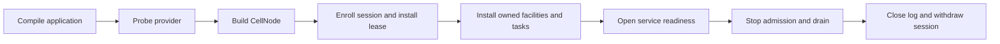
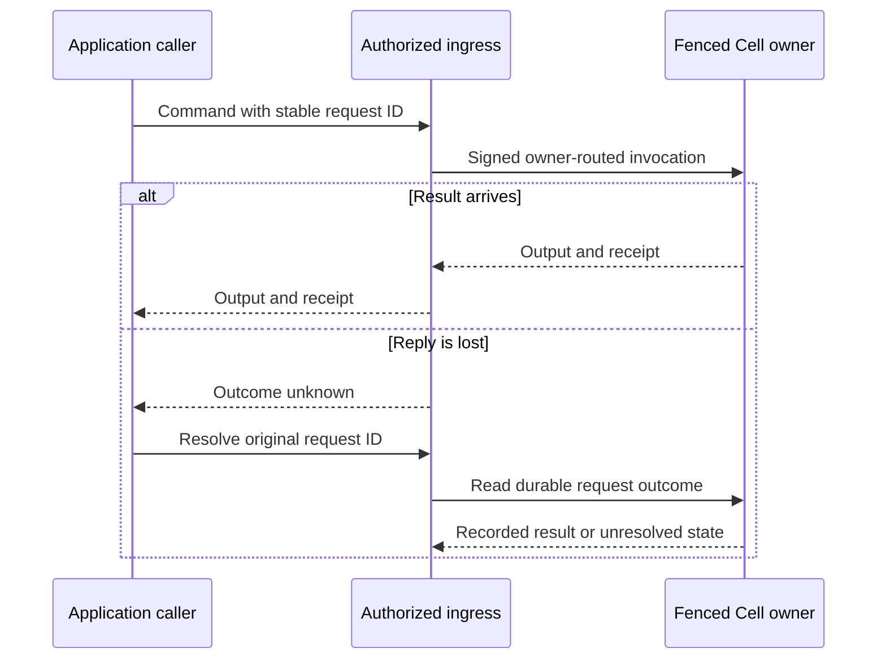

# Integrate Cellule into a service

Cellule is a framework embedded in an application process. It supplies Cell
state, ownership, publication, recovery, typed capabilities, and node drain.
Your service supplies product identity, public ingress and authorization,
object-store credentials, endpoints, and deployment policy. Start with the
[local quickstart](quickstart.md); its in-memory store and local owner show the
mechanics without a serving fleet.

The [visual overview](at-a-glance.md) shows a Cell, the component boundaries,
and the path from declaration to a typed request.

| Concern | Cellule API | Service decision |
| --- | --- | --- |
| Domain | `CellApplication`, `CellModule`, `CellType` | Which modules, schemas, and stable IDs ship in this binary. |
| Storage | `Store`, `CellStorageLayout`, `probe_storage` | Provider, credentials, bucket/prefix, capacity and readiness policy. |
| Node | `CellNodeBuilder`, `CellNode` | Session identity, lease enrollment, facilities, task supervision. |
| Requests | `ApplicationHandle`, optional `cellule-axum` and `cellule-peer-http` | Public route, user authorization, peer receiver and admission policy. |
| Background work | Activity and Effect supervisors | Which runners to install, schedule, drain, and cancel. |

## Bring one node to readiness

1. **Compile once.** Register modules, migrations, operation IDs, and Cell
   types. `CellApplication::compile(BuildDescriptor)` produces the immutable
   descriptor and registry that the node and typed clients must share. The
   [API guide](api.md) explains the author contracts.
2. **Construct and probe storage.** The service chooses provider credentials
   and scope. Build a `Store` and `CellStorageLayout`, then run
   `cellule_store::probe_storage` on a fresh private prefix before advertising
   readiness. Require conditional create, ETag update and stale-ETag rejection,
   and exact ranged reads; inspect `StorageProbeReport::passed` and
   `failed_checks`. The host does not run a credentialed probe for you.
3. **Build one host.** `CellNodeBuilder::new(compiled_application)` needs a
   `SqlWorkerPool`, retained-byte ceiling, LTX replica host, and nonzero node
   session. Set explicit disk and native-memory budgets for the environment.
   `build()` creates a lease-requiring serving node; its runtime is not ready
   merely because construction succeeded.
4. **Enroll and install ownership.** Publish the signed node session, install
   its lease and a `CellNodeTaskGroup`, and run lease renewal with
   `spawn_lease_maintenance`. Install every facility declared as required by
   `with_required_owned_components`. `CellNode::start()` refuses readiness
   without the lease, healthy task group, and required owned components.
5. **Serve through typed handles.** Authorize a product request first. Bind a
   client to the compiled application, tenant, and application IDs, then select
   the Cell with a declared partition rule. A command returns a typed output
   and receipt only after its durability gate. A later query may require that
   receipt. The [SQL example](../crates/cellule-app/examples/sql.rs)
   shows the local setup and invocation; serving products supply their own
   listener and routing.

`build_unleased_for_maintenance()` is a bounded, unadvertised offline path. It
is not a shortcut for serving readiness. The
[host lifecycle guide](../crates/cellule-host/docs/lifecycle.md) lists the
installed components and drain behavior.

## Public and peer request boundaries

For Axum 0.8 services, [`cellule-axum`](../crates/cellule-axum/README.md)
extracts an existing scoped application handle, returns JSON outputs with
receipts, and maps errors while retaining pending or published evidence.
Compose these helpers into your own router and authorization middleware. The
[runnable orders service](../crates/cellule-axum/examples/sql.rs) shows a local
SQL command, a receipt-bound query, and HTTP drain before runtime shutdown.
The optional `openapi` feature supplies shared wire schemas and typed endpoint
registration. Its [integration recipes](../crates/cellule-axum/docs/README.md)
cover request-scoped authorization, atomic prepared-command custody, resolution,
readiness and generated SDK receipt/retry contracts.

`cellule-peer-http` supplies owner routing, HTTP response classification, and
pinned mTLS transport using runtime peer contracts. It does not install a
public endpoint or authorize application users. The service owns the receiver:

1. Authenticate the enrolled peer and verify the signed request.
2. Enforce the application and target scope before dispatch.
3. Apply the adapter's body, deadline, and admission semantics.
4. Dispatch through `PeerDispatcher`; return its classified response.

Use `PeerTargetScope`, `LoadedPeerTls::load`, and `PeerHttpRoundTrip` when
wiring a signed peer `CellClient`. Read the
[transport guide](../crates/cellule-peer-http/README.md), especially its
429/503 and timeout rules.

A lost or invalid response is an **unknown outcome**, not permission to issue a
new request ID. Resolve the original mutation evidence; an owner change or
expiry can leave it unresolved. See [API outcome handling](api.md#handle-an-uncertain-command).

## Read replicas and background work

The host's read-replica manager admits immutable snapshots, refreshes them,
and evicts them under resource pressure. A typed handle can request
`ReadPolicy::Replica`; a missing or lagging reader fails with
`ReplicaUnavailable` or `ReplicaBehind`. It does not silently fall back to the
owner. Commands, mutation resolution, state streams, and lease validation
remain owner-ordered. Reserve native memory for snapshots separately from
writer capacity with `SqlWorkerPool::with_native_memory_limit`, and follow the
[read-replica guide](../crates/cellule-host/docs/read-replicas.md).

Workflow Activities and Effects perform work outside a Cell's SQLite
transaction. Their runtime supervisors retain lease and retry rules, but the
service installs and supervises the runners in its node task group. The
service also decides external idempotency behavior at a destination. A
schedule or effect intent in a module descriptor does not by itself launch a
background worker.

## Drain without losing accepted work

`CellNode` owns exactly one runtime. Shutdown and scale-down serialize through
one drain lane. The node stops admission and work producers, drains accepted
work while lease maintenance is still live, closes the covered node log, then
stops renewal and withdraws the session. Finally it releases readers, slots,
tasks, and SQLite handles. Use `shutdown_until(deadline)` for a bounded owned
drain; the deadline bounds releases after entering the drain lane, not waiting
for that lane. Fleet movement pacing remains a service planner decision.

Keep public readiness and session withdrawal aligned with this lifecycle. A
service should not announce readiness before provider probes and owned
components pass, or remain ready after node admission closes. Read
[architecture](architecture.md) for the publication and recovery contracts and
[qualification](../crates/cellule-runtime/docs/delivery.md) for evidence beyond
the local quickstart.
