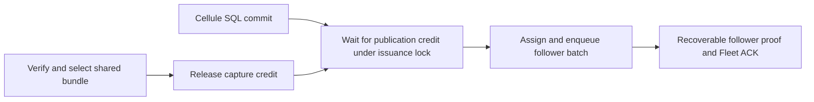

# PR 67: catalog encoding cost and fresh paired measurements

**The candidate completes 550.52 Fleet writes/s versus 512.02 before and
1,994.57 for celld. Performance parity remains unmet.** Successful scheduled
write p99 is 866.06 ms versus 853.65 before; returned errors increase while
dropped offers decrease. Read-only throughput is 17,877.42/s versus 13,780.35
before and 19,522.95 for celld. All six cases drain and pass complete ACK
warm/cold read and original-retry audits. Every performance profile fails.
PR #67 remains a draft.

## Change and compatibility evidence

The dense catalog encoder previously scanned the complete loaded catalog for
every new frame, repeatedly computed binding shard IDs, searched every binding
for each new history, and cloned shard groups again after assigning native
offsets. The preceding timing-only diagnosis measured 11.63 ms mean encoding
inside 93.85 ms selection service. Encoding was one cost among larger catalog,
upload, base and historical verification costs.

The encoder now uses a fixed digest-to-frame lookup for the original maximum
of 64 frames. It scans locators once, records their unique catalog locations,
and assigns extents in the original issued order. Two fixed stack arrays use
about 4 KiB; no additional retained admission or heap cache is introduced.
History binding lookup binary-searches the strictly ordered, already validated
pins. Detached leaf encoding substitutes authenticated history extents, so it
can reuse the original groups without cloning all bindings again. Empty-frame
checkpoint encodings bypass native lookup.

Persisted bytes, formats, authority pins, exact verification, cohort limits,
origin freshness and the 20-MiB working reservation remain unchanged. The real
SQLite regression covers six 64-frame cohorts with 2,000 catalog bindings,
original encoded lengths and issued offsets, exact frame bytes, selected proofs
and cold restoration of all 64 participating Cells' seed and command outcomes.
It passes three repetitions. An external test-only copy of the old encoder
compares complete bytes and selected heads against the candidate on the same
live inputs: all 95 bundle tests pass, including 819 logged native encodings
with identical bytes and heads. Exploratory debug timings from that oracle
are not release or application performance evidence.

## Matched workload and identities

| Dimension | This diagnostic |
| --- | --- |
| Before binary revision | `98a368acdf51c7cb7af1e06eb544f08ab5a55f68`, the preceding production candidate |
| Candidate binary revision | `30cd960ff78a2be31fe84493ad0038b2ad4be7ad` |
| Fresh celld | `f2bf648663a610eefde71f3547ad61e9b896b1f0` |
| Population | 2,000 uniformly offered Cells; all 2,000 have successful responses in every timed case |
| Command | 96-byte SQL INSERT/SELECT values, two-hour durable request/result ledger |
| Fleet | One owner and two followers; local state and follower logs on tmpfs |
| Arrival | 128 clients/queue slots, 30-second warmup, one 60-second window |
| Offered points | Separate 2,000-write/s and 20,000-read/s cases |
| Admission | Original 64-MiB retained budget, 1-GiB managed disk, 20-MiB producer reservation |

Namespaces and provider volumes are fresh. Runner, clients, auditor, images,
fixtures and resource settings match across all six cases. No build or
contributor suite overlaps timed windows. Both managed SQLite paths use WAL
NORMAL. The candidate has no timing instrumentation overlay.

The before executable is a byte-identical copy of the preceding measured
production executable; it is measured again here, not rebuilt or represented
by its historical result. Candidate SQL SHA-256 is
`fa2673bc8d7d2cbe8205a063a58c520abe6a99f9c9c261aacb45257ff2cf7864`;
before is `6c401ce0c1aaaa7fb351caeedac4c7f4f37a03217577e504c588f577c97c504f`.
All 1,936 exported framework files match the committed candidate at build time.
The 1,315 Rust/Cargo inputs remain identical after these documentation updates.

The shared ARM64 Docker VM has 8 CPUs and approximately 8 GiB total memory
across owner, followers, provider and client. Container ceilings exceed that
capacity; internal policies remain asymmetric. Another host VM remains active.
The [preceding environment capture](pr67-catalog-overlap-measurement.md)
records swap use and host limits. VM settings remain unchanged within this
pair. This does not qualify a dedicated 8-vCPU/16-GiB serving node or
physical-media durability. No Bucket or mixed-load result is claimed.

## Actual throughput, latency and failures

TPS counts successful completions inside the window. Successful scheduled p99
includes trailing successful responses. All-attempt p99 also includes fast
failures; it cannot substitute for successful latency. Drops are separate.

| Point | Successes/s | Successful scheduled p99 ms | All-attempt scheduled p99 ms | Errors | Dropped offers |
| --- | ---: | ---: | ---: | ---: | ---: |
| Cellule write, before | 512.02 | 853.65 | 751.90 | 30,367 | 58,688 |
| Cellule write, candidate | 550.52 | 866.06 | 433.80 | 52,155 | 34,687 |
| celld write | 1,994.57 | 14.29 | 14.30 | 0 | 318 |
| Cellule read-only, before | 13,780.35 | 48.28 | 48.30 | 0 | 373,130 |
| Cellule read-only, candidate | 17,877.42 | 31.04 | 31.10 | 0 | 127,309 |
| celld read-only | 19,522.95 | 8.45 | 8.50 | 0 | 28,589 |

Write throughput is 7.52% higher in this pair; successful scheduled p99 is
1.45% higher. Read throughput is 29.73% higher. The matched read ratios are
1.297 for throughput and 0.644 for all-attempt scheduled p99, but the canonical
read guardrail still fails because both arms fail delivery. No repeatable or
attributable gain is established by one short pair. The preceding result from
the same before binary was 551.73 writes/s and 16,631.43 reads/s; it remains a
separate historical observation. These offered points do not establish either
system's maximum capacity.

Write warmup errors/drops are 18,813/30,388 before, 10,983/24,978 candidate and
3/0 celld. Read warmup errors are zero; drops are 453,468/426,220/34,379.
Warmup failures remain qualification failures. All Cellule returned write errors
preserve HTTP 503 (`Cell is temporarily unavailable`). Celld's three warmup
errors preserve HTTP 400 (`request identity expired or not yet valid`). Every
write error class and count reconciles with all 128 client journals per case. Typed per-Cell pressure causes
remain unresolved; the HTTP failure alone does not identify that transition.

| Case | Complete ACK cohort | Warm reads / original retries | Joined drain | Cold reads / original retries |
| --- | ---: | --- | ---: | --- |
| Cellule write, before | 43,745 | All pass | 40.45 s | All pass |
| Cellule write, candidate | 59,198 | All pass | 45.83 s | All pass |
| celld write | 181,680 | All pass | 21.30 s | All pass |
| Cellule read-only, before | 2,001 | All pass | 45.78 s | All pass |
| Cellule read-only, candidate | 2,001 | All pass | 40.76 s | All pass |
| celld read-only | 2,001 | All pass | 4.88 s | All pass |

Independent replay reconciles every warm/timed attempt, completion, error,
dropped offer, per-Cell distribution, ACK count, receipt identity and expected
read output. All ACK mutations and original retries pass both audits with zero
errors or changed incarnations. Earlier failed initialization, warm-availability
and recovery attempts remain evidence; these passing cases do not erase them.

## Why the shared components still have different performance

[`assign_capture`](../crates/cellule-runtime/src/node/log_shipper/mod.rs)
reserves publication capacity while holding the global ordered issuance lock,
before committing a ticket and enqueueing follower work. A slow publication
consumer therefore queues otherwise independent Cells on the Fleet path.

| Successful submission phase, mean ms | Before | Candidate |
| --- | ---: | ---: |
| Local load | 0.09629 | 0.11347 |
| Global ordered-lock wait | 142.99647 | 107.11040 |
| Publication capacity with lock held | 1.51152 | 1.60629 |
| Ticket assignment and enqueue | 0.00661 | 0.00731 |
| Complete submission | 144.61130 | 108.83792 |

All eight phase counts reconcile with 30,823 before and 33,143 candidate
successful assignments; the partition residual is zero. The candidate still
spends 98.41% of submission time waiting for ordering. SQL-worker and
follower-proof means are 0.206 and 33.659 ms in separate overlapping cohorts;
these are not additive to that partition or measures of CPU utilization.

Window GET/range attempts per completed write are 6.35 before and 7.67
candidate; successful PUTs are 0.289 and 0.379. Materialized commands/root
are 8.43 and 14.86. These include background work and exclude SDK retries.
This change reduces encoder scanning, not object-store request count. No total
publication amplification reduction is demonstrated.

Candidate pending publications remain 2,392 at both boundaries; retained bytes
grow 64,502,946→65,222,836 against 67,108,864. Unpublished node-log bytes grow
28,671,326→45,465,827, while oldest unpublished age is 48.11→48.25 seconds.
The node remains unfenced with active Fleet and all 2,000 Cells. Two endpoints
cannot qualify a sustained debt slope. Read-only windows also materialize
1,085 before and 1,345 candidate seed roots, so they include background debt.

The preceding fine timing probe at `7d52e88` measured about 52 captures per
93.85-ms selection, including 18.48-ms catalog loading, 11.63-ms encoding,
23.80-ms PUT, 15.61-ms base verification and 10.64-ms historical verification.
Those nested phases are not all additive. About 52/0.094 ≈ 550 captures/s
before checkpoints explains the observed order of magnitude. That instrumented
probe also failed warm availability; it is diagnosis, not this candidate's
production throughput or complete recovery evidence.

Celld's [Fleet loop](https://github.com/denoland/celld/blob/f2bf648663a610eefde71f3547ad61e9b896b1f0/crates/celld/ltx_repl.rs#L4514)
pipelines rounds in order independently of bucket publication. Its
[follower stream](https://github.com/denoland/celld/blob/f2bf648663a610eefde71f3547ad61e9b896b1f0/crates/celld/node_log.rs#L160)
groups delivered frames before durable append. Cellule currently awaits each
append batch. SQLite WAL, LTX, followers and object storage are shared
components; admission, scheduling and publication work remain different.

## Remaining work and verification

Prioritize reduced catalog/base/history and upload work, recoverably bounded
separation of native admission from publication debt, and ordered follower
pipelining. Larger queues or weaker proof checks do not supply sustainable
capacity. Diagnose overload availability and read variance; complete Bucket
adapter integration, mixed load, failed-owner lifecycle and safe collection.
Keep the [capacity contract](../crates/cellule-runtime/docs/write-performance-design.md):
three paired five-minute repetitions, zero errors/drops, Fleet p99 ≤50 ms,
Bucket p99 ≤200 ms, bounded debt and all-ACK cold recovery on the specified node.

All contributor routes pass in the exact frozen production source: 1,981
workspace tests, 60 local LTX tests, 95 bundle tests, the new regression in three
repeats, Clippy with warnings denied on Rust 1.97 and 1.99, all-feature checks,
format, API docs and boundary/layout/document/SQL-peer gates. The 38 ignored
tests retain their documented environments. Differential source and debug
measurements remain outside Git; they are not application qualification.

Raw snapshots, exact build identities, failures, binaries, journals, metrics,
audits and inventories remain outside Git under
`/Volumes/Workspace/crabbuild-target/cellule-write-perf-8ad1/encoder-cost-20261009-*`.
All six canonical reports and their comparison explicitly fail qualification.

[Previous comparison](pr67-catalog-overlap-measurement.md),
[implementation](bundle-coverage-implementation.md),
[delivery](write-performance-delivery.md).
