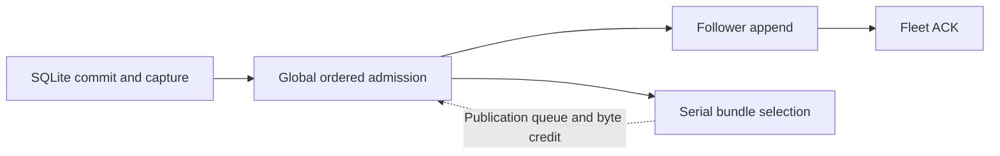

# PR 67: why write throughput still differs from celld

**The fast paths are not architecturally equivalent yet.** Both systems use
SQLite WAL, LTX captures, fenced ownership, follower logs and bucket storage.
Cellule still couples native admission to a serial, expensive publication
consumer. That consumer sets the write rate under sustained pressure.
Performance parity remains unmet and PR #67 stays a draft.

## What the code does

Cellule's [assignment path](../crates/cellule-runtime/src/node/log_shipper/mod.rs)
acquires the global ordered lock, then awaits publication queue capacity before
committing a sequence and enqueueing follower work. The
[publication feed](../crates/cellule-runtime/src/node/log_shipper/publication/mod.rs)
has 512 submission slots and retains native-byte admission through selection.
The consumer selects one cohort of at most 64 captures/frames and 4 MiB before
starting the next. A full publication queue therefore blocks otherwise
independent Cells before their follower append can start.

The reservation before issuance prevents cancellation from leaving a sequence
gap; bypassing it requires a replacement recoverable, bounded ownership path.
Moving the wait or enlarging the queue alone cannot raise sustainable service.

Celld's [shipping loop](https://github.com/denoland/celld/blob/f2bf648663a610eefde71f3547ad61e9b896b1f0/crates/celld/ltx_repl.rs#L4530)
keeps ordered rounds in flight independently of bucket work. Its
[follower stream](https://github.com/denoland/celld/blob/f2bf648663a610eefde71f3547ad61e9b896b1f0/crates/celld/node_log.rs#L179)
groups already delivered requests into one durable append. Cellule awaits each
append batch, and its example HTTP adapter holds a member grant mutex across
the RPC. Concurrent futures alone would not establish safe delivery ordering.

Publication also does different work. Celld's
[bundle flush](https://github.com/denoland/celld/blob/f2bf648663a610eefde71f3547ad61e9b896b1f0/crates/celld/node_log.rs#L6436)
uploads new native entries, then reads the original log record to check that
the epoch remains open before crediting the upload. Cellule reloads selected
catalog metadata, builds and uploads a proposal, freshly verifies its origin,
base roots and historical chains, and selects a new head by authority CAS.
These are different publication protocols and service costs.

## Cross-check against the latest retained run

Re-analysis of the unchanged `10370d2` run in the
[latest matched comparison](pr67-base-pipeline-measurement.md) verifies the
start/end telemetry files against the frozen evidence index. This is an
analysis of that existing 60-second run, not a new benchmark or optimization.

All seven native submission phase deltas have the same **34,809** completed
submission cohort. Their total durations add exactly to the complete timer:

| Native submission phase | Mean ms |
| --- | ---: |
| Complete submission | 96.669 |
| Waiting for the global ordered lane | 95.297 |
| Waiting for publication capacity while holding that lane | 1.267 |
| Local capture load/verification | 0.096 |
| Sequence assignment and enqueue | 0.008 |

The ordered-lane wait accounts for **98.58%** of native submission duration.
These are overlapping callers' queue waits, not a serial service interval;
inverting 95.297 ms would not yield node TPS. The code dependency explains why
publication backpressure becomes a queue shared by otherwise independent Cells.

Separate cohorts record a 0.187-ms mean SQL worker duration (88,882 executions),
0.140-ms capture duration (34,871 captures), and 21.543-ms follower-proof wait
(34,809 observations). Those means must not be added to the submission phases
or treated as successful-command SQL costs. Follower data-sync means are below
0.001 ms on tmpfs; this supplies no physical-media fsync comparison. Per-Cell
publication debt rises from 2,051 to 2,514 pending publications; its oldest age
is already about 45 seconds at the start of the window.

The underlying result remains **579.10 successful writes/s**, with errors,
drops and failed warm availability checks. Re-analysis does not improve it or
qualify capacity. The checked input hashes, exact count/duration partitions and
replay script are retained outside Git under
`/Volumes/Workspace/crabbuild-target/write-path-explanation-20261009`.

## Fresh timing-only reproduction

The external probe pins production `4a5b00148ba579c1f4e035b16e8eb783c3d6fe6d`
and adds operation-local timing to six files. Scheduling, proofs, formats and
budgets are unchanged. All exported framework bytes match the preceding pinned
build; client, auditor, fixtures and images also match. Instrumentation can
perturb timing, so this is diagnosis, not a new production optimization result.

Both fresh cases use 2,000 uniformly offered real Cells, 96-byte SQL values,
the same two-hour request/result ledger, one owner/two followers, tmpfs,
128 clients/queue slots, 30-second warmup and a 60-second 2,000-write/s window.
Both measured SQLite paths use WAL NORMAL. No build, contributor suite or
journal audit overlaps a timed window.

| Diagnostic | Successful writes/s | Successful scheduled p99 ms | Errors | Dropped offers |
| --- | ---: | ---: | ---: | ---: |
| Cellule, timing instrumented | 468.42 | 549.23 | 49,665 | 42,167 |
| celld reference | 1,999.77 | 29.38 | 0 | 0 |

Every Cell has timed successful responses. Independent replay reconciles all
attempts, outputs, errors, dropped offers and ACK manifests. All 51,923 Cellule
ACKs and 182,001 celld ACKs pass warm/cold reads and original retries. Joined
drain takes 77.40 and 18.84 seconds respectively. Cellule warmup also has
9,538 errors and 28,708 drops; celld has neither. These passing ACK audits do
not turn the overloaded Cellule performance profile into a pass.

### Measured service, not a SQLite throughput ceiling

| Operation-local phase | Fully contained operations | Mean ms |
| --- | ---: | ---: |
| Complete authority selection | 474 | 106.68 |
| Preparation within those selections | 474 | 50.61 |
| Verification/selection within those selections | 474 | 54.78 |
| Preparation catalog load | 474 | 16.45 |
| Proposal encoding | 474 | 8.21 |
| Proposal PUT | 474 | 25.36 |
| Base verification | 475 | 24.36 |
| Historical chain verification | 475 | 14.15 |
| Complete checkpoint callback | 365 | 24.37 |

The 474 complete selections cover 28,110 captures: 59.30 per cohort. They
consume 50.57 seconds of the 59.987-second metrics interval; checkpoint
callbacks consume another 8.895 seconds, about 14.83% of the interval.
The source runs these authority operations serially. Their approximate service
rate is `28,110 / (50.5672 + 8.8950) = 472.74 captures/s`, close to the observed
468.42 successful writes/s. This explains the order of magnitude, not maximum
capacity. Producer receipt-credit timing includes some checkpoint work and
must not be added again. Nested phase cohorts have unequal boundary counts;
do not sum every row in the table.

All submission phases have the same 28,173-success cohort and zero timing
residual. Ordered-lock wait averages **108.52 ms**, 98.26% of submission time;
publication-slot wait while holding the lock averages 1.80 ms. SQL worker
execution averages 0.205 ms, capture 0.141 ms and follower-proof wait 34.90 ms
in separate cohorts. These timers are not additive and do not measure CPU
utilization. The dominant submission wait and serial publication service
support prioritizing that dependency over SQLite execution.

### Interpreting the older numbers

The [older 144.50 versus 4,622.43 result](pr67-bounded-history-measurement.md)
used 1,000 Cells and 15,000 offered writes/s. Celld dropped 622,398 offers and
did not complete cold/drain qualification after an OOM during shutdown.
It establishes neither sustainable 4,622-write/s capacity nor a comparison
with the current 2,000-Cell profile. The latest
[uninstrumented production pair](pr67-base-pipeline-measurement.md) records
579.10 versus 1,999.83 writes/s, with Cellule errors, drops and failed warm ACK
availability. The offered-load cap prevents either 2K reference from proving
celld's maximum. The earlier
[metadata-window pair](pr67-metadata-window-measurement.md) recorded 502.28
versus 1,999.83 writes/s, with Cellule latency/error and read regressions.

## Required architectural delivery

1. Separate follower progress from publication waits with byte-accounted,
   recoverable capture ownership, preserving complete issued-range drain.
2. Use ordered member lanes and bounded rounds in flight, with follower group
   commit and ordered proof application. Preserve reconnect, cancellation,
   fencing and unresolved-prefix behavior.
3. Make publication incremental and pipeline expensive immutable work around
   ordered selection. Keep exact original scope/range proofs, authenticated
   lookup, safe checkpoint ordering and bounded debt. A single 64-capture
   consumer needs less than 32 ms/cohort to sustain 2K/s, before checkpoint
   overhead; the current probe measures 106.68 ms for about 59 captures.
4. Verify sustained write/read/mixed capacity, overload availability, complete
   failed-owner recovery and collection against the unchanged
   [capacity contract](../crates/cellule-runtime/docs/write-performance-design.md).

The shared Docker VM has eight CPUs and about 8 GiB total across all roles;
internal resource policies differ between systems. These short cases do not
qualify a dedicated 8-vCPU/16-GiB serving process or physical-media durability.
Every canonical report fails qualification. No production code changes or new
read/Bucket measurements were made in this diagnostic turn.

Raw sources, timing overlays, binaries, journals, audits and phase/model data
were recorded outside Git under
`/Volumes/Workspace/crabbuild-target/cellule-write-perf-8ad1/publication-path-20261009-*`.
That external directory later disappeared; its missing raw evidence is not
claimed to be reverified. The [fresh write comparison](pr67-base-pipeline-measurement.md)
retains newly rebuilt sources, verification and journals in a separate directory.
