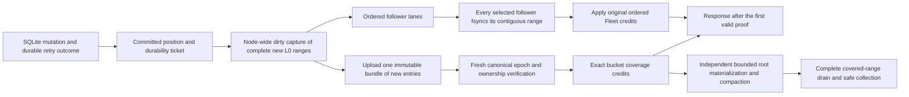
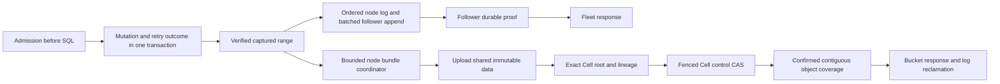

# Cellule write performance proposal and delivery plan

Status: proposed implementation plan, 2026-10-06. Write parity is not achieved.
Implementation and actual verification are tracked in the
[delivery report](write-performance-delivery.md). Its partial milestone status
does not relax the acceptance gates below.
The implementation baseline is PR [65](https://github.com/crabbuild/cellule/pull/65)
at `397f500a`, against main `0813f974` and celld v0.6.1 `f2bf6486`.
The [performance plan](performance-plan.md) retains the earlier audit and local
comparison. This document defines the next deliverables and acceptance gates;
it supersedes the implementation recommendations in the historical
[publication metadata cutover draft](publication-metadata-cutover.md).

## Active mixed-load objective

The active user goal is one 8-vCPU/16-GiB owner managing 2,000 resident Cells
while accepting 2,000 writes/s and 20,000 reads/s simultaneously with low latency.
Qualify that mixed workload directly, preserving the delivery, correctness,
stability and read-latency gates below. A resident-Cell count, write-only result,
or overloaded completion rate cannot establish it. Report owner resources and
any CPU, memory or storage shared with followers, the client and the provider.
The separate historical write-only profiles below remain distinct evidence;
they do not replace the active mixed-load measurement.

## Core write-path reference

The architectural reference also includes celld v0.6.2,
[`90b43017241f81189453d326d05948f388b34652`](https://github.com/denoland/celld/commit/90b43017241f81189453d326d05948f388b34652),
dated October 7, 2026. Its
[independent bundle loop](https://github.com/denoland/celld/blob/90b43017241f81189453d326d05948f388b34652/crates/celld/ltx_repl.rs#L4697),
[ordered shipping loop](https://github.com/denoland/celld/blob/90b43017241f81189453d326d05948f388b34652/crates/celld/ltx_repl.rs#L4816),
and [post-PUT authority check](https://github.com/denoland/celld/blob/90b43017241f81189453d326d05948f388b34652/crates/celld/node_log.rs#L6673)
retain the separation of execution, follower durability, bucket coverage and
per-Cell materialization described below. Existing benchmark manifests remain
pinned to v0.6.1; they are not measurements of v0.6.2.

Cellule already permits a Fleet response while bucket selection is held, as
tested by `delayed_selection_keeps_fleet_acks_visible_and_allows_prior_root_before_joined_drain`.
The unresolved coupling is bounded backlog: `AssignedCapture` retains native
byte admission through publication, while `select_node_bundle` verifies prior
roots and historical locators before advancing coverage. Publication that falls
behind therefore exhausts capture credit and delays new execution. Parallel
checkpoint reads reduce individual waits but do not remove this repeated work.
The next architectural change must append new captured ranges efficiently and
retire their original credit at exact bucket coverage, while independently
materializing per-Cell prefixes. It must preserve origin-loss detection,
canonical recovery inventory and complete follower retention; increasing a
backlog limit or dropping prior-dependency checks alone does not satisfy it.

Use celld's actual LTX replication path as the implementation reference, rather
than equating use of SQLite/LTX with architectural parity. The pinned reference
is `f2bf648663a610eefde71f3547ad61e9b896b1f0`. Its Git tree identifies
`ltx_repl.rs` blob `d3083dcfe17a33fba987f25e1c358a9903ea3e20` and
`node_log.rs` blob `504dd023655b52da5ea81943f5834fdeaab56118`.

The [ship loop](https://github.com/denoland/celld/blob/f2bf648663a610eefde71f3547ad61e9b896b1f0/crates/celld/ltx_repl.rs#L4530)
captures each dirty Cell's complete new L0 range, records submitted positions,
and applies follower completions in original round order. Its
[bundle loop](https://github.com/denoland/celld/blob/f2bf648663a610eefde71f3547ad61e9b896b1f0/crates/celld/ltx_repl.rs#L4411)
independently uploads new entries and advances bucket-covered positions.
The [bundle credit check](https://github.com/denoland/celld/blob/f2bf648663a610eefde71f3547ad61e9b896b1f0/crates/celld/node_log.rs#L6652)
freshly reads canonical node-log authority after the unconditional immutable
PUT; the PUT alone cannot authorize a zombie's response. Compaction is separate
from ordinary Fleet acknowledgement. This ordering is the target:

The [reference transport defaults](https://github.com/denoland/celld/blob/f2bf648663a610eefde71f3547ad61e9b896b1f0/crates/celld/node_log.rs#L5815)
matter: absent overrides, `CELLD_LOG_PIPELINE` is four, `CELLD_LOG_WINDOW` is
zero, and ordered one-shot HTTP is used. Persistent streaming requires
`CELLD_LOG_TRANSPORT=stream`. The recorded harness sets none of these options;
its celld measurements therefore do not establish performance of streaming.
Normal SQL Cells also do not receive the ship loop's Queue-specific grouping
delay. Cellule currently has eight rounds and a general four-millisecond
assembly interval. These settings and the actual capture topology must be
reported and aligned explicitly in a core comparison. A stream API added
without its production transport and receiver is not a delivered optimization.

| Remaining deliverable | Required behavior and verification |
| --- | --- |
| Separate selection cleanup from materialization ownership | Later verified captures retire while an original root callback is held; preserve the materialized prefix, later suffix, each original publication obligation, cancelled-job lifetime and exact cold outcomes. |
| Replace repeated catalog/history publication work | One bounded append of new entries and a fresh fenced selection per cohort; no full catalog rewrite or predecessor-data scan per ordinary batch. Preserve authenticated lookup, origin-loss detection, canonical recovery inventory and all existing reader/collector contracts. |
| Align dirty capture and ordered replication | Node-wide notification/capture, complete per-Cell ranges, immutable epoch/member lanes, matched declared round/byte limits and strictly ordered credit. Lost responses, partial ranges and epoch changes cannot credit a later unresolved tail. |
| Make bucket progress and compaction independent | Fleet proof never waits for ordinary root materialization; separately bounded bucket/compaction debt makes progress under load. Drain the whole issued suffix, including prior Fleet ACKs, before transfer or collection. |
| Qualify the common core and embedding separately | A Rust driver must exercise each real production LTX capture, follower fsync and response-proof path with identical inputs and explicit settings. No mocked I/O or direct SQLite/log-store-only timing substitutes for the core. Retain separate deployed-application HTTP/SQL qualification and all acceptance gates below. |

Cellule's tenant/Cell identities, signed peer contracts, persisted formats and
authority-pinned recovery remain compatibility contracts. Borrow celld's
algorithms within these layers; porting its daemon wholesale or bypassing those
contracts is not architectural parity. The ordinary path, retry/read visibility,
failed-owner recovery and cross-Cell collection must change together when the
coverage representation changes. Architectural parity remains unimplemented
until these deliverables are verified; the existing TPS results remain
end-to-end application observations and do not isolate core or language cost.

## Decision and success criteria

Prioritize reducing publication work per command, then amortizing peer proof
work. Keep one fenced writer and the existing response gate throughout the
first three implementation stages. A separate proof-model milestone is required
before uploaded node bundles can replace per-Cell root materialization as
recoverable object coverage.

| Qualification | Required result |
| --- | --- |
| Fleet writes | 15,000 successful commands/s; scheduled p99 at most 50 ms |
| Bucket writes | 2,000 successful commands/s; scheduled p99 at most 200 ms |
| Delivery | Zero errors, dropped offers, or unissued requests; at least 99% of offers finish inside the measurement window |
| Relative parity | At least celld's highest qualified rate, with scheduled p99 no worse, on the same profile and resources |
| Correctness | Every acknowledged mutation and stored retry result survives warm audit, drain, and bucket-only restore after all original node state is destroyed |
| Stability | Three paired repetitions of at least five minutes; bounded publication debt and no lease loss or drain failure |
| Read guardrail | On the same binary and durability mode, at least 90% of baseline qualified read throughput and at most 1.2 times baseline scheduled p99, for both read-only and matched mixed-load profiles |

The absolute targets preserve the requested 1,000-Cell, sub-100-byte workload.
Relative parity on a constrained Docker host does not qualify those absolute
targets. Neither target may be reduced to make a change pass.
Report KV and SQL application qualification separately; a passing KV profile
does not establish capacity for the application with its durable retry ledger.

## Evidence and remaining uncertainty

The latest matched Docker characterization used 1,000 Cells, 96-byte values,
128 clients, and INSERT plus SELECT inside the command, including a durable
request ledger and stored response. Both Cellule variants used 64 MiB retained
RAM. The owner, two followers, client, and object store shared an 8-CPU/16-GiB
VM; node state was tmpfs. Each measurement lasted 30 seconds.

| Durability | Main commands/s | PR 65 commands/s | celld commands/s | PR 65 scheduled p99 |
| --- | ---: | ---: | ---: | ---: |
| Fleet | 979 | 916 | 2,572 | 797.6 ms |
| Bucket | 55 | 113 | 375 | 3,337.6 ms |

All six cases passed their acknowledgement audits, cold restore, retries, and
drain, with zero HTTP errors. **All failed target-load qualification through
dropped offers and latency.** These are overloaded completion rates, not
sustainable capacities. They establish neither a Fleet throughput gain nor a
repeatable bucket gain from PR 65. The laptop report of 15K Fleet and 2K bucket
writes/s is useful as a target; its exact benchmark revision and command/retry
semantics remain unmatched.

Whole-case telemetry from the final Fleet candidate identifies publication
pressure. It includes setup, warmup, stress, and audit, rather than a warmed
measurement window:

| Observation | Value | Interpretation |
| --- | ---: | --- |
| Dirty admission mean | 4,461 ms | Long waits for publication resources |
| Publication mean | 1,083 ms | Overlapping work and waits; not a component to add to admission |
| Provider PUTs started | 44,946 | Includes coordination and maintenance, not just data uploads |
| Completed provider PUT mean | 37.2 ms | Significant storage occupancy; 37 requests were still pending at the snapshot |
| Command worker round trip | Mean 8.28 ms, p99 62.7 ms | Includes queueing; not SQL CPU service time |
| Capture | Mean 0.71 ms, p99 9.0 ms | Capture alone does not explain the long publication waits |
| Successful append rounds | 2,482 | A batched round across followers, not a per-command or per-follower counter |

This supports publication amplification as a priority. It does not establish
the fraction of command latency caused by peer enrollment, signing, follower
sync, or SQL scheduling. Milestone M0 must separate those costs.

The [celld bundle loop](https://github.com/denoland/celld/blob/f2bf648663a610eefde71f3547ad61e9b896b1f0/crates/celld/ltx_repl.rs#L4401)
aggregates staged LTX across Cells and separates bundle coverage from per-Cell
materialization. Its [bundle credit path](https://github.com/denoland/celld/blob/f2bf648663a610eefde71f3547ad61e9b896b1f0/crates/celld/node_log.rs#L6620)
checks the current epoch after upload before granting coverage. That separation
is the architectural target; its fencing proof cannot simply be transplanted
into Cellule's independently fenced Cell authority.

## Proposed write architecture

This diagram describes M1–M3. Upload completion grants no authority or object
coverage. A shared object may contain many Cells, but each Cell's current root
and required dependencies must be selected before its tickets are confirmed.
An uncovered ticket still blocks the contiguous retirement frontier.

The coordinator lives in runtime. LTX owns verified bytes, immutable locators,
root preparation, restore, and sparse reads. Store owns transport. HTTP,
credentials, TLS setup, and product authorization remain application concerns.
Reuse the existing file-backed `BundleBuilder`, `prepare_bundle`, node shipper,
and publication path; do not create a second durability implementation.

### M1 Compact small root dependencies

Pack small segment indexes and newly changed directory metadata into
authenticated extents alongside immutable data, with one bounded representation
and the existing larger-object path. Keep the root document small and retain
the separate accumulating lineage record and fenced control CAS. A target small
append then needs at most four successful PUTs: packed data, root, lineage, and
control. Reused dependencies cost no new upload, but still require the current
origin verification contract.

Specify exact object digest, extent bounds, content kind, checksum, and Cell
scope for every packed reference. Update producers and all consumers together:
root decoding, index loading, directory traversal, full restore, sparse reads,
compaction, reachable-object inventory, and retention. Test corrupt, missing,
overlapping, truncated, and cross-Cell extents. A root selected after ambiguous
CAS must reconcile through the same verified dependencies.

Do not fold lineage into the live control record: historical traversal needs
each candidate's predecessors. Do not replace accumulating lineage with one
immutable predecessor: the same root may acquire another derivation link.
Reducing lineage writes requires a separately specified bounded link catalog,
including all historical lookup and collection behavior.

### M2 Aggregate publication across Cells

Add one node-scoped coordinator that consumes already verified captures, retains
their admissions, and builds a bounded file-backed bundle. Freeze a cohort on
the first of byte limit, row limit, finite deadline, drain, or memory pressure.
Use existing host limits for initial bounds; record cohort age and fill before
choosing a production flush policy. Low-load commands and bucket waiters must
have a finite latency bound. A timer or larger cohort is not itself a win.

Upload a bundle once, then prepare and select the participating Cell roots
through their existing exclusive publishers. Revalidate Cell authority after
waiting for the cohort. Successful Cells confirm their own tickets; failed,
cancelled, or fenced siblings retain independent obligations. Advance node
coverage only after the authoritative coverage update succeeds, preserving
the existing contiguous frontier and ambiguous-result reconciliation.

Charge scratch, retained indexes, outcome allocations, and ownership tables to
the shared ledgers. Release them only when work finishes or is reconciled;
cancelling a caller cannot cancel dispatched storage work. Drain closes cohort
admission, seals remaining cohorts, resolves every accepted command, and joins
all upload and publisher tasks before releasing leases and handles.

Acquire node-cohort admission before retaining per-Cell preparation permits;
never fill every dirty slot with publishers waiting for a cohort that needs
another slot to finish. Document the acquisition order and test it at the
minimum supported budgets. Bound compaction occupancy and preserve progress for
lease renewal, authority reconciliation, and accepted root publication when
bulk uploads saturate I/O. Capacity growth must not consume renewal headroom.

Collection must enumerate references from every Cell, retained lineage,
recovery overlay, and pending publication that can name a shared object.
Quiesce writes and cross the grace boundary before deleting any bundle part.
Include a hot Cell sharing an object with a fenced or dormant Cell in tests.

Per-Cell selection remains a cost floor. With a packed-data PUT per cohort and
three per-Cell PUTs, approximate work is `1 / cohort_commands + 3 / commands_per_selected_root`
PUTs per command, before maintenance and retries. Thus a 0.25 budget needs
roughly twelve or more commands per selected root, even with large cohorts.
Uniform traffic over 1,000 Cells may not provide that coalescing within the
retention and latency budgets. M0 measures this; M2 must not claim that sharing
data alone removes the CAS floor.

### M3 Amortize peer authorization safely

First measure owner enrollment lookup, receiver enrollment lookup, signature
verification, queue wait, follower append, and durable sync independently.
The current `EnrolledPeerVerifier` is deliberately consumed per append. A TTL
cache of that observation is not a valid replacement.

Design a signed append-session grant binding fleet/image/release, both boot
identities, key identities, log epoch, membership, allowed sequence range,
coverage floor, and expiry. Define the authority that issues it and the durable
receiver fence that invalidates it. Each append still validates its signed
bytes, sequence, current local fence, lifetime, and coverage constraints.
Renewal performs the required fresh authority reads.

Sealing and retirement must account for outstanding grants: durably stop new
appends, establish the final accepted range, and ensure no still-valid grant can
extend that range. Lost seal messages must prevent retirement until the protocol
has proven exclusion, including grant expiry and the clock model. Restart changes
boot identity and rejects old grants. Lease loss must stop admission and proof
release; renewal cannot resurrect a closed epoch. Specify crash/replay and
concurrent append/seal/retire transitions in the pure coordination model before
implementing the adapter. Preserve mTLS and signed-message checks.

Follower `sync_data` remains the durable barrier. Measure batch size, syncs per
command, and append-to-proof latency before changing batching. tmpfs cannot
answer whether file logs beat RocksDB on physical storage; a database WAL also
needs a durable barrier. A RocksDB migration is outside this plan's first path.

### M4 Separate recoverable bundle coverage from materialized roots

This is a protocol milestone, conditional on the M2 cost floor or M3 measurements
preventing parity. It is required before a celld-style uploaded bundle can grant
object durability while individual Cell materialization lags.

Deliver a reviewed state machine and format specification, then one atomic
implementation across authority, response proof, recovery, and collection.
The new proof must contain all of the following:

| Element | Required meaning |
| --- | --- |
| Cell binding | Authority-pinned exact base root, incarnation, writer fence, and permitted node-log binding |
| Bundle manifest | Exact ordered node ranges and per-Cell commit ranges, byte extents, digests, outcomes, and complete dependency references |
| Coverage selector | A fenced authoritative selection of the immutable manifest, rechecked after upload; bucket listing is never a selector |
| Cell transfer | Close the previous binding and determine its complete recoverable endpoint before a new writer may execute |
| Recovery | Authenticate the base and binding, fetch every required bundle/follower range, reject gaps or conflicting ranges, and reconstruct identical SQLite bytes and retry outcomes |
| Retirement | Prove object coverage of every required accepted range before discarding its follower copy or collection obligation |

Keep retry outcomes and query visibility bound to the same proven logical
endpoint. A read may not observe an unproven suffix merely because upload or
SQLite commit finished; materialization lag must not change the public command
or retry contract.

Node epoch freshness alone does not establish an individual Cell's writer
authority. Model a Cell lease ending while its node remains live, upload racing
with a new Cell owner, and a recovery worker racing with late follower appends.
Do not acknowledge bucket writes or release existing retention pins through this
new proof until these transitions and cold restore are implemented and verified.
Use an explicit new proof type; a raw uploaded-object handle cannot become one.

M4 should amortize authority selection across a verified node range, while
materialization and compaction consume the same manifest later. The decision
record must state how Cell authority pins that range without reinstating a
per-command CAS. If that cannot be proved within the current authority model,
retain M2 and report the remaining performance gap; do not bypass authority.

## Delivery milestones

Estimates are engineering days for one engineer, excluding review and unavailable
infrastructure. Each row produces a reviewable PR; the next row uses measured
evidence from its dependencies. M4 has the largest uncertainty.

| Milestone | Deliverables and primary modules | Exit gate | Estimate |
| --- | --- | --- | ---: |
| M0 Measurement contract | Reproducible Docker runner and pinned celld application; windowed provider/worker/peer telemetry; machine-readable report schema. Runtime telemetry, node shipper, qualification, example adapters | Three A/A pairs agree within 10% qualified rate; otherwise fix harness/resource variance first. Cost categories reconcile to provider totals; all failed runs retained | 2–3 |
| M1 Packed dependencies | Format decision, bounded codecs and locators, all readers/writers, vectors and corruption/recovery tests. LTX replica/root/upload/directory and runtime publication/retention | At most 4 successful PUTs per selected small root including lineage/control; zero acknowledged-state loss; sparse/cold-read p99 at most 1.2 times paired baseline | 4–6 |
| M2 Shared publication | One bounded runtime coordinator using LTX bundles; per-Cell selection/reconciliation; reference collection and drain tests | At most 0.25 successful publication PUTs per acknowledged Fleet command under stable backlog, including Cell selection; debt has no positive sustained slope. If coalescing cannot meet this safely, trigger M4 | 5–8 |
| M3 Append grants | Proof-model decision, signed grant vectors, durable receiver fences, adapters and race/crash tests. Runtime node directory/log/follower/coordination; optional peer adapter and application example | At most 0.05 fresh enrollment GETs per acknowledged Fleet command, summed over owner and followers; no stale proof in seal/retire/restart/expiry/lease-loss tests | 4–7 |
| M4 Bundle coverage proof | Conditional proof-model ADR, authority-pinned manifest/catalog, canonical codec, recovery/transfer/retirement/collection implementation and fault matrix | At most 0.05 successful publication PUTs per acknowledged command in both modes under backlog; all required range and authority races pass; bucket responses require the new complete proof | 8–12 |
| M5 Qualification and rollout | Paired comparison, overload/drain report, migration/rollback runbook, compact result table and binary/source manifests | All absolute and relative write gates, read guardrails, cold audits, and full contributor checks pass; otherwise deliver a quantified gap report | 3–5 |

M0–M3 plus M5 estimate 18–29 engineering days. Including M4 estimates 26–41.
These are delivery estimates, not predictions that a particular milestone will
reach parity. Larger I/O concurrency and a two-second per-Cell publication delay
already failed to improve local throughput; they are not primary deliverables.

Implement against these existing entry points and their co-located tests:

| Concern | Entry points |
| --- | --- |
| Packing and shared objects | `crates/cellule-ltx/src/bundle.rs`, `src/replica/{root,prepare,upload}.rs`, `src/replica/directory/` |
| Root authority and lineage | `crates/cellule-runtime/src/publication/`, `src/control/authority/lineage/` |
| Ordered submission and coverage | `crates/cellule-runtime/src/node/{log,log_shipper,durability}/` |
| Append authorization and recovery | `crates/cellule-runtime/src/node/directory/`, `src/follower/`, `src/fleet/operations/` |
| Scheduling and proof visibility | `crates/cellule-runtime/src/cell/actor/`, `src/cell/worker/`, `src/coordination/` |
| Measurement and application transport | `crates/cellule-runtime/src/fleet/telemetry.rs`, `src/qualification/`, `crates/cellule-axum/examples/fleet/` |

Paths following an initial crate path in a row are relative to that crate.
M0 must inventory authority, backup, movement, failed-boot recovery, sparse-read,
and collection callers before any API or format changes; the table is a starting
map, not a complete consumer list.

## Measurement and acceptance procedure

Commit the minimal runner, workload definition, report schema, and concise result
table. Keep raw logs, profiles, resource samples, and bulk manifests outside the
repository, indexed by run ID and content hash.

| Profile | Fixed contract |
| --- | --- |
| KV parity | 1,000 uniformly selected Cells; 96-byte value; one key mutation and the same returned result; specify request identity and duplicate semantics identically in both applications |
| SQL application parity | Same current INSERT plus in-command SELECT, transaction, durable request ledger, stored retry result, and error semantics in both applications |
| Fleet durability | One owner and two native followers; acknowledged command recoverable under the tested follower failure policy; report authentication/transport differences |
| Bucket durability | Response waits for verified recoverable object coverage; destroy all original node state for cold audit |
| Mixed reads | Uniform Cells and an additional 1% hot-Cell case; offer writes at 50% and 80% of the lower paired qualified write capacity; search read capacity at identical write rates |
| Overload | Offer 1.5 times qualified write capacity for 60 seconds, then return to 50%; safe refusals occur before SQL, accepted work remains auditable, admission recovers within 30 seconds, drain finishes within 120 seconds |

Run the systems serially on the same Docker environment, alternating order with
fresh prefixes and equivalent caches. Pin source revisions, images, binaries,
provider, node limits, client concurrency, memory/disk budgets, and clock/load
generator settings. Use at least 30 seconds warmup before each five-minute
window. Publish separate profiles for the current shared VM and a Docker host
where owner/follower CPU reservations fit alongside client and store; report
actual quota and contention. The shared-VM profile remains useful for regression
diagnosis but cannot stand in for three independent machines.

Use an open-loop offered schedule and measure latency from scheduled arrival,
including client queueing. Record request latency separately. Sweep sustainable
rates below overload, then test 15K Fleet and 2K bucket targets explicitly.
Report every repetition, qualified rate, scheduled p50/p95/p99, HTTP errors,
drops, unissued requests, and completions inside/outside the window. The command
count is logical successful transactions, not SQL statements or batch RPCs.
Report logical value bytes/s and encoded replication/upload bytes/s separately.

Take metric deltas around the warmed window. Split provider PUT/GET/HEAD/LIST,
conditional writes, bytes, attempts, conflicts, and errors into data publication,
Cell/node authority, peer enrollment, compaction, and other maintenance. Report
all categories rather than excluding coordination from the cost numerator.
Publish the successful-PUT budget and total-attempt rate side by side.
Associate work completing after the window with its cohort; startup, trailing
drain, and compaction have separate totals and cannot hide a growing debt.

Track accepted/proven/materialized/tiered frontiers, oldest unpublished age,
retained RAM/disk, dirty/I/O/job permits, cohort sizes, commands per root, frames
per RPC, sync count, append-to-proof latency, SQLite service time, and worker
queue time. Collect CPU profiles only in separate diagnostic runs. Require no
positive trend in unpublished bytes/age over the last three one-minute segments
of the steady run. End-of-drain ledgers and pending tasks must return to zero.

Full-device durability qualification is a separate run on persistent storage
with measured sync latency and documented failure injection. Docker tmpfs
qualifies neither power-loss persistence nor independent-machine isolation.

## Safety, format, and rollout gates

Every implementation PR includes its changed producers and consumers, invariants,
paired measurements, and the applicable fault cases:

| Failure | Required result |
| --- | --- |
| Upload succeeds; Cell CAS fails or is ambiguous | Reconcile exact authority; no false proof; preserve required scratch and obligations |
| One Cell in a bundle fences or fails | Valid siblings remain usable; uncovered tickets block retirement; no shared part is prematurely collected |
| Owner dies after response but before materialization | Recover every acknowledged command and stored retry result from the pinned base and complete durable suffix |
| Truncated/missing/corrupt bundle or range | Fail exact recovery; never silently skip a range or serve partial state |
| Cancellation, slow store, or drain under pressure | Accepted work remains owned and finishes or reconciles; refusals do not execute SQL; resources release on every exit |
| Lease loss, concurrent seal, retirement, or restart | No stale writer proof; recovery observes a complete, closed endpoint |

Follow the current [format policy](../crates/cellule-runtime/docs/storage.md#format-policy):
update the one development layout, its schemas, producers, consumers, vectors,
and documentation atomically. Do not add speculative dual codecs, a new
`cells/vN` prefix, or automatic migration. Recreate development data when an
incompatible format changes; document the rejection and cutover explicitly.
PR 65's supported persisted node-frame versions remain their own contract.

Before enabling a new peer protocol, upgrade followers first, close and drain
old ensembles, then activate upgraded owners. For rollback, stop admission,
drain and materialize to a representation the rollback binary understands, and
retire incompatible lanes before downgrade. If safe conversion is unavailable,
preserve the bucket and local logs and roll forward; do not promise an old
binary can restore new data. A format-changing cutover requires a verified
export/restore route or recreatable development data.

Run the complete [contributor verification](../AGENTS.md#work) in CI or an
isolated verification snapshot, including local LTX without replica features,
API docs, dependency boundaries, module layout, documentation gates, and
SQL/peer contracts. Fault/provider qualification also requires its documented
environment; an ignored test is not evidence. Final delivery comprises merged
implementation PRs, the qualification report, reproducible commands, and the
rollout/rollback runbook. Until those gates pass, report the achieved rate and
remaining bottleneck rather than claim celld parity.
