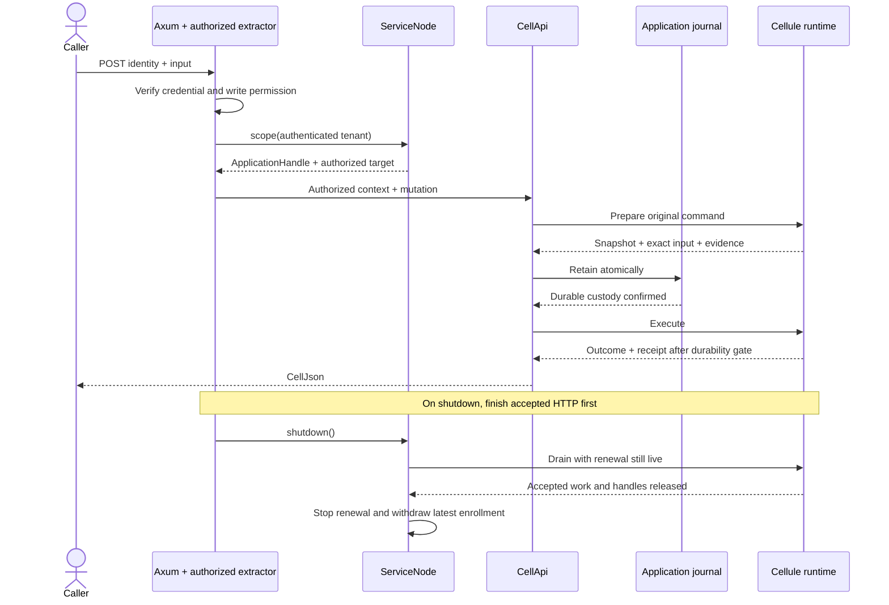

# Application builder → Axum service

A complete embedding application illustrating the proposed builder ergonomics.
Run it against the current Cellule checkout; no framework API implementation is
assumed. The conveniences are implemented locally in [proposal.rs](src/proposal.rs)
and delegate to the existing application compiler and cookbook host assembly.

```text
Orders module + Cell binding
           │
           ▼
OrdersApp::compile ───────────────► CellApi + OpenAPI
           │                             │
           ▼                             ▼
ServiceNode::start                  Axum routes
  probe storage                         │
  enroll + renew lease                  │
  provision both tenant Cells           │
           │                             │
           └── scoped handle ◄── authenticate + authorize

Shutdown: stop HTTP → finish requests → drain node → withdraw enrollment
```

## What is implemented

| File | Responsibility |
| --- | --- |
| [application.rs](src/application.rs) | Declare the SQL module, migration, command/query contracts, and application binding. |
| [proposal.rs](src/proposal.rs) | Prototype `builder.module`, explicit fixed-shard `CellBinding`, node startup, handle factory, and shutdown. |
| [auth.rs](src/auth.rs) | Authenticate a credential, authorize read/write access, then derive a scoped handle and target. |
| [journal.rs](src/journal.rs) | Atomically retain the prepared snapshot and exact encoded input before dispatch. |
| [recovery.rs](src/recovery.rs) | Resolve original evidence; replay only after authoritative absence. |
| [main.rs](src/main.rs) | Compile once, start the node, compose Axum/OpenAPI, and drain on signals or serving errors. |

`CellBinding` derives role, shard count, and schema range from the module
descriptor. Namespace identity, Cell name, limits, and fixed-shard partition
selection remain explicit. `ApplicationBuilder::finish` still performs the
canonical whole-application validation. Treat any registration error as a
failed compilation; this helper does not roll back a partially mutated builder.

`ServiceNode` wraps the cookbook's `LocalNode`, which owns one `CellNode` and
one runtime. The host owns directory enrollment, lease renewal, supervision,
recovery, and ordered drain. The service still owns its storage provider,
application identity, authorization, HTTP routes, listener, and evidence journal.

## Run

From the repository root:

```sh
cargo run --manifest-path examples/application-builder-service/Cargo.toml --locked
```

The server binds `127.0.0.1:3002`. Set `CELLULE_EXAMPLE_BIND=127.0.0.1:0`
to have the OS choose a free port; the selected address is printed.

On a workstation with the mounted Workspace volume, set `CARGO_TARGET_DIR`
to a directory unique to this checkout beneath `$HOME/Workspace/crabbuild-target`.

This tutorial uses an in-memory authoritative store, temporary local SQLite
files, and fixed local credentials. Restarting creates fresh state. Durable
publication here is relative to that provider's lifetime. For persistent
service state, supply a durable, successfully probed `Store`, stable application
identity, persistent state/journal directories, and the service's actual
identity and authorization implementation. The cookbook host is a single-node
recipe supporting schema version one; this prototype is not the general
production host startup API proposed for `cellule-host`.

## Call the service

| Credential | Tenant | Permission |
| --- | --- | --- |
| `Bearer alpha-writer` | Alpha | Read, write, resolve/replay its own command evidence |
| `Bearer beta-reader` | Beta | Read only |

The authenticated server-side record chooses the tenant. Request headers,
path parameters, and mutation inputs cannot select another tenant.

| Method and route | Body | Result |
| --- | --- | --- |
| `POST /orders/total` | Mutation identity + integer input | Committed total and receipt |
| `POST /orders/total/read` | JSON `null` | Observed total and receipt; accepts `x-cellule-receipt` |
| `POST /orders/total/resolve/{request_id}` | Empty | Original authorized command outcome, safe replay, or unresolved state |
| `GET /ready` | Empty | `204` when the node/lease are ready |
| `GET /openapi.json` | Empty | Generated command/query schemas, recovery/readiness routes, and bearer security |

Write Alpha's total, retain the original body, then read at its receipt:

```sh
set -eu
base=http://127.0.0.1:3002
request_id=$(python3 -c 'import uuid; print(uuid.uuid4())')
now_ms=$(python3 -c 'import time; print(time.time_ns() // 1000000)')
body=$(printf '{"identity":{"request_id":"%s","issued_at_ms":%s,"expires_at_ms":%s},"input":1999}' "$request_id" "$now_ms" "$((now_ms + 60000))")

reply=$(curl --fail-with-body --silent --show-error "$base/orders/total" \
  -H 'Authorization: Bearer alpha-writer' \
  -H 'Content-Type: application/json' --data "$body")
printf '%s\n' "$reply"

receipt=$(printf '%s' "$reply" | python3 -c 'import json,sys; print(json.dumps(json.load(sys.stdin)["receipt"], separators=(",", ":")))')
curl --fail-with-body --silent --show-error "$base/orders/total/read" \
  -H 'Authorization: Bearer alpha-writer' \
  -H 'Content-Type: application/json' \
  -H "x-cellule-receipt: $receipt" --data 'null'

# Exact retry returns the original outcome and receipt.
curl --fail-with-body --silent --show-error "$base/orders/total" \
  -H 'Authorization: Bearer alpha-writer' \
  -H 'Content-Type: application/json' --data "$body"

# Resolve original retained evidence if the HTTP response was lost.
curl --fail-with-body --silent --show-error --request POST \
  "$base/orders/total/resolve/$request_id" \
  -H 'Authorization: Bearer alpha-writer'

# Beta reads its independent total: output remains zero.
curl --fail-with-body --silent --show-error "$base/orders/total/read" \
  -H 'Authorization: Bearer beta-reader' \
  -H 'Content-Type: application/json' --data 'null'

# This returns 403; the read-only caller cannot dispatch a command.
curl --silent --show-error --output /dev/null --write-out '%{http_code}\n' \
  "$base/orders/total" -H 'Authorization: Bearer beta-reader' \
  -H 'Content-Type: application/json' --data "$body"

curl --fail-with-body --silent --show-error "$base/openapi.json"
```

The command's input/output is `i64`; the query accepts unit input (`null`).
Negative totals are durable domain rejections. Never create a new request ID
or change the original bytes merely because a response was lost.



Ctrl-C or SIGTERM stops HTTP admission and waits for accepted requests. Only
after `axum::serve` finishes does the node drain. Its lease-maintenance task
keeps renewal live during the drain and withdraws the latest enrollment last.
Route construction, listener bind, and serving failures take the same node
cleanup path. A failed drain reports its original error rather than claiming
successful withdrawal.
